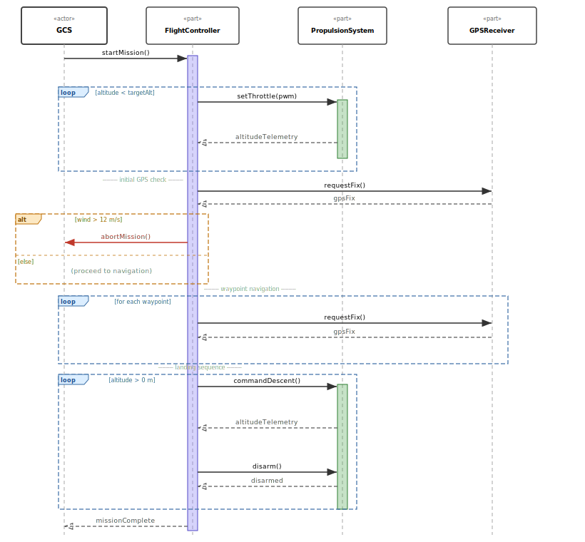

# Demo Model — UAV Autonomous Flight System

`EXAMPLE · REFERENCE MODEL · model/`

The repository ships with a complete UAV model under `model/`. It covers the full Syscribe element palette — structural architecture, behavior, requirements, test cases, constraints, calculations, allocations, and diagrams — and is used as the validator's self-test fixture.

This page is a guided tour. Browse the [source on GitHub](https://github.com/sjames/syscribe/tree/main/model) to read the raw Markdown files.

---

## Namespace layout

Each directory is a package. Each `.md` file is an element.

```
model/
├── UAV/               — structural architecture (PartDefs, sub-systems)
│   ├── Avionics/      — FlightController, GPSReceiver, IMU, AvionicsBay
│   ├── Power/         — BatteryPack, PowerDistributionUnit, PowerSystem
│   ├── Propulsion/    — Motor, RotorAssembly, PropulsionSystem, rotor configs
│   └── Payload/       — Camera, PayloadBay
├── GroundStation/     — GroundControlStation, OperatorConsole
├── Behavior/          — MissionExecution, TakeoffAction, WaypointNavAction,
│                        LandingAction, FlightStates
├── Interfaces/        — port defs, connection defs, interface blocks
├── Flows/             — PowerFlowDef, TelemetryFlowDef
├── Items/             — item types flowing through the system
├── Enumerations/      — FlightMode, ArmStatus
├── Requirements/      — requirement hierarchy (REQ-*)
├── Verification/      — test cases (TC-*) and review records
├── Calculations/      — performance trade calculations
├── Constraints/       — parametric constraints
├── Allocations/       — function and requirement allocations
├── Decisions/         — architecture decision records (ADR-*)
├── UseCases/          — actor-level use cases
├── Views/             — model views
├── Viewpoints/        — stakeholder viewpoints
├── Metadata/          — cross-cutting annotations
└── Diagrams/          — BDD, IBD, Sequence, State Machine diagrams
```

The root `_index.md` declares `type: Namespace` and imports standard SysML libraries (`ScalarValues`, `ISQ`, `SI`, etc.).

---

## Structural architecture

`UAV::UAVSystem` is the abstract top-level `PartDef`. Five sub-systems compose the vehicle:

| Sub-system | Qualified name | Key elements |
|---|---|---|
| Avionics | `UAV::Avionics` | `FlightController`, `GPSReceiver`, `IMU`, `AvionicsBay` |
| Power | `UAV::Power` | `BatteryPack`, `PowerDistributionUnit`, `PowerSystem` |
| Propulsion | `UAV::Propulsion` | `Motor`, `RotorAssembly`, `PropulsionSystem`, `QuadRotorConfig`, `HexRotorConfig` |
| Payload | `UAV::Payload` | `PayloadBay`, `Camera` |
| Airframe | `UAV` | `Airframe` |

The ground segment (`GroundStation::GroundControlStation`) interacts with the UAV over the `TelemetryConnectionDef` interface.

### Block Definition Diagram


The BDD shows the five sub-system `PartDef` blocks that compose `UAVSystem`, with composition edges indicating ownership.

---

## Avionics sub-system

The avionics bay IBD shows three part usages — `FlightController`, `IMU`, and `GPSReceiver` — with ports and flow connections inside the `AvionicsBay` boundary.


---

## Propulsion sub-system

The propulsion namespace defines an abstract `PropulsionSystem` with two concrete rotor configurations (`QuadRotorConfig`, `HexRotorConfig`), each typed by `RotorAssembly`. A `RotorAssembly` owns exactly one `Motor`.


---

## Power sub-system

The power namespace defines `PowerSystem` as a `PartDef` with two parts — `battery : BatteryPack` and `pdu : PowerDistributionUnit` — connected by a `PowerConnectionDef` flow. The PDU's output port is bound to the system-level `mainPowerOut` boundary port.


---

## Behavior

Mission execution is modelled under the `Behavior` namespace as a tree of `ActionDef` elements:

| Element | Type | Role |
|---|---|---|
| `MissionExecution` | ActionDef | Orchestrates the three flight sub-actions |
| `TakeoffAction` | ActionDef | Throttle ramp; altitude monitoring loop |
| `WaypointNavAction` | ActionDef | GPS-guided waypoint traversal loop |
| `LandingAction` | ActionDef | Descent; altitude monitoring; motor disarm |
| `FlightStates` | StateSpaceDef | `Idle → Arming → Takeoff → Cruise → Landing → Disarmed` |

### Mission Execution Sequence

The sequence diagram below shows the full message flow for `MissionExecution` across the four participants.



The diagram covers four combined fragments:

- **`loop [altitude < targetAlt]`** — takeoff throttle ramp and altitude telemetry loop
- **`alt [wind > 12 m/s]`** — weather check; aborts the mission or continues to waypoints
- **`loop [for each waypoint]`** — GPS fix requests and waypoint advancement
- **`loop [altitude > 0 m]`** — descent monitoring, disarm, and mission-complete handshake

### Flight State Machine

`FlightStates` models the UAV's operational lifecycle. Red transitions lead to the `fault` state; the gray dashed arc is the recovery path back to `disarmed`.


---

## Diagrams

| Diagram | Kind | Subject |
|---|---|---|
| [UAVSystemBDD](https://github.com/sjames/syscribe/blob/main/model/Diagrams/UAVSystemBDD.md) | BDD | `UAV::UAVSystem` — top-level block decomposition |
| [PropulsionSystemBDD](https://github.com/sjames/syscribe/blob/main/model/Diagrams/PropulsionSystemBDD.md) | BDD | `UAV::Propulsion` — Motor / RotorAssembly composition |
| [AvionicsBayIBD](https://github.com/sjames/syscribe/blob/main/model/Diagrams/AvionicsBayIBD.md) | IBD | `UAV::Avionics::AvionicsBay` — FC, IMU, GPS ports and flows |
| [PowerSystemIBD](https://github.com/sjames/syscribe/blob/main/model/Diagrams/PowerSystemIBD.md) | IBD | `UAV::Power::PowerSystem` — battery → PDU power flow |
| [MissionExecutionSeq](https://github.com/sjames/syscribe/blob/main/model/Diagrams/MissionExecutionSeq.md) | Sequence | `Behavior::MissionExecution` — full mission message flow |
| [FlightStatesMachineD](https://github.com/sjames/syscribe/blob/main/model/Diagrams/FlightStatesMachineD.md) | StateMachine | `Behavior::FlightStates` — flight phase state machine |
| [SafetyRequirementsD](https://github.com/sjames/syscribe/blob/main/model/Diagrams/SafetyRequirementsD.md) | Requirement | Safety requirement / allocation / verification trace |
| [RequirementTraceMermaid](https://github.com/sjames/syscribe/blob/main/model/Diagrams/RequirementTraceMermaid.md) | Mermaid | `Requirements` — full traceability graph |

---

## Requirements

### Parent requirements

| ID | Title |
|---|---|
| REQ-UAV-SAFE-000 | UAV shall not cause injury to persons or property during any flight phase |
| REQ-UAV-PERF-000 | UAV shall meet mission performance objectives for endurance, navigation, and data link |
| REQ-UAV-REG-000 | UAV shall comply with all applicable regulatory requirements (sub-5 kg open category) |

### Leaf requirements

| ID | Title | Domain |
|---|---|---|
| REQ-UAV-MASS-001 | Maximum take-off mass ≤ 5 kg | system |
| REQ-UAV-ENDUR-001 | Minimum 25-minute flight endurance under nominal conditions | hardware |
| REQ-UAV-NAV-001 | GPS position accuracy ≤ 1.5 m CEP under nominal GNSS | hardware |
| REQ-UAV-COMM-001 | Telemetry data link range ≥ 5 km line of sight | software |
| REQ-UAV-FC-001 | Flight controller shall detect single sensor failure within 50 ms | software |
| REQ-UAV-SAFE-001 | Autonomous safe landing on battery-critical or link-loss event | software |

Each leaf requirement carries `derivedFrom:` pointing to its parent and `breakdownAdr:` referencing the ADR that justified the decomposition — enforced by validation rule E310.

### Safety requirements trace


---

## Verification

Nine test cases cover the leaf requirements. Each is a `TestCase` element with a stable `TC-*` ID, a `testLevel` (L1–L5), and a Gherkin `scenario:` block.

| File | Level | Verifies |
|---|---|---|
| `MassVerificationCase` | L1 (analysis) | REQ-UAV-MASS-001 |
| `EnduranceTestCase` | L2 (ground) | REQ-UAV-ENDUR-001 |
| `NavigationAnalysisCase` | L3 (simulation) | REQ-UAV-NAV-001 |
| `DataLinkTestCase` | L2 (ground) | REQ-UAV-COMM-001 |
| `FCFaultInjectionTest` | L4 (flight) | REQ-UAV-FC-001 |
| `SafeLandingTest` | L4 (flight) | REQ-UAV-SAFE-001 |
| `PerformanceCaseReview` | L1 (analysis) | REQ-UAV-PERF-000 |
| `SafetyCaseReview` | L1 (analysis) | REQ-UAV-SAFE-000 |
| `RegulatoryComplianceReview` | L1 (analysis) | REQ-UAV-REG-000 |

---

## Architecture decisions

| ID | File | Status | Subject |
|---|---|---|---|
| ADR-SYS-001 | `SafetyDecompositionADR` | accepted | Safety requirement decomposition strategy |
| ADR-SYS-002 | `PerformanceDecompositionADR` | accepted | Performance requirement decomposition strategy |

---

## Interfaces and flows

| Element | Kind | Carries |
|---|---|---|
| `Interfaces::TelemetryPortDef` | PortDef | `Items::TelemetryPacket` |
| `Interfaces::ControlPortDef` | PortDef | `Items::ControlCommand` |
| `Interfaces::PowerPortDef` | PortDef | `Items::BatteryPower` |
| `Interfaces::TelemetryConnectionDef` | ConnectionDef | Telemetry flow GCS ↔ UAV |
| `Interfaces::PowerConnectionDef` | ConnectionDef | DC power distribution |

---

## Running the validator

```bash
syscribe -m model/ validate
```

The report covers all 115 elements, the full requirements traceability matrix, and any validation findings. The model produces zero errors.
