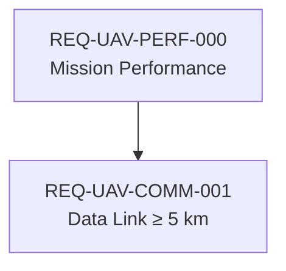

# Diagrams

`FORMAT · DIAGRAMS`

Diagrams are `type: Diagram` elements. The `diagramKind:` field selects the rendering path.

## Diagram kinds

| `diagramKind` | Rendering | Description |
|---|---|---|
| `BDD` | SVG (server / PlantUML) | Block Definition Diagram — part/item type hierarchy and compositions |
| `IBD` | SVG (server / PlantUML) | Internal Block Diagram — part usages, ports, and connections within a block |
| `StateMachine` | SVG (server / PlantUML) | State machine — states, transitions, and guards |
| `Requirement` | SVG (server / PlantUML) | Requirement diagram — requirements, derivation, and verification links |
| `Sequence` | SVG (PlantUML) | Sequence diagram — lifelines, messages, returns |
| `Mermaid` | Mermaid.js (client) | Any diagram expressible in Mermaid graph syntax |

## Structured diagrams (BDD, IBD, StateMachine, Requirement)

These diagrams declare their content in YAML frontmatter. The web server builds the SVG from the `shapes`, `edges`, and `layout` fields.

### `shapes:` — mapping of shape-id to descriptor

```yaml
shapes:
  s-uavsystem: {ref: "UAV::UAVSystem", kind: PartDef}
  s-avionics:  {ref: "UAV::Avionics::AvionicsBay", kind: PartDef}
  s-fc:        {ref: "UAV::Avionics::FlightController", kind: Part, parent: s-avionics}
```

Each shape descriptor:

| Sub-field | Description |
|---|---|
| `ref` | Qualified name of the model element this shape represents; validated by W402 |
| `kind` | Rendering hint: `PartDef`, `Part`, `Port`, `boundary`, `state`, `initial`, `Requirement`, etc. |
| `parent` | Shape-id of the enclosing boundary shape (for IBD nesting) |

Sub-feature refs (e.g. `UAV::Avionics::FlightController::powerIn`) do not resolve as top-level elements — W402 suppresses the warning for these.

### `edges:` — mapping of edge-id to descriptor

```yaml
edges:
  e-comp:  {source: s-uavsystem, target: s-avionics, kind: composition}
  e-power: {source: s-fc-power,  target: s-imu,      kind: flowConnection}
```

Each edge descriptor:

| Sub-field | Description |
|---|---|
| `source` | Shape-id of the source end; validated by W403 |
| `target` | Shape-id of the target end; validated by W403 |
| `kind` | `composition`, `flowConnection`, `derivedFrom`, `verifies`, `allocatedTo`, `transition` |
| `ref` | Optional: model element this edge represents (e.g. a feature or connection usage) |

### `layout:` — pixel coordinates

```yaml
layout:
  s-uavsystem: {x: 20,  y: 20,  w: 200, h: 56}
  s-avionics:  {x: 20,  y: 140, w: 200, h: 56}
```

`layout:` is the trigger for the SVG renderer. A diagram without a `layout:` block renders as "no layout defined."

## Mermaid diagrams

Set `diagramKind: Mermaid` and include a fenced ` ```mermaid ` block in the document body. The validator fires **E400** if the block is absent.

```yaml
---
type: Diagram
name: RequirementTrace
diagramKind: Mermaid
subject: Requirements
---

Requirement derivation tree.


```

The Mermaid.js runtime is loaded from CDN and renders the diagram client-side when the tab is activated.

## PlantUML companion diagrams

`pumlMode: companion` opts a diagram into the PlantUML workflow. Syscribe generates
a `.puml` source file; your PlantUML toolchain (JAR, CI step, IDE plugin) renders it
to SVG. Every shape emits a `[[URL]]` hyperlink back to the element's detail page in
the web browser.

### Frontmatter fields

| Field | Description |
|---|---|
| `pumlMode: companion` | Opt in; the only supported value |
| `pumlFile: ./MyDiagram.puml` | Override companion path (default: `<stem>.puml`) |

The body must reference the anticipated SVG so the diagram is visible on GitHub
and other Markdown renderers. `syscribe plantuml` injects a Markdown image link
automatically if the body has no image reference yet. Both `` and
`` satisfy W413.

```yaml
---
type: Diagram
name: UAVSystemBDD
diagramKind: BDD
pumlMode: companion
pumlFile: ./UAVSystemBDD.puml
subject: UAV::UAVSystem
shapes:
  s-uavsystem: {ref: "UAV::UAVSystem", kind: PartDef}
  s-avionics:  {ref: "UAV::Avionics::AvionicsBay", kind: PartDef, parent: s-uavsystem}
edges:
  e-comp: {source: s-uavsystem, target: s-avionics, kind: composition}
---


```

### CLI workflow

```bash
# 1. Generate .puml source files for all companion diagrams
syscribe -m model/ plantuml

# 2. Render .puml → .svg (needs plantuml on PATH or PLANTUML_JAR env var)
syscribe -m model/ plantuml render
syscribe -m model/ plantuml render --jar /opt/plantuml/plantuml.jar

# Generate a single diagram
syscribe -m model/ plantuml Diagrams::UAVSystemBDD --output -
```

### Style configuration (`.syscribe.toml`)

```toml
[plantuml]
theme = "spacelab"                    # any PlantUML built-in theme
# style_file = "style/custom.puml"   # !include — takes precedence over theme
# base_url   = "https://my-server"   # clickable link prefix (default: http://localhost:3000)
# jar        = "/opt/plantuml.jar"   # JAR path for `plantuml render`
```

### Supported `diagramKind` values for PlantUML generation

| `diagramKind` | PlantUML output |
|---|---|
| `BDD` | Class diagram — `class "Name" <<part def>>`, `*--` composition |
| `IBD` | Component diagram — `rectangle` boundary, `component` blocks |
| `StateMachine` | State diagram — `[*]` initial, `state "Name" as id` |
| `Sequence` | Sequence diagram — `actor`/`participant`, `->` messages |
| `Requirement` | Class diagram — `<<requirement>>` stereotype, `..>` edges |

`Mermaid` and unknown kinds are skipped with a warning.

## Validation rules for diagrams

| Code | Severity | Condition |
|---|---|---|
| E400 | Error | `diagramKind: Mermaid` but body has no ` ```mermaid ` block |
| E402 | Error | `svgFile:` path does not exist on disk |
| E403 | Error | `pumlMode` has an unrecognized value (only `companion` is supported) |
| E404 | Error | `pumlMode: companion` set but `diagramKind` is absent |
| W400 | Warning | Diagram element has no `diagramKind` — rendering mode ambiguous |
| W401 | Warning | `subject:` does not resolve to a known element |
| W402 | Warning | A shape `ref:` does not resolve (and is not a sub-feature of a known element) |
| W403 | Warning | An edge `source` or `target` is not a defined shape id in this diagram |
| W413 | Warning | `pumlMode: companion` but body has no `<img` tag |
| W414 | Warning | `pumlMode: companion` but the `.puml` companion file does not exist yet |
| W415 | Warning | `[plantuml] style_file` in `.syscribe.toml` does not exist on disk |
