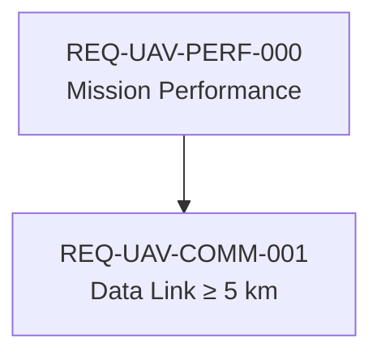

# Diagrams

`FORMAT · DIAGRAMS`

Diagrams are `type: Diagram` elements. The `diagramKind:` field selects the rendering path.

## Diagram kinds

| `diagramKind` | Rendering | Description |
|---|---|---|
| `BDD` | SVG (server / PlantUML) | Block Definition Diagram — part/item type hierarchy and compositions |
| `IBD` | SVG (server / PlantUML) | Internal Block Diagram — part usages, ports, and connections within a block |
| `StateMachine` | SVG (server / PlantUML) | State machine — states, transitions, and guards |
| `Action` | SVG (server / Mermaid) | Action diagram — action steps, fork/join/decision/merge control nodes, successions and flows |
| `FeatureModel` | SVG (server / Mermaid / PlantUML) | Feature diagram in FODA notation — the feature tree with mandatory/optional marks, XOR and OR groups and `requires`/`excludes` constraints; derived from `FeatureDef`s |
| `Requirement` | SVG (server / PlantUML) | Requirement diagram — requirements, derivation, and verification links |
| `Sequence` | SVG (PlantUML) | Sequence diagram — lifelines, messages, returns |
| `Mermaid` | Mermaid.js (client) | Any diagram expressible in Mermaid graph syntax |

## Structured diagrams (BDD, IBD, StateMachine, Action, Requirement, Sequence)

These diagrams carry their content in YAML frontmatter, from one of two sources. A `BDD`, `IBD`, `StateMachine`, `Action`, `Sequence`, `Requirement` or `Allocation` diagram with a `subject:` and no `shapes:` is **derived** from the model (next section) — the preferred form for those kinds. A diagram with a `shapes:` block is **manifest**-sourced: the hand-listed alternative, where the author enumerates the `shapes`, `edges`, and optional `layout` pins, and the only form for kinds that have no generator yet. The presence of `shapes:` selects the source; there is no mode field.

### `shapes:` — mapping of shape-id to descriptor

```yaml
shapes:
  s-uavsystem: {ref: "UAV::UAVSystem", kind: PartDef}
  s-avionics:  {ref: "UAV::Avionics::AvionicsBay", kind: PartDef}
  s-fc:        {ref: "UAV::Avionics::FlightController", kind: Part, parent: s-avionics}
```

Each shape descriptor:

| Sub-field | Description |
|---|---|
| `ref` | Qualified name of the model element this shape represents; validated by W402 |
| `kind` | Rendering hint: `PartDef`, `Part`, `Port`, `boundary`, `state`, `initial`, `Requirement`, etc. |
| `parent` | Shape-id of the enclosing boundary shape (for IBD nesting) |

Sub-feature refs (e.g. `UAV::Avionics::FlightController::powerIn`) do not resolve as top-level elements — W402 suppresses the warning for these.

### `edges:` — mapping of edge-id to descriptor

```yaml
edges:
  e-comp:  {source: s-uavsystem, target: s-avionics, kind: composition}
  e-power: {source: s-fc-power,  target: s-imu,      kind: flowConnection}
```

Each edge descriptor:

| Sub-field | Description |
|---|---|
| `source` | Shape-id of the source end; validated by W403 |
| `target` | Shape-id of the target end; validated by W403 |
| `kind` | `composition`, `flowConnection`, `derivedFrom`, `verifies`, `allocatedTo`, `transition` |
| `ref` | Optional: model element this edge represents (e.g. a feature or connection usage) |

### `layout:` — pixel coordinates

```yaml
layout:
  s-uavsystem: {x: 20,  y: 20,  w: 200, h: 56}
  s-avionics:  {x: 20,  y: 140, w: 200, h: 56}
```

`layout:` is the trigger for the SVG renderer. A diagram without a `layout:` block renders as "no layout defined."

## Derived diagrams (BDD, IBD, StateMachine, Action, Sequence, Requirement, Allocation, FeatureModel)

A `FeatureModel` diagram takes a `FeatureDef`, a `FeatureModel` sheet or a package of features as its `subject:` and draws the feature tree in FODA notation (spec §8.16.8.9); the same graph is the browser's `/features` page. A `BDD`, `IBD`, `StateMachine`, `Action` or `Sequence` diagram needs no manifest at all. Declare the kind
and the subject, and the generator reads the content from the model every time the diagram is
built:

```yaml
---
type: Diagram
name: PowerSystemDerivedIBD
diagramKind: IBD
subject: UAV::Power::PowerSystem
---
```

Adding a part, a port or a `supertype:` to the model changes the picture; nothing in the
diagram file needs editing. The demo model ships one of each: `Diagrams::UAVSystemDerivedBDD`
(subject: the `UAV` package) and `Diagrams::PowerSystemDerivedIBD` (subject:
`UAV::Power::PowerSystem`; compare the hand-listed `Diagrams::PowerSystemIBD`, the same view
as a manifest).

### What the generator draws

**BDD** — subject: a `Package`, `PartDef` or `ItemDef`.

- One block per `PartDef`, `ItemDef`, `PortDef`, `InterfaceDef` or `ConnectionDef` that is a
  direct member of the subject package (for a definition subject: the definition itself plus
  its direct sub-definitions). Actions, states and requirements never appear.
- A compartment listing the block's attribute features (`mass : Real [kg]`) and ports
  (`port powerOut : PowerPort (out)`).
- `inheritance` edges from `supertype:`; `composition` edges from part usages (inline
  `features:` typed by a definition, and child `Part`/`Item` elements), labelled with the usage
  name and a non-1 multiplicity (`motor [2]`); an `association` edge for a `ConnectionDef`
  whose two end types are blocks on the diagram.
- An edge is drawn only when both of its ends are on the diagram.

**IBD** — subject: a `PartDef` or `Part`.

- A boundary for the subject with its own ports (a `Part` subject also shows its definition's
  ports).
- One block per owned part usage — inline `features:` typed by a `PartDef`, or child `Part`
  elements — labelled `name : Type [mult]`, with ports from the usage's own features and from
  its definition, each carrying its `direction`.
- Edges from the subject's `connections:` (connection), `flowConnections:` (flow),
  `bindingConnections:` (binding) and `successionConnections:` (succession). Endpoints are the
  usual dotted chains: `engine.powerOut` is port `powerOut` of usage `engine`; a single segment
  is a usage or a boundary port. A chain that reaches nothing draws no edge — the generator
  never invents a port.

**StateMachine** — subject: a `StateDef` (or a `State`/`ExhibitState` usage, which reads the
`StateDef` it is typed by). Demo: `Diagrams::FlightStatesDerivedSM`.

- One rounded state per `subStates:` entry, with `entry / …`, `do / …` and `exit / …`
  compartment lines from `entryAction`/`doAction`/`exitAction`. A substate typed by a `StateDef`
  with its own `subStates:` becomes a container holding that machine's states, one level deep.
- An initial pseudostate per region with a transition to each `isInitial: true` state, and a
  final node every `isFinal: true` state transitions to.
- One transition edge per transition in either placement (nested under its source substate, or
  top-level with `source:`; the deprecated `from`/`to`/`trigger` keys are read like the
  canonical ones), labelled `accept [guard] / effect` with the absent parts omitted — the
  payload's last segment (or `after …`/`when …`/`at …` for a time or change trigger), the guard
  in brackets, the effect's name or type. A transition whose endpoint is not on the diagram draws
  nothing (that is W929's job).

**Action** — subject: an `ActionDef` (or an `Action` usage, which reads its definition). A new
`diagramKind: Action` (spec §8.16.8.8). Demo: `Diagrams::MissionExecutionDerivedAction`.

- One rounded step per `subActions:` entry, stereotyped by its kind (`perform`, `send`,
  `accept`, `assign`, `terminate`, or plain `action`), with a compartment for its `typedBy`,
  `payload`, trigger and `via`/`to` chains.
- An `IfAction` as a decision diamond labelled by its condition, its `then`/`else` steps joined
  to it by `[then]`/`[else]` successions and rejoining at a merge; a `LoopAction` as a container
  stereotyped `loop`, labelled `name [for v in seq]` (or `[while c]`/`[until c]`), holding its
  body in order.
- A fork/join bar or decision/merge diamond per `controlNodes:` entry.
- A succession edge per `successionConnections:` entry (labelled `[guard]` when present; an
  `IfAction` endpoint enters at its decision and leaves from its merge) and a flow edge per
  `flowConnections:` entry.
- An initial node feeding every step with no incoming succession and a final node reached from
  every step with no outgoing one — only when the action declares at least one succession;
  otherwise the steps are drawn unordered.

**Requirement** — subject: a `Package`, `RequirementDef` or `Requirement`
(`REQ-TRS-VIS-020`; demo: `Diagrams::RequirementsDerived`).

- One requirement box per native `Requirement`, `RequirementDef` or SysML `Requirement` that is
  the subject or lies under it at any depth, labelled by `name` (else id), with a compartment
  showing `id = …` and `status = …` when present.
- `derive` edges from each requirement to its `derivedFrom:` targets and `refine` edges to its
  `refines:` targets (child below parent — the layout puts the target above the source).
- `satisfy` edges from every element whose `satisfies:` names a requirement on the diagram,
  drawn as a block with its real type's stereotype, and `verify` edges from every `TestCase`
  whose `verifies:` names one. These context nodes appear only through such an edge.
- `containment` edges from a `RequirementDef` to the requirements it owns.
- `include:`/`exclude:` apply to requirements and context nodes alike, by qualified name,
  stable id (`REQ-UAV-FC-001`, `TC-UAV-FC-001`) or short name — the way to keep a large
  requirements package readable.

**Allocation** — subject: a `Package`, `AllocationDef` or `Allocation`
(`REQ-TRS-VIS-022`; demo: `Diagrams::FunctionAllocationDerived`).

- Every allocation pair under the subject: an `Allocation` element's `allocatedFrom:`/
  `allocatedTo:`, its `features:` entries of `type: Allocation`, an `AllocationDef`'s
  `allocations:` entries, and `allocatedTo:` on a `Part`/`PartDef`/`Action`/`ActionDef` (the
  element itself is the source).
- Two swimlanes, *Logical* (sources) and *Physical* (targets), each holding one block per
  distinct element with its real type's stereotype; an end that does not resolve is a dashed
  block labelled by the reference text; an element on both sides appears once in each lane.
- One `«allocate»` edge per pair, labelled by the usage name when it has one.
- `include:`/`exclude:` apply to the end elements; an edge is drawn only when both ends are
  kept.

**Sequence** — subject: an `ActionDef` or `Action` (or a `UseCaseDef`/`UseCase` with
`actors:`) (`REQ-TRS-VIS-021`; demo: `Diagrams::MissionExecutionDerivedSeq`, compare the
hand-listed `Diagrams::MissionExecutionSeq`).

- One lifeline per participant, in first-appearance order: the subject first, then every
  element a `SendAction`'s `to:` chain or an `AcceptAction`'s/`SendAction`'s `via:` chain
  resolves to — a port chain resolves to the part that owns the port (an inline feature of the
  subject, a port element's owner, or the part in the model that owns a port of that name,
  preferring one that `performs:` the subject); an unresolved chain is a dashed lifeline
  labelled by the chain text — then each entry of the subject's `actors:` as an actor.
- One message per `SendAction` (subject → participant, labelled `name(Payload)`) and per
  `AcceptAction` (participant → subject, labelled by the payload, else the trigger), in
  execution order: `successionConnections:` topological order when declared, else declaration
  order, descending into an `IfAction`'s `then`/`else` and a `LoopAction`'s `body`. A nested
  `PerformAction` is a step in the order but is not expanded; no return, create or destroy
  messages are generated.
- One `alt` fragment per `IfAction` and one `loop` fragment per `LoopAction`, labelled by the
  condition, enclosing the messages it contains; an activation on the subject's lifeline
  spanning its messages.
- The generator places everything itself — lifelines left to right at a fixed pitch, messages
  top to bottom in order, fragments around their span — as pins, with horizontal waypoints on
  every message, so every renderer (SVG export, the browser editor, Mermaid, PlantUML) draws it
  with the `fixed` algorithm and no layout-engine run. A `layout:` block can still move a
  lifeline or fragment by its id (`s-<subject>-<participant>`, `s-<subject>-<action>`).
- `include:`/`exclude:` name participants (qualified or short name; never the subject); a
  dropped participant takes its messages with it. `W080` (manifest completeness) is never raised
  on a derived Sequence diagram.

`UseCase` and `Custom` have no generator; a derived diagram of such a kind is drawn empty, so
keep using a manifest for them.

### Composition across packages: `depth:`

A derived BDD pulls in the blocks that its blocks compose, even from other packages, as
*external* blocks (marked `external`). `depth: N` sets how many composition levels are followed
beyond the subject's own blocks (default `1`; `0` = only the subject's members). A member that
`include:`/`exclude:` left out is never pulled in by composition. On a package subject, `include:`
also accepts a name qualified relative to the subject (`Hardware::Box`), a full qualified name or
a stable id (never a bare display name of a definition elsewhere). The Mermaid and PlantUML
exports tag such blocks `<<external>>`.

### Narrowing the view: `include:` / `exclude:`

```yaml
diagramKind: BDD
subject: UAV
include: [UAV::UAVSystem, Airframe]   # qualified name, or name relative to the subject
exclude: [Airframe]                    # applied after include
```

`include:` keeps only the named members (BDD: definitions in the package; IBD: owned part
usages) and the edges joining them; `exclude:` removes members, and every edge touching them,
from an otherwise complete view. Either takes a string or a list. An entry that names no member
of the subject is **W417**; `include:`/`exclude:` on a manifest diagram is one **W417** and is
ignored.

### Pins

Derived shape ids are deterministic: `s-` plus the element's qualified name lower-cased with
`::` and other non-alphanumerics replaced by `-` — `UAV::Power::PowerSystem::pdu` becomes
`s-uav-power-powersystem-pdu`. A `layout:` block therefore works on a derived diagram exactly as
on a manifest one: pins survive regeneration, and a renamed element simply loses its pin (W416)
and is laid out automatically again.

```yaml
layout:
  s-uav-power-powersystem-pdu: {x: 320, y: 80}
```

### Codes

| Code | Condition |
|---|---|
| W417 | `include:`/`exclude:` on a manifest diagram (ignored), or an entry that names no member of the subject |
| W418 | A derived diagram's `subject:` type is not valid for its `diagramKind:` (BDD: `Package`/`PartDef`/`ItemDef`; IBD: `PartDef`/`Part`; StateMachine: `StateDef`/`State`/`ExhibitState`; Action: `ActionDef`/`Action`; Requirement: `Package`/`RequirementDef`/`Requirement`; Allocation: `Package`/`AllocationDef`/`Allocation`; Sequence: `ActionDef`/`Action`/`UseCaseDef`/`UseCase`); the diagram is drawn empty |

An unresolved `subject:` is still W401, and a derived diagram never raises W402/W403 for the
shapes it generates.

## Mermaid diagrams

Set `diagramKind: Mermaid` and include a fenced ` ```mermaid ` block in the document body. The validator fires **E400** if the block is absent.

````markdown
---
type: Diagram
name: RequirementTrace
diagramKind: Mermaid
subject: Requirements
---

Requirement derivation tree.


```mermaid
graph TD
  %% ref: REQ-UAV-PERF-000
  PERF["REQ-UAV-PERF-000<br/>Mission Performance"]
  %% ref: REQ-UAV-COMM-001
  COMM["REQ-UAV-COMM-001<br/>Data Link ≥ 5 km"]
  PERF --> COMM
```
````

The Mermaid.js runtime is loaded from CDN and renders the diagram client-side when the tab is activated.

## PlantUML companion diagrams

`pumlMode: companion` opts a diagram into the PlantUML workflow. Syscribe generates
a `.puml` source file; your PlantUML toolchain (JAR, CI step, IDE plugin) renders it
to SVG. Every shape emits a `[[URL]]` hyperlink back to the element's detail page in
the web browser.

### Frontmatter fields

| Field | Description |
|---|---|
| `pumlMode: companion` | Opt in; the only supported value |
| `pumlFile: ./MyDiagram.puml` | Override companion path (default: `<stem>.puml`) |

The body must reference the anticipated SVG so the diagram is visible on GitHub
and other Markdown renderers. `syscribe plantuml` injects a Markdown image link
automatically if the body has no image reference yet. Both `` and
`` satisfy W413.

```yaml
---
type: Diagram
name: UAVSystemBDD
diagramKind: BDD
pumlMode: companion
pumlFile: ./UAVSystemBDD.puml
subject: UAV::UAVSystem
shapes:
  s-uavsystem: {ref: "UAV::UAVSystem", kind: PartDef}
  s-avionics:  {ref: "UAV::Avionics::AvionicsBay", kind: PartDef, parent: s-uavsystem}
edges:
  e-comp: {source: s-uavsystem, target: s-avionics, kind: composition}
---


```

### CLI workflow

```bash
# 1. Generate .puml source files for all companion diagrams
syscribe -m model/ plantuml

# 2. Render .puml → .svg (needs plantuml on PATH or PLANTUML_JAR env var)
syscribe -m model/ plantuml render
syscribe -m model/ plantuml render --jar /opt/plantuml/plantuml.jar

# Generate a single diagram
syscribe -m model/ plantuml Diagrams::UAVSystemBDD --output -
```

### Style configuration (`.syscribe.toml`)

```toml
[plantuml]
theme = "spacelab"                    # any PlantUML built-in theme
# style_file = "style/custom.puml"   # !include — takes precedence over theme
# base_url   = "https://my-server"   # clickable link prefix (default: http://localhost:3000)
# jar        = "/opt/plantuml.jar"   # JAR path for `plantuml render`
```

### Supported `diagramKind` values for PlantUML generation

| `diagramKind` | PlantUML output |
|---|---|
| `BDD` | Class diagram — `class "Name" <<part def>>`, `*--` composition |
| `IBD` | Component diagram — `rectangle` boundary, `component` blocks |
| `StateMachine` | State diagram — `[*]` initial, `state "Name" as id` |
| `Sequence` | Sequence diagram — `actor`/`participant`, `->` messages |
| `Requirement` | Class diagram — `<<requirement>>` stereotype, `..>` edges |

`Mermaid` and unknown kinds are skipped with a warning.

## Validation rules for diagrams

| Code | Severity | Condition |
|---|---|---|
| E400 | Error | `diagramKind: Mermaid` but body has no ` ```mermaid ` block |
| E402 | Error | `svgFile:` path does not exist on disk |
| E403 | Error | `pumlMode` has an unrecognized value (only `companion` is supported) |
| E404 | Error | `pumlMode: companion` set but `diagramKind` is absent |
| W400 | Warning | Diagram element has no `diagramKind` — rendering mode ambiguous |
| W401 | Warning | `subject:` does not resolve to a known element |
| W402 | Warning | A shape `ref:` does not resolve (and is not a sub-feature of a known element) |
| W403 | Warning | An edge `source` or `target` is not a defined shape id in this diagram |
| W417 | Warning | `include:`/`exclude:` on a manifest diagram (ignored), or an entry that names no member of the subject |
| W418 | Warning | A derived diagram's `subject:` type is not valid for its `diagramKind:`; the diagram is drawn empty |
| W413 | Warning | `pumlMode: companion` but body has no `<img` tag |
| W414 | Warning | `pumlMode: companion` but the `.puml` companion file does not exist yet |
| W415 | Warning | `[plantuml] style_file` in `.syscribe.toml` does not exist on disk |
