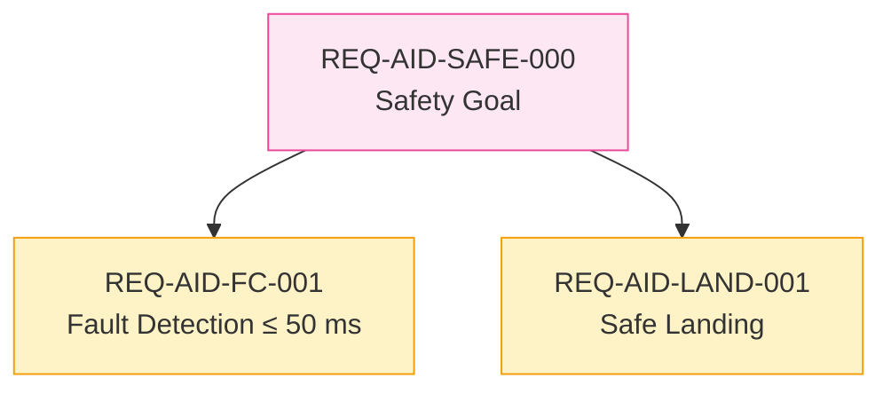

# LLM-Assisted Modeling

`GUIDE · LLM WORKFLOW`

Syscribe is designed to be written by an LLM and checked by the validator. The LLM handles the creative work of turning a description into a structured model; the validator is the ground truth on every rule. Neither alone is sufficient — but together they produce a correct, traceable model faster than either a human or a tool could alone.

This page explains the full workflow, from loading the prompt to generating diagrams.

---

## Getting the Prompt

The prompt is embedded directly in the validator binary. An LLM with shell access can load it without any additional setup:

```bash
syscribe --agent-instructions
```

This prints the complete generation prompt to stdout — all instructions, schemas, examples, and checklists. Pipe it wherever you need it:

```bash
# Into a file for editing before pasting
syscribe --agent-instructions > prompt.md

# Or read it directly into a Claude Code session
syscribe --agent-instructions | pbcopy
```

The prompt and the validator are always in sync: `--agent-instructions` is embedded at compile time from `prompts/create-model.md`.

---

## Two Modes

### Mode A — New Model

Use when creating a model from scratch. Fill in the context block at the top of the prompt:

```
Mode: NEW MODEL

System name:       Autonomous Inspection Drone
System short code: AID
Domain:            unmanned aerial vehicle for infrastructure inspection

Top-level stakeholder goals:
  - The UAV shall complete inspection missions without operator intervention
  - The UAV shall not cause injury to persons or property

Architecture elements:
  - FlightController (software)
  - GPSReceiver (hardware)
  - BatteryPack (hardware)
  - GroundControlStation (system)

Key interfaces:
  - Command uplink / telemetry downlink between FC and GCS
  - Power bus between battery and avionics

Safety concerns:
  - Battery depletion during flight
  - Loss of command link
```

### Mode B — Change Request

Use when the model already exists and you need to add, modify, or deprecate elements. Provide the existing IDs so the LLM cannot accidentally create duplicates:

```
Mode: CHANGE REQUEST

Change request title: Add redundant IMU requirement

Change description:
  A second IMU is being added for redundancy. We need a new hardware
  requirement covering dual-IMU cross-checking and a HIL test case.

Change type:
  [x] New derived requirement(s) under an existing parent

Existing Requirement IDs in use:
  REQ-AID-SAFE-000, REQ-AID-FC-001, REQ-AID-SAFE-001

Existing ADR IDs in use:
  ADR-AID-SAFE-001, ADR-AID-PERF-001

Existing TestCase IDs in use:
  TC-AID-FC-001, TC-AID-SAFE-001

Elements affected by this change:
  - Requirements::FaultTolerantFCReq  (REQ-AID-FC-001, approved, reqDomain: software)
  - AID::Avionics::FlightController   (domain: software, satisfies: [REQ-AID-FC-001])
```

Get the existing IDs from the validator output:

```bash
syscribe model/ 2>/dev/null | grep -E 'REQ-|TC-|ADR-'
```

---

## Incremental Validation Workflow

The prompt instructs the LLM to **validate after every batch of files**, not at the end. The LLM runs the CLI itself, reads the output, fixes errors in the same response, and only moves to the next batch when the current one is clean.

### The eight batches

| Batch | Contents | Errors to watch |
|---|---|---|
| 1 — Skeleton | All `_index.md` package files | None expected |
| 2 — Architecture elements | PartDef, ItemDef, PortDef, InterfaceDef, ActionDef, Part, Port | E303 (`domain` invalid), E315 (cross-domain supertype) |
| 3 — ADRs | All `ADR` elements — must exist before Requirements cite them | E300 (bad ID pattern), E301 (missing fields), E304 (bad status) |
| 4 — Requirements | Parent Requirements first, then children | E310 (missing `breakdownAdr`), E311 (unresolved `breakdownAdr`), E103 (bad `derivedFrom`) |
| 5 — TestCases | One per leaf Requirement | E011 (no gherkin), E013 (empty `verifies`), E102 (unresolved `verifies`) |
| 6 — Satisfaction links | Add `satisfies:` to architecture elements | E312 (parent in satisfies), E313 (domain mismatch) |
| 7 — Allocations | `Allocation` elements for cross-domain binding | E502/E503 (unresolved from/to) |
| 8 — Diagrams | `Diagram` elements — after all model elements exist | E400 (no mermaid block), W402 (unresolved shape ref), W403 (bad edge endpoint) |

### What this looks like in practice

The LLM writes a batch, runs the validator, and shows the result inline before continuing:

```
Writing Batch 3 — ADRs...

[new: model/Decisions/SafetyDecompADR.md]
---
type: ADR
id: ADR-AID-SAFE-001
name: "Decompose safety goal into fault-detection and safe-landing sub-requirements"
status: accepted
---
...

Running: syscribe model/

## 2. Validation Findings
> All validation rules pass — 0 errors, 0 warnings.

✓ 0 errors — continuing to Batch 4.
```

If there are errors, the LLM fixes them in the same response before declaring the batch done.

### Target state

```
0 errors
≤ 2 warnings (W404 for ScalarValues::* standard-library types — expected)
```

---

## Diagram Generation

The prompt includes full diagram instructions. The LLM generates two kinds of diagrams, both embedded directly in the `.md` file body.

### Mermaid (preferred for traceability and flow)

Use `diagramKind: Mermaid` and embed a fenced mermaid block. No SVG authoring required. Best for: requirement derivation trees, architecture overviews, sequence interactions, state machine summaries.

```yaml
---
type: Diagram
name: RequirementTrace
diagramKind: Mermaid
subject: Requirements
---

Requirement derivation showing how stakeholder goals break into leaf requirements.


```

### Embedded SVG (preferred for BDD, IBD, StateMachine, Requirement)

Use `svgMode: inline` and embed a fenced `svg` block. The `shapes:` and `edges:` frontmatter document the diagram for traceability; the SVG is what the browser renders. The browser loads a shared symbol library (`_diagram-symbols.svg`) so the LLM can reference standard SysML symbols by id.

```yaml
---
type: Diagram
name: SystemBDD
diagramKind: BDD
svgMode: inline
subject: AID::AIDSystem
shapes:
  s-root: {ref: "AID::AIDSystem", kind: PartDef}
  s-fc:   {ref: "AID::Software::FlightController", kind: PartDef}
edges:
  e-comp: {source: s-root, target: s-fc, kind: composition}
---

Block Definition Diagram: top-level decomposition of AIDSystem.

```svg
<svg xmlns="http://www.w3.org/2000/svg" xmlns:sysml="urn:Syscribe:1.0"
     width="400" height="220" viewBox="0 0 400 220">

  <g id="s-root" sysml:ref="AID::AIDSystem" transform="translate(120,20)">
    <use href="#sym-PartDef" width="160" height="56"/>
    <text class="stereotype" x="80" y="14" text-anchor="middle">«part def»</text>
    <text class="label"      x="80" y="38" text-anchor="middle">AIDSystem</text>
  </g>

  <g id="s-fc" sysml:ref="AID::Software::FlightController" transform="translate(120,140)">
    <use href="#sym-PartDef" width="160" height="56"/>
    <text class="stereotype" x="80" y="14" text-anchor="middle">«part def»</text>
    <text class="label"      x="80" y="38" text-anchor="middle">FlightController</text>
  </g>

  <line x1="200" y1="76" x2="200" y2="140"
        stroke="#333" stroke-width="1.5"
        marker-start="url(#arrow-composition)"/>
</svg>
```
```

### Available SVG symbols

The symbol library provides standard SysML shapes the LLM can reference directly:

| Symbol | Use for |
|---|---|
| `#sym-PartDef` | PartDef and Part blocks |
| `#sym-requirement` | Native Requirement blocks |
| `#sym-testcase` | TestCase blocks |
| `#sym-state` | State nodes (rounded rect) |
| `#sym-initial` | Initial pseudostate (filled circle) |
| `#sym-final` | Final state (bullseye) |
| `#sym-boundary` | IBD system boundary frame |
| `#sym-port` | Port squares on block borders |
| `#sym-actor` | Actor (stick figure) |

Arrow markers: `#arrow-open` · `#arrow-filled` · `#arrow-inherit` · `#arrow-composition` · `#arrow-aggregation` · `#arrow-flow`

---

## Change Request Patterns

The prompt includes seven named patterns. Specify which one applies and the LLM knows exactly which files to create, update, and deprecate — and what side-effects to check.

| Pattern | When to use |
|---|---|
| **A — New stakeholder goal** | A new top-level obligation (regulatory change, new stakeholder) |
| **B — Add derived requirements** | Split an existing parent into verifiable leaf requirements |
| **C — Decompose a leaf** | An existing leaf requirement must become a parent |
| **D — Status progression** | Advance a requirement: `draft → review → approved → implemented → verified` |
| **E — Replace a requirement** | Scope or text changes significantly; new ID, retire the old one |
| **F — Supersede an ADR** | A prior architectural decision is reversed or refined |
| **G — Add an architecture element** | A new hardware or software element satisfies existing requirements |

Pattern C (decompose a leaf) is the most impactful — it cascades to `satisfies:` lists, TestCase `verifies:` entries, and possibly the old TestCase status. The prompt walks through every step automatically.

---

## Tips for Better Results

**Use an LLM with tool access.** Claude Code can run the validator directly between batches, read the output, and fix errors in the same turn — no manual copy-paste. The prompt is written for this mode.

**Give concrete IDs.** List every existing `REQ-*`, `TC-*`, and `ADR-*` ID in the Mode B context block. The LLM cannot discover them otherwise and will invent IDs that collide (error E101).

**Paste the full error line.** The validator format is `Code | File | Message`. The code tells the LLM which rule; the message tells it which element. Both matter.

**Ask for one pattern at a time.** A change request mixing Pattern B and Pattern G works, but separating them produces easier-to-review output.

**Check links manually.** The validator catches every broken cross-reference, but a logically wrong link — a `satisfies:` pointing to the wrong requirement — is not a validator error. Those are your responsibility to review.

**Diagrams go in Batch 8.** Shapes and edges reference model elements, so diagrams must be written after all elements exist. The LLM knows this from the prompt; if you ask for a diagram earlier, remind it to defer.
