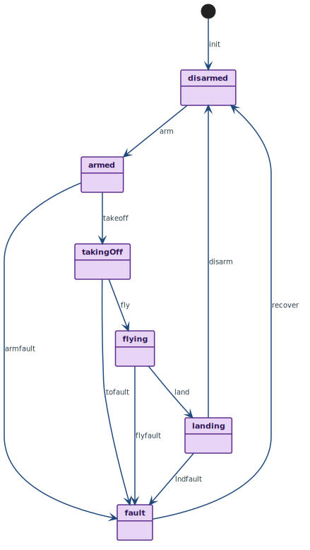

State machine diagram for the UAV flight states lifecycle, showing normal operational transitions from disarmed through takeoff, flight, and landing, as well as fault transitions from any active state and recovery back to disarmed.
