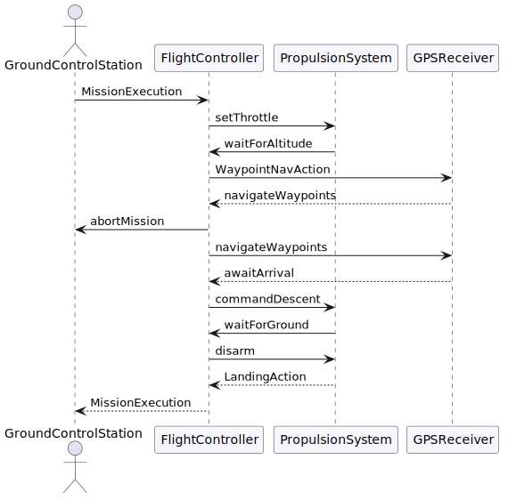

Sequence diagram for `MissionExecution`. Shows the message flow between the ground station, flight controller, propulsion system, and GPS receiver across the three sub-actions:

- **TakeoffAction** — FC commands initial throttle; loop monitors altitude telemetry until target altitude is reached.
- **Weather check** — `alt` fragment: if wind > 12 m/s the FC sends `abortMission` to GCS; else waypoint navigation begins.
- **WaypointNavAction** — loop requests GPS fixes and advances through each waypoint.
- **LandingAction** — FC commands descent; loop monitors altitude until touchdown; motors disarmed; `missionComplete` returned to GCS.
