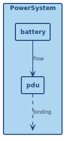

Internal Block Diagram for `PowerSystem`. Shows `battery : BatteryPack` supplying DC power to `pdu : PowerDistributionUnit` via a `PowerConnectionDef` flow, with the PDU's output port bound to the system-level `mainPowerOut` port presented at the boundary.
