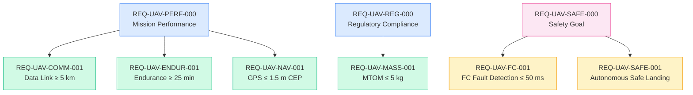

Requirement derivation tree showing how the three stakeholder goals decompose into six leaf requirements.

```mermaid
graph TD
  PERF["REQ-UAV-PERF-000<br/>Mission Performance"]
  REG["REQ-UAV-REG-000<br/>Regulatory Compliance"]
  SAFE["REQ-UAV-SAFE-000<br/>Safety Goal"]

  COMM["REQ-UAV-COMM-001<br/>Data Link ≥ 5 km"]
  ENDUR["REQ-UAV-ENDUR-001<br/>Endurance ≥ 25 min"]
  NAV["REQ-UAV-NAV-001<br/>GPS ≤ 1.5 m CEP"]
  MASS["REQ-UAV-MASS-001<br/>MTOM ≤ 5 kg"]
  FC["REQ-UAV-FC-001<br/>FC Fault Detection ≤ 50 ms"]
  SAFE001["REQ-UAV-SAFE-001<br/>Autonomous Safe Landing"]

  PERF --> COMM
  PERF --> ENDUR
  PERF --> NAV
  REG --> MASS
  SAFE --> FC
  SAFE --> SAFE001

  style PERF fill:#dbeafe,stroke:#3b82f6
  style REG fill:#dbeafe,stroke:#3b82f6
  style SAFE fill:#fce7f3,stroke:#ec4899
  style COMM fill:#d1fae5,stroke:#10b981
  style ENDUR fill:#d1fae5,stroke:#10b981
  style NAV fill:#d1fae5,stroke:#10b981
  style MASS fill:#d1fae5,stroke:#10b981
  style FC fill:#fef3c7,stroke:#f59e0b
  style SAFE001 fill:#fef3c7,stroke:#f59e0b
```
