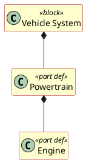

For `diagramKind: BDD`, the generator shall emit a PlantUML `@startuml` class diagram.
Each shape with `kind: PartDef` becomes `class "Name" <<part def>>`, `kind: Part` becomes
`class "Name" <<part>>`. Other kinds fall back to `class "Name" <<kind>>`. Edge kinds:
`composition` → `*--`, `usage` → `..>`, `generalization`/`specialization` → `<|--`,
unknown → `-->`. The diagram is wrapped with `hide empty members` and a `skinparam` block
for consistent styling.

## Example output

## Node alias derivation

The PlantUML node alias is the shape key from the `shapes:` map, sanitised for PlantUML
compatibility as described in REQ-TRS-PUML-026.
