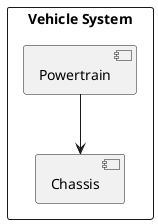

For `diagramKind: IBD`, the generator shall emit a PlantUML component diagram. Shapes
with `kind: boundary` become `rectangle "Name" as id`. Shapes with `kind: block` become
`component "Name" as id`, nested inside their parent boundary where a `parent:` key is
present. Shapes with `kind: port` are not emitted as explicit nodes; instead, edges whose
source or target is a port shape are resolved to the port's parent block, and the
connection is emitted between blocks. Edge kinds: `flow` → `-->`, `binding` → `..>`.

## Port resolution

When an edge references a shape whose `kind` is `port`, the generator shall walk the
`parent:` chain of that shape to find the nearest ancestor with `kind: block` or
`kind: boundary`, and use that ancestor as the endpoint for the emitted edge. If no such
ancestor is found, the port shape key is used directly.

## Example output

