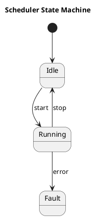

For `diagramKind: StateMachine`, the generator shall emit a PlantUML `@startuml` state
diagram. Shapes with `kind: initial` are not emitted as named states; instead, any
`transition` edge whose source is the initial shape is emitted as `[*] --> target_id`.
Shapes with `kind: state` are emitted as `state "Name" as id`. All other `transition`
edges are emitted as `source_id --> target_id`. The diagram title is set to the element's
`name`.

## Transition labels

When a `transition` edge carries a non-empty `label` field, the emitted line shall include
it as a guard/trigger annotation:

```
source_id --> target_id : label
```

When no `label` is present the annotation is omitted.

## Example output


