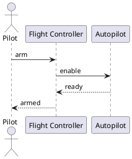

For `diagramKind: Sequence`, the generator shall emit a PlantUML `@startuml` sequence
diagram. Shapes with `kind: actor` become `actor "Name" as id`. Shapes with
`kind: lifeline` become `participant "Name" as id`. Shapes with `kind: activation` or
`kind: fragment` are skipped (not representable in PlantUML without explicit ordering
metadata). Edges are emitted in YAML key-insertion order (preserved by the parser). Edge
kinds: `message` → `id1 -> id2 : label`, `return` → `id1 --> id2 : label`. The label
is the short name (last `::` segment) of the edge's `ref` qualified name.

## Ordering guarantee

PlantUML sequence diagrams are order-sensitive: the sequence of edge emissions determines
the visual sequence. The generator relies on the YAML key-insertion order of the `edges:`
map as the authoritative ordering. Authors are responsible for ordering edges in their
`Diagram` element to match the intended message sequence.

## Example output

