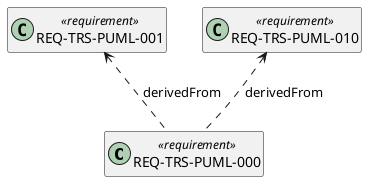

For `diagramKind: Requirement`, the generator shall emit a PlantUML class diagram. Shapes
with `kind: Requirement` become `class "Name" <<requirement>>`, shapes with
`kind: RequirementDef` become `class "Name" <<requirement def>>`. Edge kinds:
`derivedFrom` → `src <.. tgt : derivedFrom`, `verifies` → `src <.. tgt : verifies`,
`allocatedTo` → `src ..> tgt : allocated to`. Unknown edge kinds fall back to `-->`.

## Text attribute

When a shape carries a `text:` field (the requirement's short normative statement), the
generator shall emit it as a class attribute:

```plantuml
class "REQ-TRS-PUML-001" <<requirement>> {
  pumlMode and pumlFile fields on Diagram elements
}
```

When no `text:` field is present, `hide empty members` is effective and the class body
is suppressed.

## Example output


