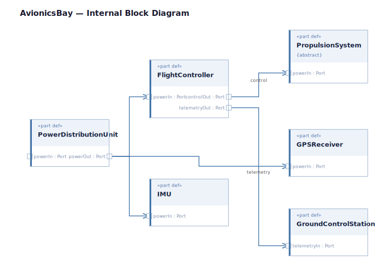

Internal block diagram of the avionics bay, showing how power flows from the PowerDistributionUnit to all onboard subsystems and how the FlightController exchanges control and telemetry signals with external elements.

The PowerDistributionUnit fans power out to the FlightController, IMU, and GPSReceiver via their `powerIn` ports. The FlightController drives the PropulsionSystem via its `controlOut` port and streams telemetry to the GroundControlStation via `telemetryOut`.
