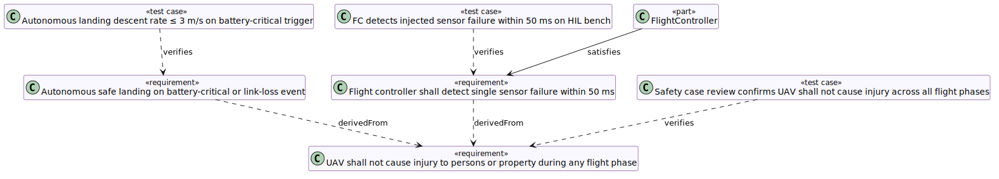

Requirement tree rooted at REQ-UAV-SAFE-000, the top-level safety goal for the UAV. The two derived requirements (REQ-UAV-FC-001, REQ-UAV-SAFE-001) are shown with their test cases and the satisfying FlightController architecture element.

`«derive»` edges connect each child requirement upward to its parent. `«verify»` edges connect each TestCase to the requirement it covers. The `«satisfy»` edge shows that FlightController is the architectural element responsible for the fault-tolerance and safe-landing requirements.
