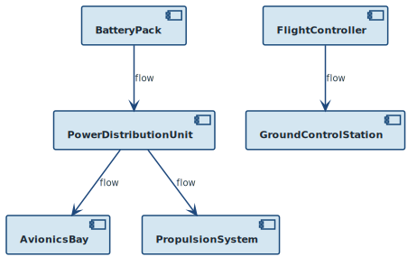

Power and data flow across the UAV's main subsystems. The battery pack supplies the power distribution unit, which fans out to the avionics bay and propulsion system. The avionics bay streams telemetry to the ground control station via the UAV's outbound telemetry port.

The two leaf requirements shown — endurance (REQ-UAV-ENDUR-001) and data link range (REQ-UAV-COMM-001) — are satisfied by BatteryPack and AvionicsBay respectively.
