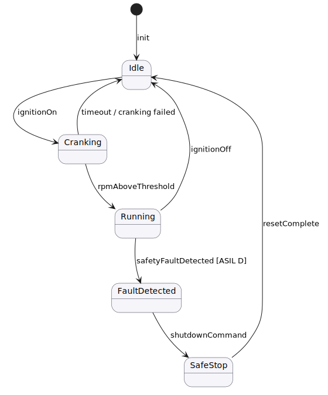

Operational states of the Engine Control Software.  The safety monitor triggers
the `FaultDetected` transition from `Running` under any ASIL-D fault; the
`SafeStop` state ensures actuators reach a known-safe position before returning
to `Idle`.
