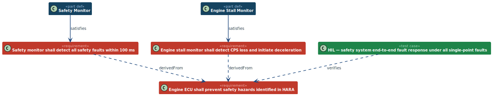

Traceability from the top-level engine safety requirement `REQ-ENG-SAFE-000` down
to derived requirements and up to verification.  `SafetyMonitor` (ASIL D) satisfies
the 100 ms fault-detection requirement; `EngineStallMonitor` (ASIL B) satisfies
the stall-detection requirement.  `TC-ENG-SAFE-001` (HIL, L5) covers the parent
end-to-end.
