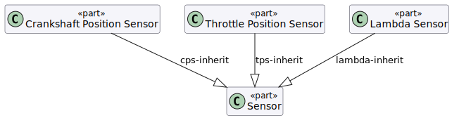

Sensor specialisation hierarchy. All three concrete sensor types specialise the
abstract `Sensor` base PartDef, inheriting its `signalOutputType` and operating
temperature range features.

```svg
<svg xmlns="http://www.w3.org/2000/svg"
     xmlns:sysml="urn:sysml-md:1.0"
     viewBox="0 0 560 260">

  <!-- Abstract Sensor block -->
  <rect id="sensor-block" x="200" y="20" width="160" height="60"
        rx="3" fill="#e8eef8" stroke="#4a6fa5" stroke-width="2"
        class="PartDef abstract"
        sysml:ref="System::Sensors::Sensor"/>
  <text x="280" y="44" text-anchor="middle" font-size="10" fill="#4a6fa5" font-style="italic">«abstract»</text>
  <text x="280" y="62" text-anchor="middle" font-size="13" font-weight="bold" fill="#222">Sensor</text>

  <!-- CrankshaftPositionSensor block -->
  <rect id="cps-block" x="15" y="170" width="155" height="56"
        rx="3" fill="#f5f5f5" stroke="#666" stroke-width="1.5"
        class="PartDef"
        sysml:ref="System::Sensors::CrankshaftPositionSensor"/>
  <text x="92" y="192" text-anchor="middle" font-size="10" fill="#555">CrankshaftPosition</text>
  <text x="92" y="208" text-anchor="middle" font-size="10" fill="#555">Sensor</text>

  <!-- ThrottlePositionSensor block -->
  <rect id="tps-block" x="202" y="170" width="155" height="56"
        rx="3" fill="#f5f5f5" stroke="#666" stroke-width="1.5"
        class="PartDef"
        sysml:ref="System::Sensors::ThrottlePositionSensor"/>
  <text x="279" y="192" text-anchor="middle" font-size="10" fill="#555">ThrottlePosition</text>
  <text x="279" y="208" text-anchor="middle" font-size="10" fill="#555">Sensor</text>

  <!-- LambdaSensor block -->
  <rect id="lambda-block" x="390" y="170" width="155" height="56"
        rx="3" fill="#f5f5f5" stroke="#666" stroke-width="1.5"
        class="PartDef"
        sysml:ref="System::Sensors::LambdaSensor"/>
  <text x="467" y="196" text-anchor="middle" font-size="10" fill="#555">Lambda Sensor</text>

  <!-- Inheritance edges with inline open-triangle arrowheads at parent end -->
  <!-- CPS → Sensor -->
  <line id="cps-inherit" x1="92" y1="170" x2="247" y2="80"
        stroke="#4a6fa5" stroke-width="1.5"
        class="connection inheritance"
        sysml:ref="System::Sensors::CrankshaftPositionSensor"
        sysml:source="cps-block" sysml:target="sensor-block"/>
  <polygon points="247,80 239,88 255,88" fill="none" stroke="#4a6fa5" stroke-width="1.5"/>

  <!-- TPS → Sensor -->
  <line id="tps-inherit" x1="279" y1="170" x2="279" y2="80"
        stroke="#4a6fa5" stroke-width="1.5"
        class="connection inheritance"
        sysml:ref="System::Sensors::ThrottlePositionSensor"
        sysml:source="tps-block" sysml:target="sensor-block"/>
  <polygon points="279,80 271,90 287,90" fill="none" stroke="#4a6fa5" stroke-width="1.5"/>

  <!-- Lambda → Sensor -->
  <line id="lambda-inherit" x1="467" y1="170" x2="313" y2="80"
        stroke="#4a6fa5" stroke-width="1.5"
        class="connection inheritance"
        sysml:ref="System::Sensors::LambdaSensor"
        sysml:source="lambda-block" sysml:target="sensor-block"/>
  <polygon points="313,80 321,88 307,90" fill="none" stroke="#4a6fa5" stroke-width="1.5"/>
</svg>
```

