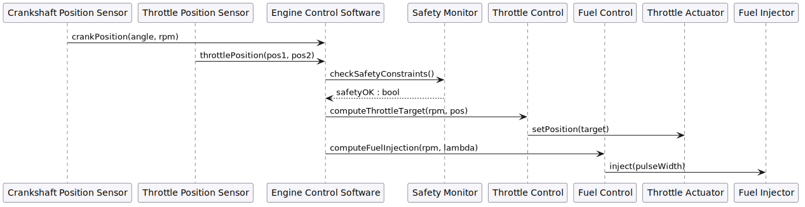

10 ms control loop: crankshaft and throttle sensor readings arrive at the Engine
Control Software, the Safety Monitor validates constraints, and the Throttle and
Fuel Control sub-modules output commands to the actuators.
