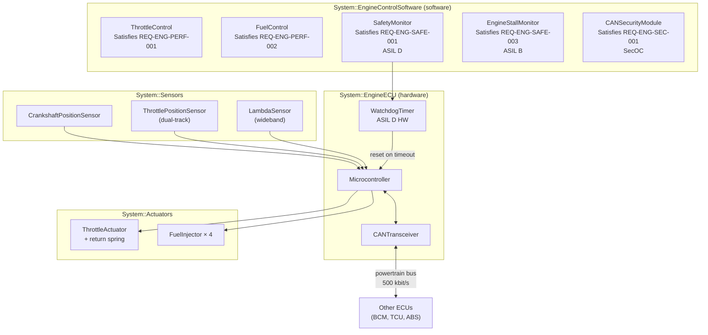

High-level block diagram of the Engine ECU system showing the main components
and their relationships.

```mermaid
%% ref: System::EngineECU
%% ref: System::EngineControlSoftware
%% ref: System::Software::SafetyMonitor
%% ref: System::Software::ThrottleControl
%% ref: System::Software::FuelControl
%% ref: System::Hardware::WatchdogTimer
graph TD
    subgraph HW["System::EngineECU (hardware)"]
        WDT["WatchdogTimer\nASIL D HW"]
        CAN_PHY["CANTransceiver"]
        MCU["Microcontroller"]
    end

    subgraph SW["System::EngineControlSoftware (software)"]
        TC["ThrottleControl\nSatisfies REQ-ENG-PERF-001"]
        FC["FuelControl\nSatisfies REQ-ENG-PERF-002"]
        SM["SafetyMonitor\nSatisfies REQ-ENG-SAFE-001\nASIL D"]
        ESM["EngineStallMonitor\nSatisfies REQ-ENG-SAFE-003\nASIL B"]
        CSM["CANSecurityModule\nSatisfies REQ-ENG-SEC-001\nSecOC"]
    end

    subgraph Sensors["System::Sensors"]
        CPS["CrankshaftPositionSensor"]
        TPS["ThrottlePositionSensor\n(dual-track)"]
        LSensor["LambdaSensor\n(wideband)"]
    end

    subgraph Actuators["System::Actuators"]
        TA["ThrottleActuator\n+ return spring"]
        FI["FuelInjector × 4"]
    end

    CPS --> MCU
    TPS --> MCU
    LSensor --> MCU
    MCU --> TA
    MCU --> FI
    MCU <--> CAN_PHY
    SM --> WDT
    WDT -->|"reset on timeout"| MCU

    CAN_PHY <-->|"powertrain bus\n500 kbit/s"| ExternalECUs["Other ECUs\n(BCM, TCU, ABS)"]
```
