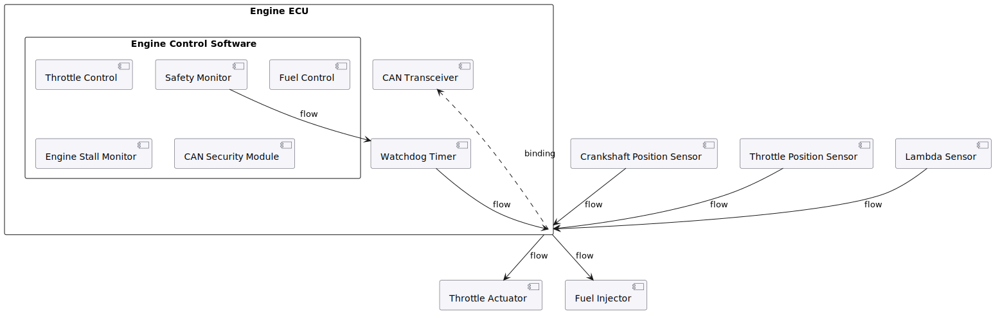

High-level block diagram of the Engine ECU system showing the main components
and their relationships. The ECU integrates hardware (Watchdog Timer, CAN
Transceiver) and software (Safety Monitor, Throttle/Fuel Control, CAN Security)
with three sensor inputs and two actuator outputs.
