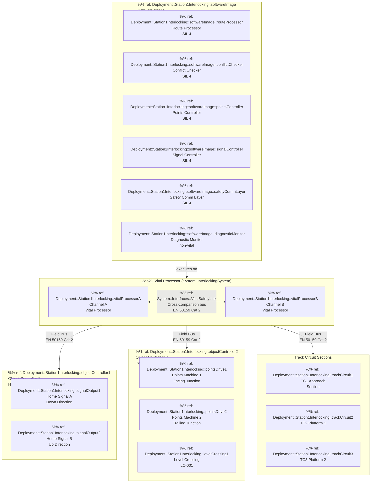

Mermaid block diagram showing the Station 1 CBI architecture: the 2oo2D vital processor pair, Object Controllers, field equipment, and level crossing.

```mermaid
%% ref: System::InterlockingSystem
%% ref: Deployment::Station1Interlocking
%% ref: System::Software::VitalSoftwareBase
graph TD
    subgraph VP["2oo2D Vital Processor (System::InterlockingSystem)"]
        VPA["%% ref: Deployment::Station1Interlocking::vitalProcessorA\nChannel A\nVital Processor"]
        VPB["%% ref: Deployment::Station1Interlocking::vitalProcessorB\nChannel B\nVital Processor"]
        VPA <-->|"%% ref: System::Interfaces::VitalSafetyLink\nCross-comparison bus\nEN 50159 Cat 2"| VPB
    end

    subgraph SW["%% ref: Deployment::Station1Interlocking::softwareImage\nSoftware Image"]
        RP["%% ref: Deployment::Station1Interlocking::softwareImage::routeProcessor\nRoute Processor\nSIL 4"]
        CC["%% ref: Deployment::Station1Interlocking::softwareImage::conflictChecker\nConflict Checker\nSIL 4"]
        PC["%% ref: Deployment::Station1Interlocking::softwareImage::pointsController\nPoints Controller\nSIL 4"]
        SC["%% ref: Deployment::Station1Interlocking::softwareImage::signalController\nSignal Controller\nSIL 4"]
        SCL["%% ref: Deployment::Station1Interlocking::softwareImage::safetyCommLayer\nSafety Comm Layer\nSIL 4"]
        DM["%% ref: Deployment::Station1Interlocking::softwareImage::diagnosticMonitor\nDiagnostic Monitor\nnon-vital"]
    end

    subgraph OC1["%% ref: Deployment::Station1Interlocking::objectController1\nObject Controller 1\nHome Signals"]
        SIG1["%% ref: Deployment::Station1Interlocking::signalOutput1\nHome Signal A\nDown Direction"]
        SIG2["%% ref: Deployment::Station1Interlocking::signalOutput2\nHome Signal B\nUp Direction"]
    end

    subgraph OC2["%% ref: Deployment::Station1Interlocking::objectController2\nObject Controller 2\nPoints and LX"]
        PT1["%% ref: Deployment::Station1Interlocking::pointsDrive1\nPoints Machine 1\nFacing Junction"]
        PT2["%% ref: Deployment::Station1Interlocking::pointsDrive2\nPoints Machine 2\nTrailing Junction"]
        LX1["%% ref: Deployment::Station1Interlocking::levelCrossing1\nLevel Crossing\nLC-001"]
    end

    subgraph TC["Track Circuit Sections"]
        TC1["%% ref: Deployment::Station1Interlocking::trackCircuit1\nTC1 Approach\nSection"]
        TC2["%% ref: Deployment::Station1Interlocking::trackCircuit2\nTC2 Platform 1"]
        TC3["%% ref: Deployment::Station1Interlocking::trackCircuit3\nTC3 Platform 2"]
    end

    VP -->|"Field Bus\nEN 50159 Cat 2"| OC1
    VP -->|"Field Bus\nEN 50159 Cat 2"| OC2
    VP -->|"Field Bus\nEN 50159 Cat 2"| TC
    SW -.->|"executes on"| VP
```
