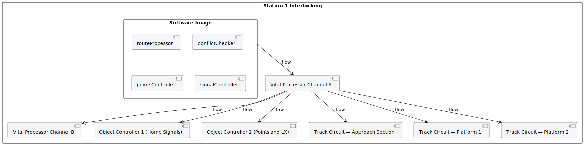

Station 1 CBI architecture: the 2oo2D vital processor pair, Software Image
(Route Processor, Conflict Checker, Points Controller, Signal Controller),
Object Controllers for home signals and points/level crossing, and Track
Circuit sections. Field Bus connections run EN 50159 Cat 2.
