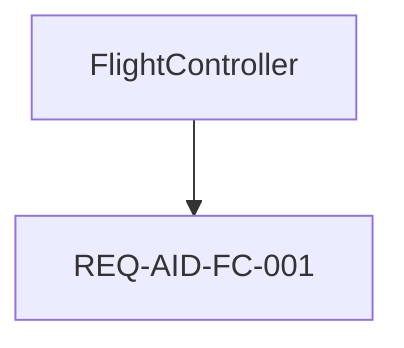

# Syscribe Model Generation Prompt

Copy everything from the horizontal rule below into your LLM session. Fill in the context block at the top for your chosen mode.

---

## How to Use This Prompt

This prompt supports two modes. Choose one and fill in the corresponding context block.

**Mode A — New model:** you are creating a model from scratch.
**Mode B — Change request:** you are adding requirements or making changes to an existing model.

---

## Mode A — New Model Context

*Fill in if creating a new model. Delete this block if using Mode B.*

```
Mode: NEW MODEL

System name:       [e.g. "Autonomous Inspection Drone"]
System short code: [e.g. "AID" — 2–6 uppercase letters, used in IDs]
Domain:            [e.g. "unmanned aerial vehicle for infrastructure inspection"]

Top-level stakeholder goals (3–5 bullet points):
  - ...

Architecture elements (hardware and software parts):
  - ...

Key interfaces between elements:
  - ...

Safety concerns (if any):
  - ...
```

---

## Mode B — Change Request Context

*Fill in if modifying an existing model. Delete this block if using Mode A.*

```
Mode: CHANGE REQUEST

Change request title: [e.g. "Add redundant IMU requirement"]
Change description:   [What is changing and why — be specific]

Change type (pick all that apply):
  [ ] New stakeholder goal (new parent requirement, no derivedFrom)
  [ ] New derived requirement(s) under an existing parent
  [ ] Decompose an existing leaf requirement into sub-requirements
  [ ] Status update on existing requirement(s) (e.g. approved → implemented)
  [ ] Replace / supersede a requirement with a revised one
  [ ] New architecture element satisfying an existing requirement
  [ ] New interface or operation on an existing PortDef/InterfaceDef
  [ ] Supersede an existing ADR with a revised decision
  [ ] Other: ...

Elements affected by this change (qualified names):
  - Requirements::SomeReq          (status: approved, reqDomain: software)
  - Decisions::SomeADR             (status: accepted)
  - AID::Avionics::FlightController (domain: software, satisfies: [REQ-XXX-001])
  - ...

Elements that must NOT change:
  - ...
```

---

## CLI Tools

Use these commands throughout the workflow. Run them in the project root.

**Discovery and navigation:**

| Command | Purpose |
|---|---|
| `syscribe model/ show <qname\|id>` | Show element details and all fields |
| `syscribe model/ ls [qname]` | List namespace children (default: root) |
| `syscribe model/ tree [qname]` | Recursive namespace tree |
| `syscribe model/ find <pattern>` | Fuzzy search by name / ID / content |
| `syscribe model/ list <type> [scope]` | List all elements of a given type, optionally scoped |
| `syscribe model/ types` | All element types present in the model with counts |
| `syscribe model/ untyped` | List elements with no `type:` field set |
| `syscribe model/ links <qname\|id>` | All outbound and inbound relationships |
| `syscribe model/ refs <qname\|id>` | What elements reference this element |

**Traceability:**

| Command | Purpose |
|---|---|
| `syscribe model/ trace <qname\|req-id>` | Full traceability slice for a requirement |
| `syscribe model/ why <qname>` | What requirements this element satisfies |
| `syscribe model/ who-verifies <req-id>` | Which test cases cover a requirement |

**Authoring helpers:**

| Command | Purpose |
|---|---|
| `syscribe model/ validate` | Validation findings only — errors and warnings |
| `syscribe model/ validate --json` | Same, machine-readable JSON |
| `syscribe model/ validate --file <path>` | Findings for a single file only |
| `syscribe model/ template <type>` | Print a ready-to-fill frontmatter skeleton |
| `syscribe model/ next-id <prefix>` | Print the next available stable ID (e.g. `REQ-AID-FC-002`) |
| `syscribe model/ check-ref <qname\|id>` | Verify a cross-reference resolves before writing it |
| `syscribe model/ path-for <qname\|id>` | Print the file path for an element |

**Before writing a new element:**
1. `template <type>` — get the frontmatter skeleton
2. `next-id <prefix>` — get the next non-colliding ID (for Requirement / TestCase / ADR)
3. `check-ref <qname>` — verify every cross-reference resolves before committing it to a file

---

## Validation Workflow

**Validate as you work.** Do not output all files at once and validate at the end. Write a batch, validate, fix errors, then continue.

### The validator command

```bash
syscribe model/ validate
```

- **Errors** (`E___`) block a correct model. Fix every error before continuing.
- **Warnings** (`W___`) are advisory. Aim to fix them, but they do not block progress.

The target is **0 errors**. Two W404 warnings for `ScalarValues::*` types are expected and acceptable.

For single-file feedback during iterative authoring:

```bash
syscribe model/ validate --file model/Requirements/MyNewReq.md
```

For structured output (useful when parsing findings programmatically):

```bash
syscribe model/ validate --json
```

### Validation batches

Work in this order, validating after each batch:

**Batch 1 — Skeleton**
Write all `_index.md` package files. Validate. There should be 0 errors.

**Batch 2 — Architecture elements**
Write PartDef / ItemDef / PortDef / InterfaceDef / ActionDef elements, then Part / Port / Connection instances. Validate and fix before continuing.

**Batch 3 — ADRs**
Write all `ADR` elements first — they must exist before any Requirement cites them in `breakdownAdr:`. Validate: 0 errors expected.

**Batch 4 — Requirements**
Write parent `Requirement` elements (no `derivedFrom`) first, then child Requirements. Validate and fix any E310 (missing `breakdownAdr:`), E311 (unresolved `breakdownAdr:`), E103 (unresolved `derivedFrom:`).

**Batch 5 — TestCases**
Write one `TestCase` per leaf Requirement. Validate and fix any E011 (missing gherkin), E013 (missing `verifies:`), E102 (unresolved `verifies:`).

**Batch 6 — Satisfaction links**
Add `satisfies:` to architecture elements. Validate and fix any E312 (parent in satisfies), E313 (domain mismatch).

**Batch 7 — Allocations** (if needed)
Write `Allocation` elements. Validate: fix E502/E503 (unresolved `allocatedFrom`/`allocatedTo`).

**Batch 8 — Diagrams**
Write `Diagram` elements after all model elements are in place. For Mermaid or embedded SVG diagrams, write the `.md` file directly. For `svgMode: companion` diagrams, use the 4-step CLI workflow: `diagram list` → `diagram measure` → author `*.layout.json` → `diagram compose --output <path>`, then commit both the `.md` and the generated `.svg`. Validate: fix E400, W402, W403, W408, W409.

After all batches pass with 0 errors, review warnings and fix any that indicate genuine gaps (W300 — leaf requirement has no satisfying element; W002 — approved requirement has no active TestCase).

### Fixing errors

When the validator reports errors, fix them before writing new files. Paste the error table as a checklist:

```
Errors to fix:
[ ] E310  model/Requirements/FaultDetectionReq.md  — add breakdownAdr:
[ ] E102  model/Verification/FCTest.md             — verifies: REQ-AID-FC-999 does not resolve
```

Check off each one, then re-run `validate` to confirm 0 errors before proceeding.

---

## Output Format

When you write a file, show its full content in a fenced block labelled with the file path and action keyword:

````
```new: model/Requirements/MyNewReq.md
---
type: Requirement
...
---

Body text.
```

```update: model/AID/Avionics/FlightController.md
---
type: PartDef
...
satisfies:
  - REQ-AID-FC-001
  - REQ-AID-FC-002    ← added
---

Updated body.
```

```deprecate: model/Decisions/OldADR.md
Change status: accepted → superseded
Add field:     supersededBy: Decisions::NewADR
No other changes.
```
````

**Action semantics:**

| Action | Meaning |
|---|---|
| `new:` | Create this file; it does not exist yet |
| `update:` | Replace the entire file; show the complete new content |
| `deprecate:` | Describe field changes only — do not rewrite the whole file |

After each batch of files, show the validator command and its output before continuing:

```
Running: syscribe model/ validate

[paste output here]

✓ 0 errors — continuing to next batch.
```

---

## Part 1 — Directory and Namespace Conventions

The model root is `model/`. Every directory corresponds to a package. The file path encodes the qualified name.

```
model/
  _index.md                    ← root package, type: Package
  <System>/
    _index.md                  ← type: Package
    <PartDef>.md
    Avionics/
      _index.md
      FlightController.md
  Requirements/
    _index.md
    <ParentReq>.md
    <ChildReq>.md
  Decisions/
    _index.md
    <ADR>.md
  Verification/
    _index.md
    <TestCase>.md
  Interfaces/
    _index.md
    <PortDef>.md
  Allocations/
    _index.md
    <Allocation>.md
```

**Qualified name rule:** a file at `model/Foo/Bar/Baz.md` has qualified name `Foo::Bar::Baz`. Use `::` as the separator in all cross-references.

**Package index:** every directory must contain `_index.md`:

```yaml
---
type: Package
name: <DirectoryName>
---

One-line description of this package.
```

---

## Part 2 — Element Types Quick Reference

| File `type:` | SysML concept | Typical location |
|---|---|---|
| `Package` | `package` | `_index.md` in any directory |
| `PartDef` | `part def` | `<System>/` or sub-package |
| `Part` | `part` (usage) | inside a `PartDef`'s directory |
| `ItemDef` | `item def` | `Items/` |
| `Item` | `item` | inside owning element |
| `PortDef` | `port def` | `Interfaces/` |
| `Port` | `port` | inside a `PartDef` |
| `InterfaceDef` | `interface def` | `Interfaces/` |
| `ConnectionDef` | `connection def` | `Interfaces/` |
| `Connection` | `connection` | inside a `PartDef` |
| `ActionDef` | `action def` | `Behavior/` |
| `Action` | `action` | inside an `ActionDef` |
| `Requirement` | native requirement | `Requirements/` |
| `RequirementDef` | `requirement def` | `Requirements/` |
| `TestCase` | native test case | `Verification/` |
| `ADR` | architecture decision | `Decisions/` |
| `Allocation` | `allocation` | `Allocations/` |
| `Diagram` | diagram | `Diagrams/` |

For a ready-to-fill frontmatter skeleton for any type, run:

```bash
syscribe model/ template <type>
```

---

## Part 3 — Common Frontmatter Fields

Key fields that apply to most element types:

| Field | Notes |
|---|---|
| `type` | Required — one of the types in Part 2 |
| `name` | Display name; defaults to filename stem if omitted |
| `supertype` | Specialisation link (`>` in SysML) |
| `typedBy` | Type of a usage element (port, part, action, etc.) |
| `isAbstract` | `true` for abstract definitions |
| `multiplicity` | Cardinality; default `"1"` |
| `domain` | `system` \| `hardware` \| `software` — required on Part/PartDef |
| `features` | Inline attributes or ports |
| `connections` | Port bindings (on Part files) |
| `satisfies` | List of `REQ-*` IDs this element satisfies |

### `domain:` field rules

- Set `domain:` on every `PartDef` and `Part` that represents a physical or software element.
- Values: `system` (top-level or cross-cutting), `hardware` (physical), `software` (firmware/SW).
- `supertype:` and `typedBy:` must not cross the `hardware`/`software` boundary (error E315). Use `Allocation` for cross-domain integration.

---

## Part 4 — Native Requirement (`type: Requirement`)

### Required fields

| Field | Rule |
|---|---|
| `id` | Must match `^REQ(-[A-Z0-9]{2,12})+-[0-9]{3}$` — e.g. `REQ-SYS-001`, `REQ-AID-FC-001` |
| `title` | Short human-readable description |
| `status` | One of: `draft` · `review` · `approved` · `implemented` · `verified` |

### Optional fields

| Field | Notes |
|---|---|
| `reqDomain` | `system` · `hardware` · `software` — required on leaf requirements |
| `silLevel` | Integer 1–4; must accompany `asilLevel` |
| `asilLevel` | `A` · `B` · `C` · `D`; must accompany `silLevel` |
| `derivedFrom` | List of parent Requirement `id`s — triggers §12 rules |
| `breakdownAdr` | Qualified name of an `accepted` ADR — **required whenever `derivedFrom` is set** (E310) |

### Normative body rules

- The Markdown body **before the first `##` heading** is the normative text.
- It must be **non-empty** (error E012) and contain the word **`shall`** (warning W001).

### Requirement hierarchy

```
REQ-SYS-000  (parent — stakeholder goal, no derivedFrom, no reqDomain needed)
  ├── REQ-HW-001   (leaf, derivedFrom: [REQ-SYS-000], breakdownAdr: Decisions::MyADR, reqDomain: hardware)
  └── REQ-SW-001   (leaf, derivedFrom: [REQ-SYS-000], breakdownAdr: Decisions::MyADR, reqDomain: software)
```

**Parent requirements** must **never** appear in any element's `satisfies:` list (error E312). Only leaf requirements may be satisfied.

**Getting the next ID:** `syscribe model/ next-id REQ-AID-FC` → prints e.g. `REQ-AID-FC-002`

**Template:** `syscribe model/ template Requirement`

---

## Part 5 — Architecture Decision Record (`type: ADR`)

### Required fields

| Field | Rule |
|---|---|
| `id` | Must match `^ADR(-[A-Z0-9]{2,12})+-[0-9]{3}$` |
| `title` | Short description of the decision |
| `status` | `proposed` · `accepted` · `deprecated` · `superseded` |

**ADR must be `accepted` before any Requirement can cite it in `breakdownAdr:`** (warning W303 if still `proposed`).

Body structure: `## Context`, `## Decision`, `## Consequences` (conventional — not validated beyond being non-empty).

**Getting the next ID:** `syscribe model/ next-id ADR-AID-SAFE`

**Template:** `syscribe model/ template ADR`

---

## Part 6 — Native TestCase (`type: TestCase`)

### Required fields

| Field | Rule |
|---|---|
| `id` | Must match `^TC(-[A-Z0-9]{2,12})+-[0-9]{3}$` |
| `title` | Short description |
| `status` | `draft` · `review` · `approved` · `active` · `retired` |
| `testLevel` | `L1` · `L2` · `L3` · `L4` · `L5` |
| `verifies` | List of Requirement `id`s — **must not be empty** (error E013) |

### Body rules

- Must contain a fenced ` ```gherkin ` block (error E011).
- First ` ```gherkin ` block must begin with `Feature:` (error E015).
- Every `Scenario Outline:` must have an `Examples:` table (error E014).

**Getting the next ID:** `syscribe model/ next-id TC-AID-FC`

**Template:** `syscribe model/ template TestCase`

---

## Part 7 — Allocation (`type: Allocation`)

Allocations link a `software` or `system` element to a `hardware` element. Use them for cross-domain integration; never use `supertype:` across domain boundaries.

Required: `allocatedFrom` and `allocatedTo` must both resolve to known elements (errors E502, E503).

**Template:** `syscribe model/ template Allocation`

---

## Part 8 — PortDef with Operations (`type: PortDef`)

Operations on a PortDef:
- `isAsync: true` and `returnType:` are mutually exclusive.
- `direction:` values: `in` · `out` · `inout`.
- `typedBy:` and `returnType:` trigger W404 if they don't resolve — `ScalarValues::*` warnings are acceptable.

**Template:** `syscribe model/ template PortDef`

---

## Part 9 — Diagrams

Every diagram is a `type: Diagram` element in `Diagrams/`. Three authoring approaches:

- **Mermaid** — for traceability trees, flow diagrams, sequence diagrams, simple state machines. Set `diagramKind: Mermaid`. Include a fenced ` ```mermaid ` block (error E400 if absent).
- **Composed SVG** (`syscribe diagram` CLI) — element-card architecture diagrams. Cards generated from live model data. Commit the generated SVG as a companion file.
- **Embedded SVG** — hand-coded SVG using the symbol library, for precise SysML notation (BDD, IBD, StateMachine, Requirement).

### Diagram element frontmatter

```yaml
---
type: Diagram
name: UAVSystemBDD
diagramKind: BDD            # BDD | IBD | StateMachine | Requirement | Mermaid
subject: UAV::UAVSystem     # element this diagram depicts (W401 if it doesn't resolve)
svgMode: inline             # required when embedding SVG in the body
shapes:                     # shape-id → descriptor
  s-uav: {ref: "UAV::UAVSystem", kind: PartDef}
  s-fc:  {ref: "UAV::Avionics::FlightController", kind: Part, parent: s-uav}
edges:
  e-comp: {source: s-uav, target: s-fc, kind: composition}
---
```

Shape `ref:` triggers W402 if it doesn't resolve. Edge `source`/`target` trigger W403 if they don't match a defined shape-id.

### Annotating Mermaid nodes with model element references (`%% ref:`)

Place `%% ref: QualifiedName` immediately before the node or edge it annotates. W408 fires on an unresolved annotation; W409 fires when a Mermaid diagram has no annotations at all.

````markdown

````

### Composed SVG diagrams (syscribe diagram CLI)

#### Step 1 — Inventory elements

```bash
syscribe diagram list model/
syscribe diagram list model/ --type PartDef,Part --ns UAV
```

#### Step 2 — Measure elements

```bash
syscribe diagram measure model/ \
  "UAV::Power::BatteryPack,UAV::Power::PowerDistributionUnit" \
  --view ports
```

Output JSON: `width`, `height`, `port_anchors`, `peers`.

**`--view` presets:** `full` · `ports` · `features` · `compact` · `name` · `requirement`

#### Step 3 — Author the layout JSON

Name it `<anything>.layout.json` — gitignored. **Never commit layout files.**

```json
{
  "title": "UAV Power Architecture",
  "canvas": { "padding": 40, "bg": "#fafafa" },
  "elements": [
    { "qname": "UAV::Power::BatteryPack",           "x": 20,  "y": 80, "view": "ports" },
    { "qname": "UAV::Power::PowerDistributionUnit", "x": 240, "y": 80, "view": "ports" }
  ],
  "edges": [
    {
      "from": { "qname": "UAV::Power::BatteryPack",           "port": "powerOut" },
      "to":   { "qname": "UAV::Power::PowerDistributionUnit", "port": "powerIn" },
      "kind": "flow"
    }
  ]
}
```

**Edge kinds:** `flow` · `derive` · `verify` · `allocate` · `satisfy` · `generalize`

#### Step 4 — Compose the SVG

```bash
syscribe diagram compose model/ my-arch.layout.json \
  --output model/Views/MyDiagram.svg
```

Commit the generated SVG. For the Diagram element, use `svgMode: companion` and `expose:` listing the qualified names shown.

### Embedded SVG — available symbols

| Symbol id | Use for |
|---|---|
| `#sym-PartDef` | PartDef or Part blocks |
| `#sym-ItemDef` | ItemDef blocks |
| `#sym-ActionDef` | ActionDef blocks |
| `#sym-RequirementDef` | RequirementDef blocks |
| `#sym-requirement` | Native Requirement blocks |
| `#sym-testcase` | TestCase blocks |
| `#sym-boundary` | IBD system boundary frame |
| `#sym-port` | Port squares on block borders |
| `#sym-state` | State nodes |
| `#sym-initial` | Initial pseudostate |
| `#sym-actor` | Actor (stick figure) |
| `#sym-usecase` | Use-case ellipse |

**Arrow markers:** `#arrow-open` · `#arrow-filled` · `#arrow-inherit` · `#arrow-composition` · `#arrow-aggregation` · `#arrow-flow`

SVG conventions: root `<svg>` uses `xmlns:sysml="urn:syscribe:1.0"`. Each shape is a `<g id="<shape-id>" sysml:ref="<qname>" transform="translate(x,y)">`. Shape `id` must match the `shapes:` frontmatter key; `sysml:ref` must match the `ref:` value.

### Diagram validation rules

| Code | Condition |
|---|---|
| E400 | `diagramKind: Mermaid` but no ` ```mermaid ` block |
| W400 | Diagram has no `diagramKind` |
| W401 | `subject:` does not resolve |
| W402 | Shape `ref:` does not resolve |
| W403 | Edge `source`/`target` is not a defined shape-id |
| W408 | Mermaid `%% ref:` annotation doesn't resolve |
| W409 | Mermaid diagram has no `%% ref:` annotations |

---

## Part 10 — §12 Traceability Rules

### §12.1 — Link direction
Links always point **upstream**. The child holds `derivedFrom:`, the TestCase holds `verifies:`, architecture elements hold `satisfies:`. Never put backward links on a parent.

### §12.2 — Breakdown ADR required
Every Requirement with `derivedFrom:` **must also have `breakdownAdr:`** pointing to an `accepted` ADR (error E310). Create the ADR *before* the child requirements.

### §12.3 — Leaf assignment
Every leaf Requirement at `status: approved` or `implemented` should be assigned to exactly one architecture element via `satisfies:` (warning W300 if none).

### §12.4 — No parent assignment
A Requirement from which others derive must **never** appear in any `satisfies:` list (error E312).

### §12.5 — Domain match
The `reqDomain:` of the leaf Requirement must match the `domain:` of the element that satisfies it, unless either is `system` (error E313).

### §12.6 — HW/SW independence
Do not use `supertype:` or `typedBy:` across the `hardware`/`software` boundary (error E315). Use `Allocation` elements for cross-domain binding.

---

## Part 11 — Change Request Patterns

### Pattern A — Add a new stakeholder goal
Top-level requirement, no `derivedFrom:`, no `breakdownAdr:`, no `reqDomain:` required. **Create:** one new `Requirement` file.

### Pattern B — Add derived requirements under an existing parent
**Create (in order):** 1) accepted ADR, 2) child Requirements with `derivedFrom:` and `breakdownAdr:`, 3) one TestCase per leaf.
**Update:** architecture elements — add new IDs to `satisfies:`.
**Check:** parent must NOT appear in any `satisfies:`; if it had a TestCase, set it `retired`.

### Pattern C — Decompose an existing leaf requirement
**Create (in order):** 1) accepted ADR, 2) child Requirements, 3) new TestCases for each leaf.
**Update:** remove former leaf ID from all `satisfies:` lists; retire its TestCase; add new leaf IDs to appropriate elements.

### Pattern D — Status progression

```
draft → review → approved → implemented → verified
```

| Transition | What else to check |
|---|---|
| `draft` → `review` | Normative text contains `shall`; `reqDomain:` set on leaf |
| `review` → `approved` | An active TestCase exists (W002) |
| `approved` → `implemented` | A satisfying element has this ID in `satisfies:` (W300) |
| `implemented` → `verified` | At least one `active` TestCase verifies it (W003) |

### Pattern E — Replace a requirement
**Create:** new `Requirement` with a new ID; new TestCase.
**Update:** old Requirement — leave the file, do not change the ID; update `satisfies:` in architecture elements; retire old TestCase.

### Pattern F — Supersede an ADR
**Create:** new ADR (`status: accepted`). **Deprecate:** old ADR (`status: superseded`). **Update:** any Requirement with `breakdownAdr:` pointing to the old ADR — update to the new one.

### Pattern G — Add a new architecture element
**Create:** new PartDef/Part with correct `domain:` and `satisfies:`. **Check:** domain matches `reqDomain:` on satisfied requirements; add `Allocation` if it's software running on hardware.

---

## Part 12 — Validation Error Quick Reference

| Code | Cause | Fix |
|---|---|---|
| E004 | TestCase missing `id`, `title`, `status`, or `testLevel` | Add all four fields |
| E004 | Requirement missing `title` or `status` | Add both fields |
| E006 | `id` does not match the pattern for its type | Check regex: `REQ(-[A-Z0-9]{2,12})+-[0-9]{3}` |
| E007 | `status` value not in allowed enum | Check status table for each type |
| E008 | `testLevel` not `L1`–`L5` | Use exactly `L1`–`L5` |
| E009 | `silLevel` outside 1–4 | Use integer 1–4 |
| E010 | `asilLevel` not `A`–`D` | Use exactly `A`–`D` |
| E011 | TestCase body has no ` ```gherkin ` block | Add a gherkin fenced block |
| E012 | Requirement normative text is empty | Write the `shall` statement before any `##` heading |
| E013 | `verifies:` absent or empty on TestCase | Add at least one `REQ-*` ID |
| E014 | `Scenario Outline:` has no `Examples:` table | Add `Examples:` table |
| E015 | First gherkin block has no `Feature:` line | Start the block with `Feature: <name>` |
| E016 | Supertype cycle | Break the inheritance loop |
| E017 | DerivedFrom cycle | Break the requirement hierarchy loop |
| E018 | Subsets cycle | Break the subsetting loop |
| E101 | Duplicate `id` | Each `REQ-*`, `TC-*`, `ADR-*` must be globally unique — use `next-id` |
| E102 | `verifies:` ID does not resolve | Check the ID matches a Requirement file |
| E103 | `derivedFrom:` ID does not resolve | Check parent Requirement ID |
| E104 | `verifies:` target is not a native Requirement | Only point `verifies:` at `type: Requirement` |
| E105 | `derivedFrom:` target is not a native Requirement | Only point `derivedFrom:` at `type: Requirement` |
| E300 | ADR `id` does not match `ADR-*` pattern | Fix the ID |
| E301 | ADR missing `id`, `title`, or `status` | Add all three fields |
| E302 | `reqDomain` not `system`/`hardware`/`software` | Use one of the three values |
| E303 | `domain` not `system`/`hardware`/`software` | Use one of the three values |
| E304 | ADR `status` not valid | Use `proposed`, `accepted`, `deprecated`, or `superseded` |
| E310 | `derivedFrom:` present but `breakdownAdr:` absent | Add `breakdownAdr:` |
| E311 | `breakdownAdr:` does not resolve or is not an ADR | Use the qualified name of an `ADR` element |
| E312 | Parent requirement in a `satisfies:` list | Only leaf requirements may be satisfied |
| E313 | Domain mismatch between element and requirement | Match `domain:` to `reqDomain:` |
| E314 | `isDeploymentPackage: true` with no `Allocation` | Add an Allocation to a hardware element |
| E315 | Cross-domain `supertype:` or `typedBy:` | Use Allocation for HW↔SW binding |
| E500–E503 | `allocatedFrom`/`allocatedTo` does not resolve | Use correct qualified names |

---

## Part 13 — Minimum Viable Model Skeleton (Mode A)

```
model/
  _index.md                    (Package)
  <System>/
    _index.md                  (Package)
    <TopLevel>.md              (PartDef, domain: system)
    Hardware/
      _index.md                (Package)
      <HWElement>.md           (PartDef, domain: hardware, satisfies: [REQ-*-HW-*])
    Software/
      _index.md                (Package)
      <SWElement>.md           (PartDef, domain: software, satisfies: [REQ-*-SW-*])
  Requirements/
    _index.md                  (Package)
    <ParentReq>.md             (Requirement, no derivedFrom, no reqDomain required)
    <LeafHWReq>.md             (Requirement, derivedFrom, breakdownAdr, reqDomain: hardware)
    <LeafSWReq>.md             (Requirement, derivedFrom, breakdownAdr, reqDomain: software)
  Decisions/
    _index.md                  (Package)
    <DecompADR>.md             (ADR, status: accepted — created before the child Requirements)
  Verification/
    _index.md                  (Package)
    <TC-for-HW-Req>.md         (TestCase, verifies: [REQ-*-HW-*], gherkin block)
    <TC-for-SW-Req>.md         (TestCase, verifies: [REQ-*-SW-*], gherkin block)
  Allocations/
    _index.md                  (Package)
    <SWtoHW>.md                (Allocation, allocatedFrom: SW element, allocatedTo: HW element)
```

---

## Part 14 — Final Checklist

### For every Requirement (new or updated)

- [ ] `id:` is globally unique (verified with `next-id`) and matches `^REQ(-[A-Z0-9]{2,12})+-[0-9]{3}$`
- [ ] `title:` and `status:` are present
- [ ] Normative body is non-empty and contains `shall`
- [ ] If `derivedFrom:` is set → `breakdownAdr:` is also set, pointing to an `accepted` ADR
- [ ] If it is a leaf at `approved`/`implemented` → exactly one architecture element has it in `satisfies:`
- [ ] If it has children deriving from it → it does NOT appear in any `satisfies:` list
- [ ] `reqDomain:` matches `domain:` of the satisfying element (or one of them is `system`)

### For every TestCase (new or updated)

- [ ] `id:` is globally unique and matches `^TC(-[A-Z0-9]{2,12})+-[0-9]{3}$`
- [ ] `title:`, `status:`, `testLevel:` are present
- [ ] `verifies:` is non-empty and every ID resolves to a `type: Requirement` element (use `check-ref`)
- [ ] Body contains a ` ```gherkin ` block whose first line is `Feature:`
- [ ] Every `Scenario Outline:` has an `Examples:` table

### For every ADR (new or updated)

- [ ] `id:` is globally unique and matches `^ADR(-[A-Z0-9]{2,12})+-[0-9]{3}$`
- [ ] `title:` and `status:` are present
- [ ] `status: accepted` before any Requirement cites it in `breakdownAdr:`

### Cross-cutting (Mode B only)

- [ ] No new ID collides with existing ones — use `next-id <prefix>` to generate IDs
- [ ] Any requirement promoted to a parent has been removed from all `satisfies:` lists
- [ ] Any retired TestCase has `status: retired` — do not delete it
- [ ] Any superseded ADR has `status: superseded` — do not delete it
- [ ] All `breakdownAdr:` references on child requirements point to the current ADR

### Cross-references

- [ ] Every cross-reference verified with `check-ref <qname>` before writing the file
- [ ] Every directory referenced by a new file has an `_index.md`
- [ ] All qualified name cross-references use `::` and resolve to actual files
- [ ] No `supertype:` or `typedBy:` crosses the `hardware`/`software` domain boundary

Now generate the output.
