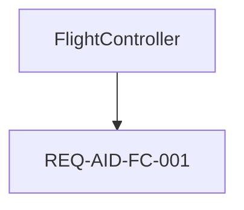

**DISCLAIMER:** Syscribe is provided "as-is" without warranty of any kind. The authors accept no responsibility or liability for the use of this tool in safety-critical, life-critical, or mission-critical applications. Output from Syscribe must be independently reviewed and verified by qualified engineers before use in any certification, regulatory submission, or safety case. Compliance with applicable standards (ISO 26262, IEC 61508, DO-178C, ISO/SAE 21434, etc.) remains the sole responsibility of the user and their organisation.

---

This prompt supports two modes. Choose one and fill in the corresponding context block.

**Mode A — New model:** you are creating a model from scratch.
**Mode B — Change request:** you are adding requirements or making changes to an existing model.

---

## Mode A — New Model Context

*Fill in if creating a new model. Delete this block if using Mode B.*

```
Mode: NEW MODEL

System name:       [e.g. "Autonomous Inspection Drone"]
System short code: [e.g. "AID" — 2–6 uppercase letters, used in IDs]
Domain:            [e.g. "unmanned aerial vehicle for infrastructure inspection"]

Top-level stakeholder goals (3–5 bullet points):
  - ...

Architecture elements (hardware and software parts):
  - ...

Key interfaces between elements:
  - ...

Safety concerns (if any):
  - ...

Security concerns (if any):
  - ...
```

---

## Mode B — Change Request Context

*Fill in if modifying an existing model. Delete this block if using Mode A.*

```
Mode: CHANGE REQUEST

Change request title: [e.g. "Add redundant IMU requirement"]
Change description:   [What is changing and why — be specific]

Change type (pick all that apply):
  [ ] New stakeholder goal (new parent requirement, no derivedFrom)
  [ ] New derived requirement(s) under an existing parent
  [ ] Decompose an existing leaf requirement into sub-requirements
  [ ] Status update on existing requirement(s) (e.g. approved → implemented)
  [ ] Replace / supersede a requirement with a revised one
  [ ] New architecture element satisfying an existing requirement
  [ ] New interface or operation on an existing PortDef/InterfaceDef
  [ ] Supersede an existing ADR with a revised decision
  [ ] Other: ...

Elements affected by this change (qualified names):
  - Requirements::SomeReq          (status: approved, reqDomain: software)
  - Decisions::SomeADR             (status: accepted)
  - AID::Avionics::FlightController (domain: software, satisfies: [REQ-XXX-001])
  - ...

Elements that must NOT change:
  - ...
```

---

## CLI Tools

Use these commands throughout the workflow. Run them in the project root.

**Discovery and navigation:**

| Command | Purpose |
|---|---|
| `syscribe model/ show <qname\|id>` | Show element details and all fields |
| `syscribe model/ ls [qname]` | List namespace children (default: root) |
| `syscribe model/ tree [qname]` | Recursive namespace tree |
| `syscribe model/ find <pattern>` | Fuzzy search by name / ID / content |
| `syscribe model/ list <type> [scope] [--tag <t>]` | List elements of a type, optionally scoped; `--tag` filters by `tags:` |
| `syscribe model/ ls\|find\|list … --where custom.<key>[op<val>]` | Filter by `custom_fields:` (`=` exact, `=~` regex/substring, `~=` list-membership, bare key = presence) |
| `syscribe model/ types` | All element types present in the model with counts |
| `syscribe model/ untyped` | List elements with no `type:` field set |
| `syscribe model/ links <qname\|id>` | All outbound and inbound relationships |
| `syscribe model/ refs <qname\|id>` | What elements reference this element (for a `Configuration`: the TestCases that run in it) |
| `syscribe model/ matrix [--json] [--tag <t>]` | Requirement × Configuration coverage grid (variant-aware; see Part 9b) |
| `syscribe model/ feature-check [--json]` | Holistic feature-model validation (requires/excludes, cycles, bindTo, constraints, orphan-feature W024); separate from `validate` |
| `syscribe model/ features [--json]` | The feature model as a tree (groupKind, constraints, params, per-feature config rollup) |
| `syscribe model/ feature <qname>` | One feature's card: constraints, params, configs that select it, elements it gates |
| `syscribe model/ matrix --features` | Feature × Configuration grid (which feature ships in which product) |
| `syscribe model/ list <type> --feature <F>` | Elements gated by feature `F` (via `appliesWhen:`) |
| `syscribe model/ why-active <qname\|id> --config <C>` | Whether an element is active in a product, and why |
| `syscribe model/ feature-check --deep` | SAT-backed analysis: void / dead / core / false-optional features, full-semantics config validity, explanations + diagnoses |
| `syscribe model/ feature-check --count` / `--enumerate` | Count / list the valid configurations the feature model permits |
| `syscribe model/ configure <Configuration>` | Assisted configuration: from a partial selection, report satisfiability + forced/free features |
| `syscribe model/ validate --config <C>` | Project onto a configuration and validate that variant (escaping refs: E226/W019) |
| `syscribe model/ validate --all-configs` | Validate every stored Configuration (CI gate) |
| `syscribe model/ diff --config <A> --config <B>` | Elements active in one variant but not the other |

**Traceability:**

| Command | Purpose |
|---|---|
| `syscribe model/ trace <qname\|req-id>` | Full traceability slice for a requirement |
| `syscribe model/ why <qname>` | What requirements this element satisfies |
| `syscribe model/ who-verifies <req-id>` | Which test cases cover a requirement |

**Reports & analysis:**

| Command | Purpose |
|---|---|
| `syscribe model/ audit [--json] [--profile <p>]` | Safety-readiness dashboard: status split, SIL/ASIL distribution, coverage %, orphans, PASS/FAIL verdict (exit 2 on fail) |
| `syscribe model/ verification-depth [--sil <v>] [--status <s>] [--min-levels N] [--json]` | Per-requirement distinct verification levels + depth flag (none/hil-only/single/ok); `--min-levels` gates |
| `syscribe model/ metrics [--json]` | Quantitative HW safety metrics SPFM/LFM/PMHF per SafetyGoal vs ASIL/SIL target (needs `diagnosticCoverage`) |
| `syscribe model/ cyber-risk [--json]` | ISO/SAE 21434 risk per ThreatScenario (severity×feasibility) + treatment + untreated flag |
| `syscribe model/ co-analysis [--json]` | Safety↔security: which cyber threats can violate each SafetyGoal (via `hazardRef`) |
| `syscribe model/ safety-case [<SG>] [--json]` | GSN goal→argument→evidence tree (Argument/AssumptionOfUse + implicit goal→req→test) |
| `syscribe model/ connectivity <element> [--depth N] [--format text\|dot\|json]` | Element-rooted subgraph of elements + connections (model root = whole model) |
| `syscribe model/ extref <ref> [--json]` | Find elements by external reference (`extRef`) |
| `syscribe model/ list <type> [--status <s>] [--sil <v>] [--has-wcet] [--json]` | (filters) status/integrity/WCET filters + JSON |
| `syscribe model/ matrix [--gaps-only] [--status <s>] [--linked-only]` | (flags) drop covered rows; status filter; coverage-% footer; executed-evidence glyphs when results ingested |

**Authoring helpers:**

| Command | Purpose |
|---|---|
| `syscribe model/ validate` | Validation findings only — errors and warnings |
| `syscribe model/ validate --json` | Same, machine-readable JSON |
| `syscribe model/ validate --file <path>` | Findings for a single file only |
| `syscribe model/ template <type>` | Print a ready-to-fill frontmatter skeleton |
| `syscribe model/ next-id <prefix>` | Print the next available stable ID (e.g. `REQ-AID-FC-002`) |
| `syscribe model/ check-ref <qname\|id>` | Verify a cross-reference resolves before writing it |
| `syscribe model/ path-for <qname\|id>` | Print the file path for an element |

**Before writing a new element:**
1. `template <type>` — get the frontmatter skeleton
2. `next-id <prefix>` — get the next non-colliding ID (for Requirement / TestCase / ADR)
3. `check-ref <qname>` — verify every cross-reference resolves before committing it to a file

---

## Validation Workflow

**Validate as you work.** Do not output all files at once and validate at the end. Write a batch, validate, fix errors, then continue.

### The validator command

```bash
syscribe model/ validate
```

- **Errors** (`E___`) block a correct model. Fix every error before continuing.
- **Warnings** (`W___`) are advisory. Aim to fix them, but they do not block progress.

The target is **0 errors**. Two W404 warnings for `ScalarValues::*` types are expected and acceptable.

For single-file feedback during iterative authoring:

```bash
syscribe model/ validate --file model/Requirements/MyNewReq.md
```

For structured output (useful when parsing findings programmatically):

```bash
syscribe model/ validate --json
```

### Validation batches

Work in this order, validating after each batch:

**Batch 1 — Skeleton**
Write all `_index.md` package files. Validate. There should be 0 errors.

**Batch 2 — Architecture elements**
Write PartDef / ItemDef / PortDef / InterfaceDef / ActionDef elements, then Part / Port / Connection instances. Validate and fix before continuing.

**Batch 3 — ADRs**
Write all `ADR` elements first — they must exist before any Requirement cites them in `breakdownAdr:`. Validate: 0 errors expected.

**Batch 4 — Requirements**
Write parent `Requirement` elements (no `derivedFrom`) first, then child Requirements. Validate and fix any E310 (missing `breakdownAdr:`), E311 (unresolved `breakdownAdr:`), E103 (unresolved `derivedFrom:`).

**Batch 5 — TestCases**
Write one `TestCase` per leaf Requirement. Validate and fix any E011 (missing gherkin), E013 (missing `verifies:`), E102 (unresolved `verifies:`).

**Batch 6 — Satisfaction links**
Add `satisfies:` to architecture elements. Validate and fix any E312 (parent in satisfies), E313 (domain mismatch).

**Batch 7 — Allocations** (if needed)
Write `Allocation` elements. Validate: fix E502/E503 (unresolved `allocatedFrom`/`allocatedTo`).

**Batch 8 — Diagrams**
Write `Diagram` elements after all model elements are in place. For Mermaid or embedded SVG diagrams, write the `.md` file directly. For `svgMode: companion` diagrams, use the 4-step CLI workflow: `diagram list` → `diagram measure` → author `*.layout.json` → `diagram compose --output <path>`, then commit both the `.md` and the generated `.svg`. Validate: fix E400, W402, W403, W408, W409.

**Batch 9 — Resolve leaf PartDefs (closure pass)**
After all architecture and requirement elements exist, verify that every leaf `PartDef`/`Part` is properly closed. See Part 7b for the full procedure. Validate: resolve all W300 (unassigned leaf requirements) and W301 (over-assigned leaf requirements).

After all batches pass with 0 errors, review warnings and fix any that indicate genuine gaps (W300 — leaf requirement has no satisfying element; W002 — approved requirement has no active TestCase).

### Fixing errors

When the validator reports errors, fix them before writing new files. Paste the error table as a checklist:

```
Errors to fix:
[ ] E310  model/Requirements/FaultDetectionReq.md  — add breakdownAdr:
[ ] E102  model/Verification/FCTest.md             — verifies: REQ-AID-FC-999 does not resolve
```

Check off each one, then re-run `validate` to confirm 0 errors before proceeding.

---

## Output Format

When you write a file, show its full content in a fenced block labelled with the file path and action keyword:

````
```new: model/Requirements/MyNewReq.md
---
type: Requirement
...
---

Body text.
```

```update: model/AID/Avionics/FlightController.md
---
type: PartDef
...
satisfies:
  - REQ-AID-FC-001
  - REQ-AID-FC-002    ← added
---

Updated body.
```

```deprecate: model/Decisions/OldADR.md
Change status: accepted → superseded
Add field:     supersededBy: Decisions::NewADR
No other changes.
```
````

**Action semantics:**

| Action | Meaning |
|---|---|
| `new:` | Create this file; it does not exist yet |
| `update:` | Replace the entire file; show the complete new content |
| `deprecate:` | Describe field changes only — do not rewrite the whole file |

After each batch of files, show the validator command and its output before continuing:

```
Running: syscribe model/ validate

[paste output here]

✓ 0 errors — continuing to next batch.
```

---

## Part 1 — Directory and Namespace Conventions

The model root is `model/`. Every directory corresponds to a package. The file path encodes the qualified name.

```
model/
  _index.md                    ← root package, type: Package
  <System>/
    _index.md                  ← type: Package
    <PartDef>.md
    Avionics/
      _index.md
      FlightController.md
  Requirements/
    _index.md
    <ParentReq>.md
    <ChildReq>.md
  Decisions/
    _index.md
    <ADR>.md
  Verification/
    _index.md
    <TestCase>.md
  Interfaces/
    _index.md
    <PortDef>.md
  Allocations/
    _index.md
    <Allocation>.md
```

**Qualified name rule:** a file at `model/Foo/Bar/Baz.md` has qualified name `Foo::Bar::Baz`. Use `::` as the separator in all cross-references.

**Package index:** every directory must contain `_index.md`:

```yaml
---
type: Package
name: <DirectoryName>
---

One-line description of this package.
```

---

## Part 2 — Element Types Quick Reference

| File `type:` | SysML concept | Typical location |
|---|---|---|
| `Package` | `package` | `_index.md` in any directory |
| `PartDef` | `part def` | `<System>/` or sub-package |
| `Part` | `part` (usage) | inside a `PartDef`'s directory |
| `ItemDef` | `item def` | `Items/` |
| `Item` | `item` | inside owning element |
| `PortDef` | `port def` | `Interfaces/` |
| `Port` | `port` | inside a `PartDef` |
| `InterfaceDef` | `interface def` | `Interfaces/` |
| `ConnectionDef` | `connection def` | `Interfaces/` |
| `Connection` | `connection` | inside a `PartDef` |
| `ActionDef` | `action def` | `Behavior/` |
| `Action` | `action` | inside an `ActionDef` |
| `Requirement` | native requirement | `Requirements/` |
| `RequirementDef` | `requirement def` | `Requirements/` |
| `TestCase` | native test case | `Verification/` |
| `TestPlan` | native test plan (groups TestCases) | `TestPlans/` |
| `ADR` | architecture decision | `Decisions/` |
| `Allocation` | `allocation` | `Allocations/` |
| `Diagram` | diagram | `Diagrams/` |
| `HazardousEvent` | native hazard (HARA) | `Safety/HARA/` |
| `SafetyGoal` | native safety goal | `Safety/HARA/` |
| `DamageScenario` | native damage scenario (TARA) | `Safety/TARA/` or inside `TARASheet` |
| `ThreatScenario` | native threat scenario | `Safety/TARA/` or inside `TARASheet` |
| `CybersecurityGoal` | native cybersecurity goal | `Safety/TARA/` or inside `TARASheet` |
| `SecurityControl` | native security control | `Safety/TARA/` or inside `TARASheet` |
| `VulnerabilityReport` | tracked vulnerability | `Safety/TARA/` |
| `TARASheet` | TARA container (exploded at parse time) | `Safety/TARA/` |
| `FaultTree` | FTA root element | `Safety/FTA/` |
| `FaultTreeGate` | FTA logic gate | `Safety/FTA/<FT-id>/` |
| `FaultTreeEvent` | FTA leaf event | `Safety/FTA/<FT-id>/` |
| `FMEASheet` | FMEA container | `Safety/FMEA/` |
| `AttackTree` | attack-path tree root (ISO/SAE 21434) | `Safety/AttackTrees/` |
| `AttackTreeGate` | attack-tree gate (AND=path, OR=alternatives) | `Safety/AttackTrees/<AT-id>/` |
| `AttackStep` | attack-tree leaf step (carries `attackFeasibility`) | `Safety/AttackTrees/<AT-id>/` |
| `ConfirmationMeasure` | confirmation review / FS audit / FS or cyber assessment (I1–I3) | `Safety/Confirmation/` |
| `Argument` | GSN safety-case node (claim/strategy/solution) | `Safety/Case/` |
| `AssumptionOfUse` | safety-related application condition (SRAC) | `Safety/Case/` |

The safety/security **analysis fields and checks** (HARA S/E/C, TARA `attackFeasibility`/`damageSeverity`, `hazardRef` safety↔security link, `riskTreatment`, `diagnosticCoverage` + SPFM/LFM/PMHF, `ffiRationale`, `responsibility`, attack-tree roll-up, GSN `Argument`) are documented in full under **`syscribe spec safety`**, with every field in **`syscribe spec fields`** and every rule code in **`syscribe spec validation`**.

For a ready-to-fill frontmatter skeleton for any type, run:

```bash
syscribe model/ template <type>
```

---

## Part 3 — Common Frontmatter Fields

Key fields that apply to most element types:

| Field | Notes |
|---|---|
| `type` | Required — one of the types in Part 2 |
| `name` | The single human-readable label on **every** element type (`Requirement`, `TestCase`, `ADR`, `PartDef`, `Package`, `FeatureDef`, the safety/security types — all of them). For **name-identified** types (SysML structural types, `Package`, `Diagram`, `FeatureDef`) `name` is also the identity segment: it defaults to the filename stem and **must be a SysMLv2 basic name** `[A-Za-z_][A-Za-z0-9_]*` — letters/digits/`_`, no hyphens or spaces (use `_` or CamelCase: `Anti_Lock`, not `Anti-Lock`); a hyphen breaks `appliesWhen`/`parameterConstraints` references and non-basic names warn `W042`. For **id-identified** types (`Requirement`, `TestCase`, `TestPlan`, `Configuration`, `ADR`, and the safety/security types) identity is the stable `id`, so `name` is **free prose** — spaces and punctuation allowed, `W042` does not apply — and is **required** on these types. |
| `title` | **REMOVED — use `name`.** `title` is no longer a label field on any element; a stray `title:` is error `E025` ("rename it to `name`"). |
| `supertype` | Specialisation link (`>` in SysML) |
| `typedBy` | Type of a usage element (port, part, action, etc.) |
| `isAbstract` | `true` for abstract definitions |
| `multiplicity` | Cardinality; default `"1"` |
| `domain` | `system` \| `hardware` \| `software` — required on Part/PartDef |
| `features` | Inline attributes or ports |
| `connections` | Port bindings (on Part files) |
| `satisfies` | List of `REQ-*` IDs this element satisfies |
| `implementedBy` | Path(s) to the source code realising this Part/PartDef (string or list); missing local paths warn W023 |
| `custom_fields` | Optional freeform user metadata (see below) |

### `custom_fields:` — user-defined metadata

Attach arbitrary metadata to any element under a `custom_fields:` map. Use this instead
of inventing top-level keys (which are silently ignored).

```yaml
custom_fields:
  supplier: Bosch
  costCenter: PWT-4471
  partNumbers: [A-1001, A-1002]   # lists of scalars allowed
```

- Keys are freeform; values must be a scalar or a list of scalars (a nested map warns `W041`).
- Serialised in sorted order; read-only in the UI and `show`.
- Query with `--where`: `syscribe model/ ls --where custom.supplier=Bosch` (also
  `=~` regex/substring, `~=` list-membership, and bare `custom.key` presence).

### `domain:` field rules

- Set `domain:` on every `PartDef` and `Part` that represents a physical or software element.
- Values: `system` (top-level or cross-cutting), `hardware` (physical), `software` (firmware/SW).
- `supertype:` and `typedBy:` must not cross the `hardware`/`software` boundary (error E315). Use `Allocation` for cross-domain integration.

---

## Part 4 — Native Requirement (`type: Requirement`)

### Required fields

| Field | Rule |
|---|---|
| `id` | Must match `^REQ(-[A-Z0-9]{2,12})+-[0-9]{3,8}$` — e.g. `REQ-SYS-001`, `REQ-AID-FC-001` |
| `name` | Short human-readable label — free prose (spaces/punctuation allowed) |
| `status` | One of: `draft` · `review` · `approved` · `implemented` · `verified` |

### Optional fields

| Field | Notes |
|---|---|
| `reqDomain` | `system` · `hardware` · `software` — required on leaf requirements |
| `silLevel` | Integer 1–4 (IEC 61508). **Do not set both `silLevel` and `asilLevel`** — they are incompatible standards (W006). |
| `asilLevel` | `A` · `B` · `C` · `D` (ISO 26262). Mutually exclusive with `silLevel`. |
| `plLevel` | `a` · `b` · `c` · `d` · `e` (ISO 13849-1 Performance Level). Mutually exclusive with the above. |
| `derivedFromSafetyGoal` | ID of the `SafetyGoal` that motivated this requirement. The SafetyGoal's integrity level must also be set on this element (E841). |
| `derivedFromSecurityGoal` | ID of the `CybersecurityGoal` that motivated this requirement. Requires `verificationMethod:` (W807). |
| `verificationMethod` | `test` · `inspection` · `analysis` · `demonstration` — required for ASIL B/C/D (W701). |
| `derivedFrom` | List of parent Requirement `id`s — triggers §12 rules |
| `breakdownAdr` | Qualified name of an `accepted` ADR — **required whenever `derivedFrom` is set** (E310); also required when integrity level is lower than the source (W808) |

### Normative body rules

- The Markdown body **before the first `##` heading** is the normative text.
- It must be **non-empty** (error E012) and contain the word **`shall`** (warning W001).

### Requirement hierarchy

```
REQ-SYS-000  (parent — stakeholder goal, no derivedFrom, no reqDomain needed)
  ├── REQ-HW-001   (leaf, derivedFrom: [REQ-SYS-000], breakdownAdr: Decisions::MyADR, reqDomain: hardware)
  └── REQ-SW-001   (leaf, derivedFrom: [REQ-SYS-000], breakdownAdr: Decisions::MyADR, reqDomain: software)
```

**Parent requirements** must **never** appear in any element's `satisfies:` list (error E312). Only leaf requirements may be satisfied.

**Getting the next ID:** `syscribe model/ next-id REQ-AID-FC` → prints e.g. `REQ-AID-FC-002`

**Template:** `syscribe model/ template Requirement`

---

## Part 5 — Architecture Decision Record (`type: ADR`)

### Required fields

| Field | Rule |
|---|---|
| `id` | Must match `^ADR(-[A-Z0-9]{2,12})+-[0-9]{3,8}$` |
| `name` | Short description of the decision — free prose |
| `status` | `proposed` · `accepted` · `deprecated` · `superseded` |

**ADR must be `accepted` before any Requirement can cite it in `breakdownAdr:`** (warning W303 if still `proposed`).

Body structure: `## Context`, `## Decision`, `## Consequences` (conventional — not validated beyond being non-empty).

**Getting the next ID:** `syscribe model/ next-id ADR-AID-SAFE`

**Template:** `syscribe model/ template ADR`

---

## Part 6 — Native TestCase (`type: TestCase`)

### Required fields

| Field | Rule |
|---|---|
| `id` | Must match `^TC(-[A-Z0-9]{2,12})+-[0-9]{3,8}$` |
| `name` | Short description — free prose |
| `status` | `draft` · `review` · `approved` · `active` · `retired` |
| `testLevel` | `L1` · `L2` · `L3` · `L4` · `L5` |
| `verifies` | List of Requirement `id`s — **must not be empty** (error E013) |

### Body rules

- Must contain a fenced ` ```gherkin ` block (error E011).
- First ` ```gherkin ` block must begin with `Feature:` (error E015).
- Every `Scenario Outline:` must have an `Examples:` table (error E014).

**Getting the next ID:** `syscribe model/ next-id TC-AID-FC`

**Template:** `syscribe model/ template TestCase`

---

## Part 6b — Native TestPlan (`type: TestPlan`)

A `TestPlan` groups reusable `TestCase`s into the unit a team executes and reports
against. It is a per-product artifact: typically one plan per `(configuration, scope)`.
Place plans under `TestPlans/`.

### Fields

| Field | Rule |
|---|---|
| `id` | Required; must match `^TP(-[A-Z0-9]{2,12})+-[0-9]{3,8}$` |
| `name` | Required — free prose label |
| `status` | Required; `draft` · `review` · `approved` · `active` · `retired` |
| `scope` | Optional; `unit` · `smoke` · `integration` · `hil` · `certification` · `security` · `regression` (other values warn `W610`). Distinguishes multiple plans over the same config. |
| `configurations` | Optional; a `Configuration` id or list. Absent = applies to every configuration. Each must resolve (`E606`). |
| `demonstrates` | Optional; goals/requirements this plan is evidence for (`E603` if unresolved). Not required. |
| `testCases` | Optional; explicit `TC-*` members (`E601` if not a TestCase). |
| `selection` | Optional additive query: `testLevels` (L1–L5), `domains` (system/hardware/software), `tags`. |

Effective members = `testCases` ∪ `selection` matches. Membership of a config is still
computed from each TestCase's own `appliesWhen:` — the plan only says which products it
is *for*.

### Tooling

- `syscribe model/ testplan` — list plans (scope, configs, coverage %, verdict).
- `syscribe model/ testplan TP-X [--json]` — per-plan detail.
- `--plan TP-X` lens on `matrix`, `verification-depth`, `audit` (composes with `--config`).

**Getting the next ID:** `syscribe model/ next-id TP-DELIVERY-INTEGRATION`

**Template:** `syscribe model/ template TestPlan`

---

## Part 7 — Allocation (`type: Allocation`)

Allocations link a `software` or `system` element to a `hardware` element. Use them for cross-domain integration; never use `supertype:` across domain boundaries.

Required: `allocatedFrom` and `allocatedTo` must both resolve to known elements (errors E502, E503).

**Template:** `syscribe model/ template Allocation`

---

## Part 7b — Closing the Architecture: Resolving Leaf PartDefs

A **leaf PartDef** is a `PartDef` or `Part` that has no sub-part children in the model — it represents the lowest-level component that actually implements requirements. The closure pass ensures every leaf PartDef is assigned to at least one leaf requirement, and every leaf requirement at `approved` or higher is assigned to exactly one element.

### Step 1 — Find unassigned leaf requirements

```bash
syscribe model/ validate 2>&1 | grep W300
```

W300 fires for every leaf `Requirement` at `status: approved` or `implemented` that has no element with `satisfies:` pointing to it. This is your work list.

### Step 2 — Find under-specified PartDefs

```bash
syscribe model/ list PartDef
```

For each PartDef, check what requirements it already covers:

```bash
syscribe model/ why <qname>          # requirements this element satisfies
syscribe model/ links <qname>        # all outbound and inbound relationships
```

### Step 3 — Assign requirements

For each unassigned leaf requirement:
1. Identify the PartDef responsible for implementing it.
2. Add the requirement `id` to that PartDef's `satisfies:` list.
3. Verify domain compatibility: `domain:` on the PartDef must match `reqDomain:` on the requirement (or one of them is `system`). Error E313 if they differ.
4. Verify the requirement is truly a leaf (no `derivedChildren`). Error E312 if you try to satisfy a parent requirement.

```yaml
# example update to a PartDef
satisfies:
  - REQ-AID-FC-001    # existing
  - REQ-AID-FC-002    # newly assigned
```

### Step 4 — Handle over-assigned requirements (W301)

A leaf requirement with more than one satisfying element fires W301. This is almost always a modelling mistake — decide which single element owns the requirement and remove it from the others. Legitimate split ownership (redundancy architectures) should be documented in the breakdown ADR and the requirement should be decomposed into two child requirements, one per element.

### Step 5 — Handle deployment packages

Any `PartDef` with `isDeploymentPackage: true` must have at least one `Allocation` linking it to a `hardware` element (error E314). Create an `Allocation` element or add `allocatedTo:` directly:

```yaml
# In Allocations/SWtoHW.md
type: Allocation
allocatedFrom: Software::MyModule
allocatedTo: Hardware::TargetBoard
```

### Step 6 — Final validation

```bash
syscribe model/ validate
```

Target state at end of closure pass:
- **0 errors**
- **0 × W300** — every leaf requirement at `approved`/`implemented` has a satisfying element
- **0 × W301** — no leaf requirement is satisfied by more than one element
- **0 × E314** — every deployment package has an allocation to hardware

Remaining acceptable warnings after closure: W404 (`ScalarValues::*` stdlib), W007 (unused definition types), W305 (parent requirement without system-integration TestCase), W008 (README file).

### Summary checklist for each leaf PartDef

- [ ] `domain:` is set (`system`, `hardware`, or `software`)
- [ ] `satisfies:` lists only leaf requirement IDs (no parents — E312)
- [ ] Every listed requirement's `reqDomain:` is compatible with this element's `domain:` (E313)
- [ ] If `isDeploymentPackage: true` → at least one `Allocation` to a `hardware` element exists (E314)
- [ ] If `asilLevel:`/`silLevel:` is set on any satisfied requirement → the same field is set on this PartDef (E843)

---

## Part 8 — Ports & Interfaces

**Decision guide (model this right).** A `PortDef` is a reusable *kind* of connection point with directed features (`in`/`out`/`inout`); a `Port` is a usage of one on a part (in `features:`, `type: Port`, `typedBy:` the PortDef). An **`InterfaceDef` is a kind of `ConnectionDef` whose ends are ports** — use it for a reusable compatible pairing; a `ConnectionDef` connects arbitrary features/parts. Pick: expose a point → `Port`; reusable port pairing → `InterfaceDef`; arbitrary connection → `ConnectionDef`; wire two ports → a connection usage (`connections:` `from`/`to` feature chains, `typedBy:` the interface); move items → `flowConnections:`; equate features → `bindingConnections:`.

**Conjugation:** the receiver is the **conjugate** of the sender — directions flip (`in`↔`out`; `inout` self-conjugate). Use a conjugate `PortDef` (`conjugates:`) for reuse, or `isConjugated: true` on the usage. Full guide: `syscribe spec types` and format spec §8.3.

### PortDef with Operations (`type: PortDef`)

Operations on a PortDef:
- `isAsync: true` and `returnType:` are mutually exclusive.
- `direction:` values: `in` · `out` · `inout`.
- `typedBy:` and `returnType:` trigger W404 if they don't resolve — `ScalarValues::*` warnings are acceptable.

**Template:** `syscribe model/ template PortDef`

---

## Part 9 — Diagrams

Every diagram is a `type: Diagram` element in `Diagrams/`. Three authoring approaches:

- **Mermaid** — for traceability trees, flow diagrams, sequence diagrams, simple state machines. Set `diagramKind: Mermaid`. Include a fenced ` ```mermaid ` block (error E400 if absent).
- **Composed SVG** (`syscribe diagram` CLI) — element-card architecture diagrams. Cards generated from live model data. Commit the generated SVG as a companion file.
- **Embedded SVG** — hand-coded SVG using the symbol library, for precise SysML notation (BDD, IBD, StateMachine, Requirement).

### Diagram element frontmatter

```yaml
---
type: Diagram
name: UAVSystemBDD
diagramKind: BDD            # BDD | IBD | StateMachine | Requirement | Mermaid
subject: UAV::UAVSystem     # element this diagram depicts (W401 if it doesn't resolve)
svgMode: inline             # required when embedding SVG in the body
shapes:                     # shape-id → descriptor
  s-uav: {ref: "UAV::UAVSystem", kind: PartDef}
  s-fc:  {ref: "UAV::Avionics::FlightController", kind: Part, parent: s-uav}
edges:
  e-comp: {source: s-uav, target: s-fc, kind: composition}
---
```

Shape `ref:` triggers W402 if it doesn't resolve. Edge `source`/`target` trigger W403 if they don't match a defined shape-id.

### Annotating Mermaid nodes with model element references (`%% ref:`)

Place `%% ref: QualifiedName` immediately before the node or edge it annotates. W408 fires on an unresolved annotation; W409 fires when a Mermaid diagram has no annotations at all.

````markdown

````

### Composed SVG diagrams (syscribe diagram CLI)

#### Step 1 — Inventory elements

```bash
syscribe diagram list model/
syscribe diagram list model/ --type PartDef,Part --ns UAV
```

#### Step 2 — Measure elements

```bash
syscribe diagram measure model/ \
  "UAV::Power::BatteryPack,UAV::Power::PowerDistributionUnit" \
  --view ports
```

Output JSON: `width`, `height`, `port_anchors`, `peers`.

**`--view` presets:** `full` · `ports` · `features` · `compact` · `name` · `requirement`

#### Step 3 — Author the layout JSON

Name it `<anything>.layout.json` — gitignored. **Never commit layout files.**

```json
{
  "title": "UAV Power Architecture",
  "canvas": { "padding": 40, "bg": "#fafafa" },
  "elements": [
    { "qname": "UAV::Power::BatteryPack",           "x": 20,  "y": 80, "view": "ports" },
    { "qname": "UAV::Power::PowerDistributionUnit", "x": 240, "y": 80, "view": "ports" }
  ],
  "edges": [
    {
      "from": { "qname": "UAV::Power::BatteryPack",           "port": "powerOut" },
      "to":   { "qname": "UAV::Power::PowerDistributionUnit", "port": "powerIn" },
      "kind": "flow"
    }
  ]
}
```

**Edge kinds:** `flow` · `derive` · `verify` · `allocate` · `satisfy` · `generalize`

#### Step 4 — Compose the SVG

```bash
syscribe diagram compose model/ my-arch.layout.json \
  --output model/Views/MyDiagram.svg
```

Commit the generated SVG. For the Diagram element, use `svgMode: companion` and `expose:` listing the qualified names shown.

### Embedded SVG — available symbols

| Symbol id | Use for |
|---|---|
| `#sym-PartDef` | PartDef or Part blocks |
| `#sym-ItemDef` | ItemDef blocks |
| `#sym-ActionDef` | ActionDef blocks |
| `#sym-RequirementDef` | RequirementDef blocks |
| `#sym-requirement` | Native Requirement blocks |
| `#sym-testcase` | TestCase blocks |
| `#sym-boundary` | IBD system boundary frame |
| `#sym-port` | Port squares on block borders |
| `#sym-state` | State nodes |
| `#sym-initial` | Initial pseudostate |
| `#sym-actor` | Actor (stick figure) |
| `#sym-usecase` | Use-case ellipse |

**Arrow markers:** `#arrow-open` · `#arrow-filled` · `#arrow-inherit` · `#arrow-composition` · `#arrow-aggregation` · `#arrow-flow`

SVG conventions: root `<svg>` uses `xmlns:sysml="urn:syscribe:1.0"`. Each shape is a `<g id="<shape-id>" sysml:ref="<qname>" transform="translate(x,y)">`. Shape `id` must match the `shapes:` frontmatter key; `sysml:ref` must match the `ref:` value.

### Diagram validation rules

| Code | Condition |
|---|---|
| E400 | `diagramKind: Mermaid` but no ` ```mermaid ` block |
| W400 | Diagram has no `diagramKind` |
| W401 | `subject:` does not resolve |
| W402 | Shape `ref:` does not resolve |
| W403 | Edge `source`/`target` is not a defined shape-id |
| W408 | Mermaid `%% ref:` annotation doesn't resolve |
| W409 | Mermaid diagram has no `%% ref:` annotations |

---

## Part 9b — Variability (Product Lines, §9)

**Opt-in.** Skip this entirely for single-product models. The variability dimension is dormant — and changes nothing about validation — unless the model has at least one `FeatureDef` *and* something links to it. Add it only when modelling a product line.

Three building blocks:

| Element / field | Role |
|---|---|
| `type: FeatureDef` | A node in the feature model (a selectable characteristic). **Requires a mandatory `id:` matching `FEAT-*`** (`E201` if missing); labelled by `name`. `groupKind:` (`optional`/`alternative`/`or`) groups its children; `mandatory: true` makes it a mandatory member of its parent (combine with `groupKind: alternative` for a mandatory XOR group). |
| `type: Configuration` | A named product variant. `id:` matches `CONF-*`; `featureModel:` names the feature package; `features:` is a **map** of `<FeatureDef QName>: true/false`. |
| `appliesWhen:` | On *any* element (including a `TestCase`): conditions it on a boolean expression over `FeatureDef` QNames. |

**`appliesWhen:` forms** — a bare QName, a list (AND), or an expression with `and`/`or`/`not`/parentheses:

```yaml
appliesWhen: Features::Wdt
appliesWhen: "Features::CortexM and Features::Mpu"
appliesWhen: "(Features::A or Features::B) and not Features::A"
```

Every operand must resolve to a `FeatureDef` (else `E209`).

**Test coverage is variant-aware — there is no `runsIn` field.** A `TestCase` *runs in* a `Configuration` iff its `appliesWhen:` is satisfied by that configuration's `features:` selections; a `TestCase` with no `appliesWhen:` runs in every configuration. To check coverage per variant:

- `syscribe model/ matrix` — Requirement × Configuration grid (cells: covered / gap / N-A). Use `--json` for structured output, `--tag` to filter rows.
- Validation emits **W015** when a requirement is active in a `Configuration` but no non-draft `TestCase` running there verifies it. Gate it with `validate --deny W015`.

If two configurations would have identical `features:` (e.g. emulator vs physical rig), model the distinguishing axis as its own feature (e.g. an `ExecEnv` alternative group) rather than reaching for a separate field.

**Feature parameters (quantitative variability, §9.7).** A `FeatureDef` may declare typed `parameters:` (each `{name, type, range: "min..max" or "min..=max", enumValues, default, isFixed, isRequired, bindingTime}`); a `Configuration` binds them under `parameterBindings:` keyed by the dotted reference `<FeatureDef QName>.<param>`. Bindings are validated by `validate`: a binding for an unselected feature (`E203`), of a fixed parameter (`E204`), out of `range:` (`E205`), not in `enumValues:` (`E206`), or to an undeclared/legacy-`::` path (`E222`) is an error; a selected feature's required, default-less parameter left unbound warns (`W017`). Cross-feature `parameterConstraints` (on a package `_index.md`) are evaluated by `feature-check`: a violated comparison is `E221` (or `W025` if `severity: warning`). The optional `bindingTime:` records *when* a parameter is resolved — `compile` < `load` < `runtime` (ordered); an unknown value is `E230`, a parameter bound earlier than a `derivedFrom`/`bindTo` source it depends on is `E229` (`feature-check`), binding a `runtime` parameter in a `Configuration` warns `W027`, and `W017` is suppressed for unbound `runtime` parameters.

**Holistic checks — run `feature-check` (not part of `validate`).** `syscribe feature-check` validates the feature model as a whole: `requires:`/`excludes:` resolution (`E212`) and satisfaction per configuration (`E219`/`E220`), dead/always-on optional features (`W011`/`W012`), circular `derivedFrom:` (`E207`), `bindTo:` propagation outside the component `range:` (`E202`), and cross-feature `parameterConstraints` declared on a package `_index.md` — unresolved paths (`E213`) and `appliesWhen:` features used in no configuration (`W014`).

**Whole-space analysis — `feature-check --deep`.** Adds SAT-backed reasoning over a propositional encoding of the feature model (Boolean layer only; deterministic, no external solver; comfortably ~500 features): **void** models (`E223`), **dead** features (`E224`), **false-optional** features (`W018`), **invalid configurations** under full group/cardinality semantics (`E225`), **core** features, a minimal conflict-set explanation, and **diagnoses** (minimal correction sets) for void models. Companion commands: `--count`/`--enumerate` report the valid-configuration space, and `configure <Configuration>` completes a partial selection (forced/free features). Use these to prove the feature model itself is sound and to drive configuration, beyond linting authored configs. (Numeric/parameter SMT reasoning and DRAT proofs are not yet implemented.)

**Configuration lens (`--config`).** The model is a 150% superset; `--config <CONF|features>` projects it onto one variant and runs `validate`/`list`/`export` over the active elements only. `validate --config` certifies a variant and flags **escaping references** (an active element pointing at one inactive in that variant: structural `E226` / traceability `W019`); `feature-check --deep` additionally proves no structural reference can escape in *any* valid configuration (`E227`). `validate --all-configs` gates every stored variant; `diff --config A --config B` shows what differs. All inert when no feature model is present.

---

## Part 9c — MagicGrid Overlay (opt-in)

**Opt-in overlay.** The MagicGrid MBSE method (problem black-box **B** / white-box **W** / solution **S** rows × Requirements **1** / Behaviour **2** / Structure **3** / Parameters **4** columns) is supported with **no change to the base format**: all data rides on **`mg_`-prefixed `custom_fields:`** (flat scalars) plus the base `actors:` field, and all MagicGrid-specific validation is **gated behind a profile**. Skip this entirely unless building a MagicGrid model.

**Profile gate.** Declare the profile once in `<model_root>/.syscribe.toml`, then run `validate --profile magicgrid`:

```toml
[profiles.magicgrid]
magicgrid = true
promote = ["W307"]   # optional: gate "use case with no refines:"
```

The `MG###` checks fire only under that profile. The reports (`magicgrid`, `trade-study`, `matrix --allocations`) are read-only and work regardless of profile.

**Overlay fields** (all on `custom_fields:`):

| Field | On | Meaning |
|---|---|---|
| `mg_cell: <coord>` | any element | grid coordinate, one of `B1`–`B4`/`W1`–`W4`/`S1`–`S4`; pillar must match the element type (`MG020`/`MG021`) |
| `mg_external: true` | `Part`/`PartDef` | an actor outside the system boundary (B3) |
| `mg_soi: true` | `Part`/`PartDef` | the single System of Interest block (B3); at most one (`MG060`–`MG062`) |
| `mg_moe: true` + `mg_moe_measures`/`mg_moe_direction` (`maximize`/`minimize`)/`mg_moe_threshold`/`mg_moe_objective`/`mg_moe_weight`/`mg_moe_unit` | `CalculationDef`/`AnalysisCase` | a Measure of Effectiveness (B4) (`MG030`–`MG033`) |
| `mg_mop: true` + `mg_mop_refines` (the MoE it refines)/`mg_mop_unit` | `CalculationDef`/`ConstraintDef`/`AnalysisCase` | a Measure of Performance (W4/S4); inverse index `mopRefinedBy` on the MoE (`MG050`–`MG052`) |
| `mg_layer: logical \| physical` | `Part`/`PartDef` | W3 logical vs S3 physical; bridge them only with an `Allocation` (`MG040`–`MG042`) |
| `mg_variant: true` | `Configuration` | a parametric variant — relaxes the `featureModel:` requirement (`E201`); differentiated by `parameterBindings:` alone (`MG070`) |

**Base-format `refines:`.** A `UseCaseDef`/`UseCase` (or `ActionDef`/`Action`/`StateDef`/`State`) declares `refines:` pointing at the `Requirement`/`RequirementDef` it elaborates — an unresolved/wrong-type operand is `E316` (always checked, no profile needed); a non-`draft` `UseCaseDef` with no `refines:` warns `W307`. The reverse index `refinedBy` is computed on each requirement.

**Reports** (read-only): `syscribe model/ magicgrid` (B/W/S × 1-4 cell grid, empty-cell hints, plus a `System of interest:` line when one `mg_soi` is set); `syscribe model/ trade-study` (MoE-weighted scoring of every `Configuration`, WINNER/FAIL rollup); `syscribe model/ matrix --allocations` (allocation source × target matrix with a logical→physical partition when `mg_layer` is present).

---

## Part 10 — §12 Traceability Rules

### §12.1 — Link direction
Links always point **upstream**. The child holds `derivedFrom:`, the TestCase holds `verifies:`, architecture elements hold `satisfies:`. Never put backward links on a parent.

### §12.2 — Breakdown ADR required
Every Requirement with `derivedFrom:` **must also have `breakdownAdr:`** pointing to an `accepted` ADR (error E310). Create the ADR *before* the child requirements.

### §12.3 — Leaf assignment
Every leaf Requirement at `status: approved` or `implemented` should be assigned to exactly one architecture element via `satisfies:` (warning W300 if none).

### §12.4 — No parent assignment
A Requirement from which others derive must **never** appear in any `satisfies:` list (error E312).

### §12.5 — Domain match
The `reqDomain:` of the leaf Requirement must match the `domain:` of the element that satisfies it, unless either is `system` (error E313).

### §12.6 — HW/SW independence
Do not use `supertype:` or `typedBy:` across the `hardware`/`software` boundary (error E315). Use `Allocation` elements for cross-domain binding.

### §12.7 — Integrity level propagation
Once a `SafetyGoal` carries `asilLevel:`, `silLevel:`, or `plLevel:`, every downstream element in the traceability chain must also carry the same field:

| Link | Error if field missing | Warning if lower without ADR |
|---|---|---|
| `derivedFromSafetyGoal:` → SafetyGoal | E841 | W808 |
| `derivedFrom:` → parent Requirement | E842 | W808 |
| `satisfies:` → Requirement | E843 | W808 |

A lower level (ASIL decomposition per ISO 26262-9) is valid only when `breakdownAdr:` references an `accepted` ADR documenting the decomposition rationale.

---

## Part 10b — Safety and Security Analysis Workflow

### HARA (ISO 26262 / IEC 61508)

**Authoring order:**
1. Create `HazardousEvent` elements — one per identified hazard/operating-situation combination.
2. Create `SafetyGoal` elements — each references one or more `HazardousEvent`s via `hazardousEvents:` and carries an integrity level.
3. Create `Requirement` elements with `derivedFromSafetyGoal:` — these inherit the integrity level (§12.7).
4. Create `TestCase` elements verifying those requirements.

**Key validation rules:**
- W800 — `HazardousEvent` not covered by any `SafetyGoal`
- W801 — `SafetyGoal` has no integrity level
- W806 — `SafetyGoal` has no `hazardousEvents:` (not grounded in HARA)
- E841 — `Requirement` missing integrity level when `SafetyGoal` has one

**Templates:** `syscribe model/ template HazardousEvent`, `template SafetyGoal`

### TARA (ISO/SAE 21434) — TARASheet (recommended)

Use a single `TARASheet` file. The parser explodes it into individual `DamageScenario`, `ThreatScenario`, `CybersecurityGoal`, and `SecurityControl` elements.

```yaml
type: TARASheet
id: TARA-SYS-001
name: "TARA — CAN bus"
status: draft
damageTable:
  - id: DS-SYS-001
    name: "..."
    damageSeverity: severe
    impactCategories: [safety]
threatTable:
  - id: TS-SYS-001
    ...
    damageScenarios: [DS-SYS-001]
goalTable:
  - id: CSG-SYS-001
    ...
    threatScenarios: [TS-SYS-001]
controlTable:
  - id: SC-SYS-001
    ...
    implementsGoals: [CSG-SYS-001]
```

**Template:** `syscribe model/ template TARASheet`

After the TARASheet is in place, create `Requirement` elements with `derivedFromSecurityGoal: CSG-SYS-001` and set `verificationMethod:`.

**Binding a SecurityControl to an architecture element** (OSLC-compliant direction — architecture element holds the reference):

```yaml
# In Hardware/ECU.md
type: PartDef
allocatedFrom:
  - SC-SYS-001    # this component implements this security control
```

### FTA (Fault Tree Analysis)

**Directory layout:** `FaultTreeGate` and `FaultTreeEvent` must be nested **inside a subdirectory named after the FaultTree file** (W900 fires if flat):

```
Safety/FTA/
  FT-SYS-001.md               ← FaultTree
  FT-SYS-001/
    FTG-SYS-001.md            ← top gate
    FTE-SYS-001.md            ← basic event
```

```bash
syscribe model/ template FaultTree      > Safety/FTA/FT-SYS-001.md
mkdir -p Safety/FTA/FT-SYS-001
syscribe model/ template FaultTreeGate  > Safety/FTA/FT-SYS-001/FTG-SYS-001.md
syscribe model/ template FaultTreeEvent > Safety/FTA/FT-SYS-001/FTE-SYS-001.md
```

### FMEA

Use a single `FMEASheet` file with an `entries:` list. Each entry becomes a virtual `FMEAEntry` element at parse time.

**Template:** `syscribe model/ template FMEASheet`

---

## Part 11 — Change Request Patterns

### Pattern A — Add a new stakeholder goal
Top-level requirement, no `derivedFrom:`, no `breakdownAdr:`, no `reqDomain:` required. **Create:** one new `Requirement` file.

### Pattern B — Add derived requirements under an existing parent
**Create (in order):** 1) accepted ADR, 2) child Requirements with `derivedFrom:` and `breakdownAdr:`, 3) one TestCase per leaf.
**Update:** architecture elements — add new IDs to `satisfies:`.
**Check:** parent must NOT appear in any `satisfies:`; if it had a TestCase, set it `retired`.

### Pattern C — Decompose an existing leaf requirement
**Create (in order):** 1) accepted ADR, 2) child Requirements, 3) new TestCases for each leaf.
**Update:** remove former leaf ID from all `satisfies:` lists; retire its TestCase; add new leaf IDs to appropriate elements.

### Pattern D — Status progression

```
draft → review → approved → implemented → verified
```

| Transition | What else to check |
|---|---|
| `draft` → `review` | Normative text contains `shall`; `reqDomain:` set on leaf |
| `review` → `approved` | An active TestCase exists (W002) |
| `approved` → `implemented` | A satisfying element has this ID in `satisfies:` (W300) |
| `implemented` → `verified` | At least one `active` TestCase verifies it (W003) |

### Pattern E — Replace a requirement
**Create:** new `Requirement` with a new ID; new TestCase.
**Update:** old Requirement — leave the file, do not change the ID; update `satisfies:` in architecture elements; retire old TestCase.

### Pattern F — Supersede an ADR
**Create:** new ADR (`status: accepted`). **Deprecate:** old ADR (`status: superseded`). **Update:** any Requirement with `breakdownAdr:` pointing to the old ADR — update to the new one.

### Pattern G — Add a new architecture element
**Create:** new PartDef/Part with correct `domain:` and `satisfies:`. **Check:** domain matches `reqDomain:` on satisfied requirements; add `Allocation` if it's software running on hardware.

---

## Part 12 — Validation Error Quick Reference

| Code | Cause | Fix |
|---|---|---|
| E004 | TestCase missing `id`, `name`, `status`, or `testLevel` | Add all four fields |
| E004 | Requirement missing `name` or `status` | Add both fields |
| E006 | `id` does not match the pattern for its type | Check regex: `REQ(-[A-Z0-9]{2,12})+-[0-9]{3,8}` |
| E007 | `status` value not in allowed enum | Check status table for each type |
| E008 | `testLevel` not `L1`–`L5` | Use exactly `L1`–`L5` |
| E009 | `silLevel` outside 1–4 | Use integer 1–4 |
| E010 | `asilLevel` not `A`–`D` | Use exactly `A`–`D` |
| E011 | TestCase body has no ` ```gherkin ` block | Add a gherkin fenced block |
| E012 | Requirement normative text is empty | Write the `shall` statement before any `##` heading |
| E013 | `verifies:` absent or empty on TestCase | Add at least one `REQ-*` ID |
| E014 | `Scenario Outline:` has no `Examples:` table | Add `Examples:` table |
| E015 | First gherkin block has no `Feature:` line | Start the block with `Feature: <name>` |
| E016 | Supertype cycle | Break the inheritance loop |
| E017 | DerivedFrom cycle | Break the requirement hierarchy loop |
| E018 | Subsets cycle | Break the subsetting loop |
| E101 | Duplicate `id` | Each `REQ-*`, `TC-*`, `ADR-*` must be globally unique — use `next-id` |
| E102 | `verifies:` ID does not resolve | Check the ID matches a Requirement file |
| E103 | `derivedFrom:` ID does not resolve | Check parent Requirement ID |
| E104 | `verifies:` target is not a native Requirement | Only point `verifies:` at `type: Requirement` |
| E105 | `derivedFrom:` target is not a native Requirement | Only point `derivedFrom:` at `type: Requirement` |
| E300 | ADR `id` does not match `ADR-*` pattern | Fix the ID |
| E301 | ADR missing `id`, `name`, or `status` | Add all three fields |
| E302 | `reqDomain` not `system`/`hardware`/`software` | Use one of the three values |
| E303 | `domain` not `system`/`hardware`/`software` | Use one of the three values |
| E304 | ADR `status` not valid | Use `proposed`, `accepted`, `deprecated`, or `superseded` |
| E310 | `derivedFrom:` present but `breakdownAdr:` absent | Add `breakdownAdr:` |
| E311 | `breakdownAdr:` does not resolve or is not an ADR | Use the qualified name of an `ADR` element |
| E312 | Parent requirement in a `satisfies:` list | Only leaf requirements may be satisfied |
| E313 | Domain mismatch between element and requirement | Match `domain:` to `reqDomain:` |
| E314 | `isDeploymentPackage: true` with no `Allocation` | Add an Allocation to a hardware element |
| E315 | Cross-domain `supertype:` or `typedBy:` | Use Allocation for HW↔SW binding |
| E500–E503 | `allocatedFrom`/`allocatedTo` does not resolve | Use correct qualified names |
| E841 | `derivedFromSafetyGoal` source has integrity level; this element has none | Add `asilLevel`, `silLevel`, or `plLevel` |
| E842 | `derivedFrom` parent has integrity level; this element has none | Add the same integrity level field |
| E843 | `satisfies` target has integrity level; this element has none | Add the same integrity level field |
| W006 | Both `silLevel` and `asilLevel` set on the same element | Use only one — they are incompatible standards |
| W806 | `SafetyGoal` has no `hazardousEvents:` | Add `hazardousEvents:` referencing the relevant `HE-*` IDs |
| W808 | Integrity level is lower than source but no `breakdownAdr:` | Add `breakdownAdr:` documenting the ASIL/SIL decomposition |
| E209 | `appliesWhen:` malformed or an operand is not a `FeatureDef` | Fix the expression; every operand must be a `FeatureDef` QName |
| W015 | Requirement active in a `Configuration` with no covering in-config TestCase | Add a `TestCase` whose `appliesWhen:` holds in that config and `verifies:` the requirement (see Part 9b) |
| W016 | `Configuration` parsed no feature selections (e.g. used `selections:`) | Use a `features:` map of `<FeatureDef>: true/false` (run `template Configuration`) |
| E203–E206 / E222 | Bad `parameterBindings`: unselected feature / fixed param / out of range / not in enum / undeclared (or legacy-`::`) path | Bind only selected, configurable params with in-range, in-enum values keyed `<FeatureDef>.<param>` (dotted) |
| W017 | Selected feature's required parameter left unbound | Bind it in `parameterBindings:` or give the parameter a `default:` |

---

## Part 13 — Minimum Viable Model Skeleton (Mode A)

```
model/
  _index.md                    (Package)
  <System>/
    _index.md                  (Package)
    <TopLevel>.md              (PartDef, domain: system)
    Hardware/
      _index.md                (Package)
      <HWElement>.md           (PartDef, domain: hardware, satisfies: [REQ-*-HW-*])
    Software/
      _index.md                (Package)
      <SWElement>.md           (PartDef, domain: software, satisfies: [REQ-*-SW-*])
  Requirements/
    _index.md                  (Package)
    <ParentReq>.md             (Requirement, no derivedFrom, no reqDomain required)
    <LeafHWReq>.md             (Requirement, derivedFrom, breakdownAdr, reqDomain: hardware)
    <LeafSWReq>.md             (Requirement, derivedFrom, breakdownAdr, reqDomain: software)
  Decisions/
    _index.md                  (Package)
    <DecompADR>.md             (ADR, status: accepted — created before the child Requirements)
  Verification/
    _index.md                  (Package)
    <TC-for-HW-Req>.md         (TestCase, verifies: [REQ-*-HW-*], gherkin block)
    <TC-for-SW-Req>.md         (TestCase, verifies: [REQ-*-SW-*], gherkin block)
  Allocations/
    _index.md                  (Package)
    <SWtoHW>.md                (Allocation, allocatedFrom: SW element, allocatedTo: HW element)
```

---

## Part 14 — Final Checklist

### For every Requirement (new or updated)

- [ ] `id:` is globally unique (verified with `next-id`) and matches `^REQ(-[A-Z0-9]{2,12})+-[0-9]{3,8}$`
- [ ] `name:` and `status:` are present
- [ ] Normative body is non-empty and contains `shall`
- [ ] If `derivedFrom:` is set → `breakdownAdr:` is also set, pointing to an `accepted` ADR
- [ ] If it is a leaf at `approved`/`implemented` → exactly one architecture element has it in `satisfies:`
- [ ] If it has children deriving from it → it does NOT appear in any `satisfies:` list
- [ ] `reqDomain:` matches `domain:` of the satisfying element (or one of them is `system`)

### For every TestCase (new or updated)

- [ ] `id:` is globally unique and matches `^TC(-[A-Z0-9]{2,12})+-[0-9]{3,8}$`
- [ ] `name:`, `status:`, `testLevel:` are present
- [ ] `verifies:` is non-empty and every ID resolves to a `type: Requirement` element (use `check-ref`)
- [ ] Body contains a ` ```gherkin ` block whose first line is `Feature:`
- [ ] Every `Scenario Outline:` has an `Examples:` table

### For every ADR (new or updated)

- [ ] `id:` is globally unique and matches `^ADR(-[A-Z0-9]{2,12})+-[0-9]{3,8}$`
- [ ] `name:` and `status:` are present
- [ ] `status: accepted` before any Requirement cites it in `breakdownAdr:`

### Cross-cutting (Mode B only)

- [ ] No new ID collides with existing ones — use `next-id <prefix>` to generate IDs
- [ ] Any requirement promoted to a parent has been removed from all `satisfies:` lists
- [ ] Any retired TestCase has `status: retired` — do not delete it
- [ ] Any superseded ADR has `status: superseded` — do not delete it
- [ ] All `breakdownAdr:` references on child requirements point to the current ADR

### For every SafetyGoal (new or updated)

- [ ] `id:` matches `^SG(-[A-Z0-9]{2,12})+-[0-9]{3,8}$`
- [ ] `hazardousEvents:` references at least one `HE-*` element (W806)
- [ ] Exactly one integrity level is set: `asilLevel:`, `silLevel:`, or `plLevel:` — never more than one (W006)

### For every safety/security Requirement

- [ ] If `derivedFromSafetyGoal:` is set → the same integrity level field is set on this element (E841)
- [ ] If `derivedFromSecurityGoal:` is set → `verificationMethod:` is also set (W807)
- [ ] If integrity level is lower than the source SafetyGoal/parent → `breakdownAdr:` is set (W808)
- [ ] Do not set both `silLevel:` and `asilLevel:` — use one standard per element (W006)

### Cross-references

- [ ] Every cross-reference verified with `check-ref <qname>` before writing the file
- [ ] Every directory referenced by a new file has an `_index.md`
- [ ] All qualified name cross-references use `::` and resolve to actual files
- [ ] No `supertype:` or `typedBy:` crosses the `hardware`/`software` domain boundary

Now generate the output.
