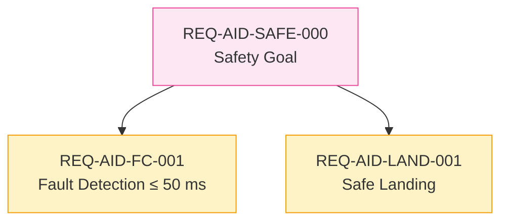
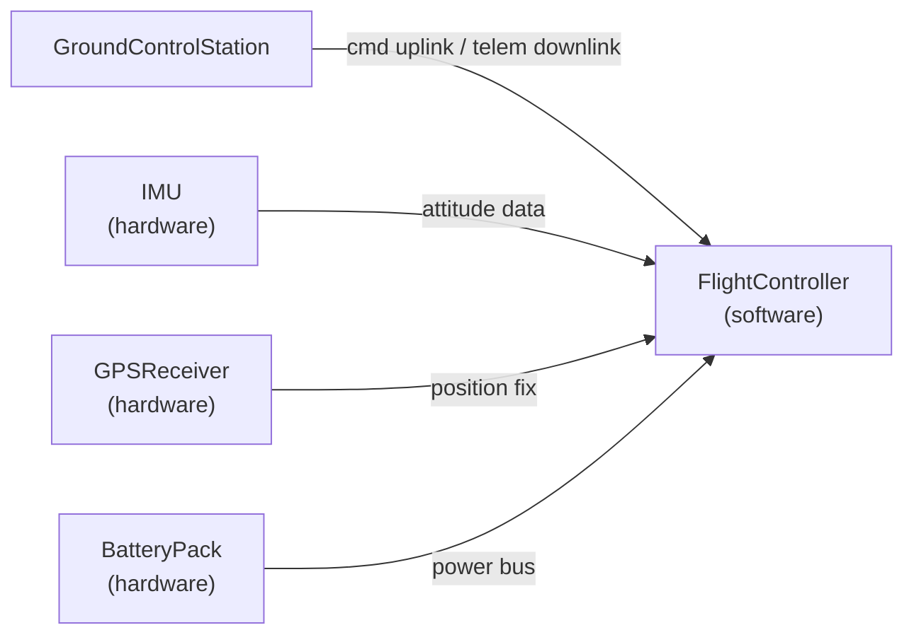
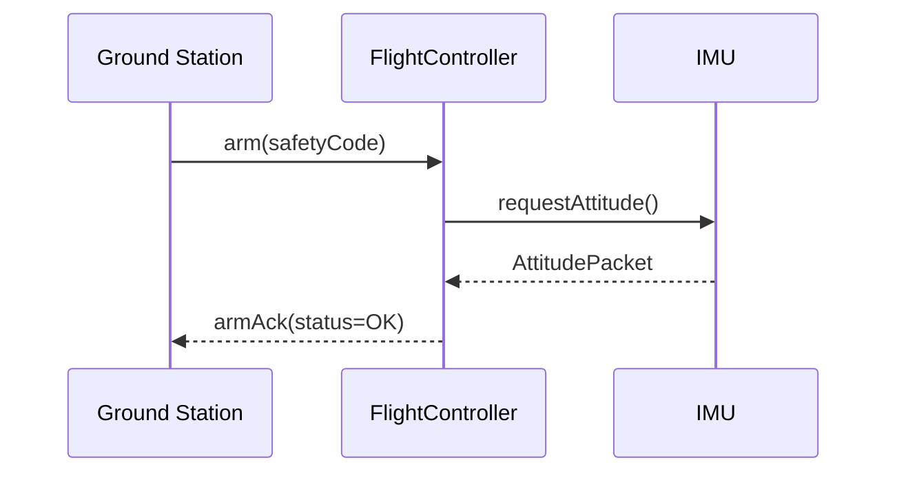
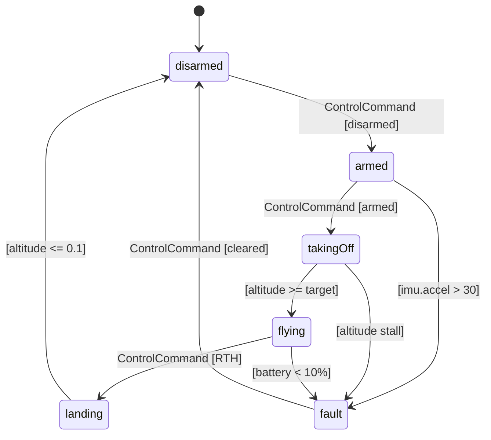

# Syscribe Model Generation Prompt

Copy everything from the horizontal rule below into your LLM session. Fill in the context block at the top for your chosen mode.

---

## How to Use This Prompt

This prompt supports two modes. Choose one and fill in the corresponding context block.

**Mode A — New model:** you are creating a model from scratch.
**Mode B — Change request:** you are adding requirements or making changes to an existing model.

---

## Mode A — New Model Context

*Fill in if creating a new model. Delete this block if using Mode B.*

```
Mode: NEW MODEL

System name:       [e.g. "Autonomous Inspection Drone"]
System short code: [e.g. "AID" — 2–6 uppercase letters, used in IDs]
Domain:            [e.g. "unmanned aerial vehicle for infrastructure inspection"]

Top-level stakeholder goals (3–5 bullet points):
  - ...

Architecture elements (hardware and software parts):
  - ...

Key interfaces between elements:
  - ...

Safety concerns (if any):
  - ...
```

---

## Mode B — Change Request Context

*Fill in if modifying an existing model. Delete this block if using Mode A.*

```
Mode: CHANGE REQUEST

Change request title: [e.g. "Add redundant IMU requirement"]
Change description:   [What is changing and why — be specific]

Change type (pick all that apply):
  [ ] New stakeholder goal (new parent requirement, no derivedFrom)
  [ ] New derived requirement(s) under an existing parent
  [ ] Decompose an existing leaf requirement into sub-requirements
  [ ] Status update on existing requirement(s) (e.g. approved → implemented)
  [ ] Replace / supersede a requirement with a revised one
  [ ] New architecture element satisfying an existing requirement
  [ ] New interface or operation on an existing PortDef/InterfaceDef
  [ ] Supersede an existing ADR with a revised decision
  [ ] Other: ...

Existing model summary (paste the output of the validator summary or list manually):

  Existing Requirement IDs in use:
    REQ-XXX-001, REQ-XXX-002, ...   ← list all so new IDs don't collide

  Existing ADR IDs in use:
    ADR-XXX-001, ...

  Existing TestCase IDs in use:
    TC-XXX-001, ...

  Elements affected by this change (qualified names):
    - Requirements::SomeReq          (status: approved, reqDomain: software)
    - Decisions::SomeADR             (status: accepted)
    - AID::Avionics::FlightController (domain: software, satisfies: [REQ-XXX-001])
    - ...

  Elements that must NOT change:
    - ...
```

---

## Validation Workflow

**You must validate the model with the CLI tool as you work.** Do not output all files at once and then validate at the end. Write a batch, validate, fix errors, then continue to the next batch.

### The validator command

```bash
cargo run --example validate_model -- model/
```

The report prints to stdout. The relevant lines are in **Section 2 — Validation Findings**:

```
## 2. Validation Findings

### Errors

| Code | File | Message |
|---|---|---|
| E310 | model/Requirements/FaultDetectionReq.md | derivedFrom is set but breakdownAdr is absent |

### Warnings

| Code | File | Message |
|---|---|---|
| W001 | model/Requirements/DataLinkReq.md | normative text contains no 'shall' |
```

- **Errors** (`E___`) block a correct model. Fix every error before continuing.
- **Warnings** (`W___`) are advisory. Aim to fix them, but they do not block progress.

The target is **0 errors**. Two W404 warnings for `ScalarValues::*` types are expected and acceptable — standard library types are not registered in the model tree.

### Validation batches

Work in this order, validating after each batch:

**Batch 1 — Skeleton**
Write all `_index.md` package files. Validate. There should be 0 errors at this point.

**Batch 2 — Architecture elements**
Write PartDef / ItemDef / PortDef / InterfaceDef / ActionDef elements, then Part / Port / Connection instances. Validate and fix before continuing.

**Batch 3 — ADRs**
Write all `ADR` elements first — they must exist before any Requirement cites them in `breakdownAdr:`. Validate: 0 errors expected.

**Batch 4 — Requirements**
Write parent `Requirement` elements (no `derivedFrom`) first, then child Requirements. Validate and fix any E310 (missing `breakdownAdr:`), E311 (unresolved `breakdownAdr:`), E103 (unresolved `derivedFrom:`).

**Batch 5 — TestCases**
Write one `TestCase` per leaf Requirement. Validate and fix any E011 (missing gherkin), E013 (missing `verifies:`), E102 (unresolved `verifies:`).

**Batch 6 — Satisfaction links**
Add `satisfies:` to architecture elements. Validate and fix any E312 (parent in satisfies), E313 (domain mismatch).

**Batch 7 — Allocations** (if needed)
Write `Allocation` elements. Validate: fix E502/E503 (unresolved `allocatedFrom`/`allocatedTo`).

**Batch 8 — Diagrams**
Write `Diagram` elements after all model elements are in place (shapes and edges reference them). Validate: fix E400 (missing mermaid block), W402 (unresolved shape ref), W403 (undefined edge endpoint).

After all batches pass with 0 errors, review the warnings section and fix any that indicate genuine gaps (W300 — leaf requirement has no satisfying element; W002 — approved requirement has no active TestCase).

### Fixing errors

When the validator reports errors, fix them before writing new files. Paste the error table to yourself as a checklist:

```
Errors to fix:
[ ] E310  model/Requirements/FaultDetectionReq.md  — add breakdownAdr:
[ ] E102  model/Verification/FCTest.md             — verifies: REQ-AID-FC-999 does not resolve
```

Check off each one, then re-run the validator to confirm 0 errors before proceeding.

---

## Output Format

When you write a file, show its full content in a fenced block labelled with the file path and action keyword:

````
```new: model/Requirements/MyNewReq.md
---
type: Requirement
...
---

Body text.
```

```update: model/AID/Avionics/FlightController.md
---
type: PartDef
...
satisfies:
  - REQ-AID-FC-001
  - REQ-AID-FC-002    ← added
---

Updated body.
```

```deprecate: model/Decisions/OldADR.md
Change status: accepted → superseded
Add field:     supersededBy: Decisions::NewADR
No other changes.
```
````

**Action semantics:**

| Action | Meaning |
|---|---|
| `new:` | Create this file; it does not exist yet |
| `update:` | Replace the entire file; show the complete new content |
| `deprecate:` | Describe field changes only — do not rewrite the whole file |

After each batch of files, show the validator command and its output before continuing:

```
Running: cargo run --example validate_model -- model/

[paste Section 2 of the report here]

✓ 0 errors — continuing to next batch.
```

If there are errors, fix them in the same response before declaring the batch done.

---

## Part 1 — Directory and Namespace Conventions

The model root is `model/`. Every directory corresponds to a package. The file path encodes the qualified name.

```
model/
  _index.md                    ← root package, type: Package
  <System>/
    _index.md                  ← type: Package
    <PartDef>.md
    Avionics/
      _index.md
      FlightController.md
  Requirements/
    _index.md
    <ParentReq>.md
    <ChildReq>.md
  Decisions/
    _index.md
    <ADR>.md
  Verification/
    _index.md
    <TestCase>.md
  Interfaces/
    _index.md
    <PortDef>.md
  Allocations/
    _index.md
    <Allocation>.md
```

**Qualified name rule:** a file at `model/Foo/Bar/Baz.md` has qualified name `Foo::Bar::Baz`. Use `::` as the separator in all cross-references.

**Package index:** every directory must contain `_index.md`:

```yaml
---
type: Package
name: <DirectoryName>
---

One-line description of this package.
```

---

## Part 2 — Element Types Quick Reference

| File `type:` | SysML concept | Typical location |
|---|---|---|
| `Package` | `package` | `_index.md` in any directory |
| `PartDef` | `part def` | `<System>/` or sub-package |
| `Part` | `part` (usage) | inside a `PartDef`'s directory |
| `ItemDef` | `item def` | `Items/` |
| `Item` | `item` | inside owning element |
| `PortDef` | `port def` | `Interfaces/` |
| `Port` | `port` | inside a `PartDef` |
| `InterfaceDef` | `interface def` | `Interfaces/` |
| `ConnectionDef` | `connection def` | `Interfaces/` |
| `Connection` | `connection` | inside a `PartDef` |
| `ActionDef` | `action def` | `Behavior/` |
| `Action` | `action` | inside an `ActionDef` |
| `Requirement` | native requirement | `Requirements/` |
| `RequirementDef` | `requirement def` | `Requirements/` |
| `TestCase` | native test case | `Verification/` |
| `ADR` | architecture decision | `Decisions/` |
| `Allocation` | `allocation` | `Allocations/` |
| `Diagram` | diagram | `Diagrams/` |

---

## Part 3 — Common Frontmatter Fields

These fields apply to most element types:

```yaml
---
type: PartDef                     # required — one of the types above
name: MyElement                   # display name; defaults to filename stem if omitted
supertype: OtherPkg::OtherElement # specialisation link ('>' in SysML)
isAbstract: false                 # true for abstract element definitions
multiplicity: "1"                 # cardinality; default "1"
domain: system                    # system | hardware | software  (required on Part/PartDef)
features:                         # inline attributes or ports
  - name: mass
    type: ScalarValues::Real
    unit: kg
connections:                      # port bindings (on Part files)
  - from: subpartA::outPort
    to: subpartB::inPort
tags:
  - myTag
---

Markdown body — documentation text goes here. Leave non-empty for PartDef and Part
(empty body triggers warning W600).
```

### `domain:` field rules

- Set `domain:` on every `PartDef` and `Part` that represents a physical or software element.
- Values: `system` (top-level or cross-cutting), `hardware` (physical), `software` (firmware/SW).
- `supertype:` and `typedBy:` must not cross the `hardware`/`software` boundary (error E315). Use `Allocation` for cross-domain integration.

---

## Part 4 — Native Requirement (`type: Requirement`)

### Required fields

| Field | Rule |
|---|---|
| `id` | Must match `^REQ(-[A-Z0-9]{2,12})+-[0-9]{3}$` — e.g. `REQ-SYS-001`, `REQ-AID-FC-001` |
| `title` | Short human-readable description |
| `status` | One of: `draft` · `review` · `approved` · `implemented` · `verified` |

### Optional fields

| Field | Notes |
|---|---|
| `reqDomain` | `system` · `hardware` · `software` — required on leaf requirements |
| `silLevel` | Integer 1–4; must accompany `asilLevel` (W006 if one is present without the other) |
| `asilLevel` | `A` · `B` · `C` · `D`; must accompany `silLevel` |
| `derivedFrom` | List of parent Requirement `id`s — triggers §12 rules |
| `breakdownAdr` | Qualified name of an `accepted` ADR — **required whenever `derivedFrom` is set** (E310) |
| `tags` | Free list |

### Normative body rules

- The Markdown body **before the first `##` heading** is the normative text.
- It must be **non-empty** (error E012).
- It must contain the word **`shall`** (warning W001 if absent — aim to satisfy this).

### Requirement hierarchy

```
REQ-SYS-000  (parent — stakeholder goal, no derivedFrom, no reqDomain needed)
  ├── REQ-HW-001   (leaf, derivedFrom: [REQ-SYS-000], breakdownAdr: Decisions::MyADR, reqDomain: hardware)
  └── REQ-SW-001   (leaf, derivedFrom: [REQ-SYS-000], breakdownAdr: Decisions::MyADR, reqDomain: software)
```

**Parent requirements** (those that have children deriving from them) must **never** appear in any element's `satisfies:` list (error E312). Only leaf requirements may be satisfied.

### Full example

```yaml
---
type: Requirement
id: REQ-AID-FC-001
title: "Flight controller shall detect sensor failure within 50 ms"
status: approved
silLevel: 3
asilLevel: C
reqDomain: software
derivedFrom:
  - REQ-AID-SAFE-000
breakdownAdr: Decisions::SafetyDecompositionADR
tags:
  - safety
  - fault-detection
---

The flight controller shall detect and isolate any single sensor failure within 50 ms of failure onset and emit a fault telemetry event.

## Rationale

A 50 ms detection window ensures the autopilot can initiate corrective action before attitude error exceeds recoverable bounds.
```

---

## Part 5 — Architecture Decision Record (`type: ADR`)

### Required fields

| Field | Rule |
|---|---|
| `id` | Must match `^ADR(-[A-Z0-9]{2,12})+-[0-9]{3}$` — e.g. `ADR-SYS-001`, `ADR-SW-SCHED-001` |
| `title` | Short description of the decision |
| `status` | `proposed` · `accepted` · `deprecated` · `superseded` |

**ADR must be `accepted` before any Requirement can cite it in `breakdownAdr:`** (warning W303 if still `proposed`).

### Body structure (conventional — not validated beyond being non-empty)

```markdown
## Context

Why was this decision needed?

## Decision

What was decided and why.

## Consequences

What changes as a result.
```

### Full example

```yaml
---
type: ADR
id: ADR-AID-SAFE-001
title: "Decompose safety goal into fault-detection and safe-landing sub-requirements"
status: accepted
tags:
  - safety
  - decomposition
---

## Context

The top-level safety requirement REQ-AID-SAFE-000 is too broad to assign to a single element.

## Decision

Decompose REQ-AID-SAFE-000 into:
- REQ-AID-FC-001 — sensor fault detection ≤ 50 ms (software, ASIL-C)
- REQ-AID-LAND-001 — autonomous safe landing on battery-critical event (software, ASIL-B)

## Consequences

The flight controller becomes the primary safety-relevant software element.
```

---

## Part 6 — Native TestCase (`type: TestCase`)

### Required fields

| Field | Rule |
|---|---|
| `id` | Must match `^TC(-[A-Z0-9]{2,12})+-[0-9]{3}$` — e.g. `TC-AID-FC-001` |
| `title` | Short description |
| `status` | `draft` · `review` · `approved` · `active` · `retired` |
| `testLevel` | `L1` · `L2` · `L3` · `L4` · `L5` |
| `verifies` | List of Requirement `id`s — **must not be empty** (error E013); targets must be native `Requirement` elements (error E104) |

### Body rules

- The body **must contain a fenced ` ```gherkin ` block** (error E011).
- The first ` ```gherkin ` block **must begin with a `Feature:` line** (error E015).
- Every `Scenario Outline:` block must have an `Examples:` table (error E014).

### Gherkin structure

````markdown
```gherkin
Feature: <Feature name>

  Background:
    Given <precondition>
    And <precondition>

  Scenario: <Scenario name>
    When <action>
    Then <expected result>
    And <expected result>

  Scenario Outline: <Parameterised scenario>
    When <action with <param>>
    Then <result with <param>>

    Examples:
      | param |
      | value |
```
````

### Full example

````markdown
```yaml
---
type: TestCase
id: TC-AID-FC-001
title: "FC detects injected sensor failure within 50 ms on HIL bench"
status: active
testLevel: L5
verifies:
  - REQ-AID-FC-001
tags:
  - safety
  - fault-detection
---

Hardware-in-the-loop test using the fault injection bench.
```

```gherkin
Feature: Flight controller sensor fault detection

  Background:
    Given the HIL bench is configured with the flight controller under test
    And CAN bus monitoring is active at 1 kHz sample rate

  Scenario: IMU failure is detected within 50 ms
    When a simulated IMU sensor failure is injected
    Then the flight controller shall assert FAULT_DETECTED within 50 ms
    And the FC shall transition to degraded mode

  Scenario: GPS failure is detected within 50 ms
    When a simulated GPS loss-of-fix condition is injected
    Then the flight controller shall assert FAULT_DETECTED within 50 ms
```
````

---

## Part 7 — Allocation (`type: Allocation`)

Allocations link a `software` or `system` element to a `hardware` element. Use them for cross-domain integration; never use `supertype:` across domain boundaries.

```yaml
---
type: Allocation
name: FCAllocation
allocatedFrom: AID::Avionics::FlightController   # software element (qualified name)
allocatedTo:   AID::Hardware::ProcessorBoard     # hardware element (qualified name)
---
```

Required: `allocatedFrom` and `allocatedTo` must both resolve to known elements (errors E502, E503).

---

## Part 8 — PortDef with Operations (`type: PortDef`)

```yaml
---
type: PortDef
name: ControlPortDef
operations:
  - name: arm
    doc: "Arm the system."
    isQuery: false
    isAsync: false
    parameters:
      - name: safetyCode
        typedBy: ScalarValues::Integer
        direction: in
        multiplicity: "1"
    returnType: ScalarValues::Boolean
  - name: emergencyStop
    doc: "Signal immediate abort — fire-and-forget."
    isAsync: true          # async receptions have no returnType
    parameters: []
---

Control port definition for arming and emergency-stop signalling.
```

Rules:
- `isAsync: true` and `returnType:` are mutually exclusive.
- `direction:` values: `in` · `out` · `inout`.
- `typedBy:` and `returnType:` trigger W404 if they don't resolve — standard-library types like `ScalarValues::*` are acceptable W404 warnings.

---

## Part 9 — Diagrams

Every diagram is a `type: Diagram` element in `Diagrams/`. Prefer **Mermaid** for traceability and flow diagrams; prefer **embedded SVG** for structural SysML diagrams (BDD, IBD, StateMachine, Requirement).

### Diagram element frontmatter

```yaml
---
type: Diagram
name: UAVSystemBDD          # becomes the qualified name Diagrams::UAVSystemBDD
diagramKind: BDD            # BDD | IBD | StateMachine | Requirement | Mermaid
subject: UAV::UAVSystem     # element this diagram depicts (W401 if it doesn't resolve)
svgMode: inline             # required when embedding SVG in the body
shapes:                     # shape-id → descriptor (for structured diagrams)
  s-uav: {ref: "UAV::UAVSystem", kind: PartDef}
  s-fc:  {ref: "UAV::Avionics::FlightController", kind: Part, parent: s-uav}
edges:                      # edge-id → descriptor
  e-comp: {source: s-uav, target: s-fc, kind: composition}
---
```

Shape descriptor fields:

| Field | Values |
|---|---|
| `ref` | Qualified name of the element — W402 if it doesn't resolve (sub-features like `Foo::portName` are suppressed) |
| `kind` | `PartDef` · `Part` · `Port` · `boundary` · `state` · `initial` · `Requirement` · `RequirementDef` · `TestCaseDef` |
| `parent` | Shape-id of the enclosing boundary (IBD nesting only) |

Edge descriptor fields:

| Field | Values |
|---|---|
| `source` / `target` | Shape-ids — W403 if they don't match a defined shape |
| `kind` | `composition` · `flowConnection` · `derivedFrom` · `verifies` · `allocatedTo` · `transition` |
| `ref` | Optional: qualified name of the element this edge represents |

---

### Mermaid diagrams

Use for: requirement derivation trees, architecture overviews, sequence interactions, anything not requiring precise SysML block notation.

Set `diagramKind: Mermaid`. Include a fenced ` ```mermaid ` block in the body (error E400 if absent). No `svgMode:`, no `shapes:`, no `edges:`.

**Requirement derivation tree:**

````markdown
```new: model/Diagrams/RequirementTrace.md
---
type: Diagram
name: RequirementTrace
diagramKind: Mermaid
subject: Requirements
---

Requirement derivation showing how stakeholder goals break down into leaf requirements.


```
````

**Architecture overview (flowchart):**

````markdown

````

**Sequence diagram:**

````markdown

````

**State machine (alternative to embedded SVG for simple machines):**

````markdown

````

---

### Embedded SVG diagrams

Use for: BDD (block decomposition), IBD (internal structure with ports), StateMachine (when guard conditions are important), Requirement (requirements with derivation and verification).

Set `svgMode: inline`. Declare `shapes:` and `edges:` in frontmatter (for traceability metadata). Place the SVG in the body inside a fenced ` ```svg ` block.

The symbol library `_diagram-symbols.svg` is always loaded by the browser. Use these symbols:

#### Available symbols

| Symbol id | ViewBox | Use for |
|---|---|---|
| `#sym-PartDef` | 160×80 | PartDef or Part blocks |
| `#sym-ItemDef` | 160×80 | ItemDef blocks |
| `#sym-ActionDef` | 160×80 | ActionDef blocks (rounded corners) |
| `#sym-RequirementDef` | 180×100 | RequirementDef blocks (3 compartments) |
| `#sym-requirement` | 180×100 | Native Requirement blocks |
| `#sym-testcase` | 160×80 | TestCase blocks |
| `#sym-InterfaceDef` | 160×80 | InterfaceDef blocks |
| `#sym-boundary` | 300×200 | IBD system boundary frame |
| `#sym-port` | 14×14 | Port squares on block borders |
| `#sym-state` | 140×60 | State nodes (rounded rect) |
| `#sym-initial` | 24×24 | Initial pseudostate (filled circle) |
| `#sym-final` | 28×28 | Final state (bullseye) |
| `#sym-actor` | 40×80 | Actor (stick figure) |
| `#sym-usecase` | 160×70 | Use-case ellipse |

#### Available arrow markers

| Marker id | Use for |
|---|---|
| `#arrow-open` | General directed edges, transitions |
| `#arrow-filled` | Navigable associations, messages |
| `#arrow-inherit` | Generalization / inheritance |
| `#arrow-composition` | Composition (filled diamond) |
| `#arrow-aggregation` | Aggregation (hollow diamond) |
| `#arrow-flow` | Item flow (blue filled arrowhead) |

#### SVG conventions

- Root element: `<svg xmlns="http://www.w3.org/2000/svg" xmlns:sysml="urn:syscribe:1.0" width="W" height="H" viewBox="0 0 W H">`
- Each shape is a `<g id="<shape-id>" sysml:ref="<qualified-name>" transform="translate(x,y)">` containing a `<use href="#sym-...">` and text elements.
- Shape `id` must match the shape-id key in the `shapes:` frontmatter.
- `sysml:ref` must match the `ref:` value in the `shapes:` frontmatter.
- Text labels: `<text class="stereotype">«part def»</text>` and `<text class="label">ElementName</text>`.
- Edges: `<line>` or `<path>` with `id="<edge-id>"` and `marker-end="url(#arrow-...)"`. Coordinates are absolute within the SVG viewport.
- Composition edges use `marker-start="url(#arrow-composition)"` at the parent end and no marker at the child end (or `marker-end="url(#arrow-open)"`).

#### BDD example (abridged)

````markdown
```new: model/Diagrams/SystemBDD.md
---
type: Diagram
name: SystemBDD
diagramKind: BDD
svgMode: inline
subject: AID::AIDSystem
shapes:
  s-root:    {ref: "AID::AIDSystem",            kind: PartDef}
  s-hw:      {ref: "AID::Hardware::Chassis",     kind: PartDef}
  s-sw:      {ref: "AID::Software::FlightStack", kind: PartDef}
edges:
  e-hw: {source: s-root, target: s-hw, kind: composition}
  e-sw: {source: s-root, target: s-sw, kind: composition}
---

Block Definition Diagram: top-level decomposition of AIDSystem.

```svg
<svg xmlns="http://www.w3.org/2000/svg" xmlns:sysml="urn:syscribe:1.0"
     width="520" height="280" viewBox="0 0 520 280">

  <!-- Root block -->
  <g id="s-root" sysml:ref="AID::AIDSystem" transform="translate(160,20)">
    <use href="#sym-PartDef" width="200" height="60"/>
    <text class="stereotype" x="100" y="14" text-anchor="middle">«part def»</text>
    <text class="label"      x="100" y="42" text-anchor="middle">AIDSystem</text>
  </g>

  <!-- Hardware block -->
  <g id="s-hw" sysml:ref="AID::Hardware::Chassis" transform="translate(60,180)">
    <use href="#sym-PartDef" width="160" height="56"/>
    <text class="stereotype" x="80" y="14" text-anchor="middle">«part def»</text>
    <text class="label"      x="80" y="38" text-anchor="middle">Chassis</text>
  </g>

  <!-- Software block -->
  <g id="s-sw" sysml:ref="AID::Software::FlightStack" transform="translate(300,180)">
    <use href="#sym-PartDef" width="160" height="56"/>
    <text class="stereotype" x="80" y="14" text-anchor="middle">«part def»</text>
    <text class="label"      x="80" y="38" text-anchor="middle">FlightStack</text>
  </g>

  <!-- Composition: root → Chassis -->
  <line x1="260" y1="80" x2="140" y2="180"
        stroke="#333" stroke-width="1.5"
        marker-start="url(#arrow-composition)"/>

  <!-- Composition: root → FlightStack -->
  <line x1="260" y1="80" x2="380" y2="180"
        stroke="#333" stroke-width="1.5"
        marker-start="url(#arrow-composition)"/>
</svg>
```
```
````

#### IBD example (abridged)

````markdown
```new: model/Diagrams/AvionicsBayIBD.md
---
type: Diagram
name: AvionicsBayIBD
diagramKind: IBD
svgMode: inline
subject: AID::Avionics::AvionicsBay
shapes:
  s-boundary: {ref: "AID::Avionics::AvionicsBay",          kind: boundary}
  s-fc:       {ref: "AID::Avionics::FlightController",      kind: Part, parent: s-boundary}
  s-imu:      {ref: "AID::Avionics::IMU",                   kind: Part, parent: s-boundary}
  s-pwr-port: {ref: "AID::Avionics::FlightController::powerIn", kind: Port}
edges:
  e-pwr: {source: s-pwr-port, target: s-imu, kind: flowConnection}
---

Internal structure of the AvionicsBay showing FlightController and IMU with power port.

```svg
<svg xmlns="http://www.w3.org/2000/svg" xmlns:sysml="urn:syscribe:1.0"
     width="600" height="320" viewBox="0 0 600 320">

  <!-- Boundary frame -->
  <g id="s-boundary" sysml:ref="AID::Avionics::AvionicsBay">
    <use href="#sym-boundary" x="20" y="20" width="560" height="280"/>
    <text font-size="11" fill="#4a6a9a" x="30" y="38">«block» AvionicsBay</text>
  </g>

  <!-- FlightController part -->
  <g id="s-fc" sysml:ref="AID::Avionics::FlightController" transform="translate(60,80)">
    <use href="#sym-PartDef" width="160" height="60"/>
    <text class="stereotype" x="80" y="14" text-anchor="middle">«part»</text>
    <text class="label"      x="80" y="38" text-anchor="middle">FlightController</text>
  </g>

  <!-- IMU part -->
  <g id="s-imu" sysml:ref="AID::Avionics::IMU" transform="translate(360,80)">
    <use href="#sym-PartDef" width="120" height="60"/>
    <text class="stereotype" x="60" y="14" text-anchor="middle">«part»</text>
    <text class="label"      x="60" y="38" text-anchor="middle">IMU</text>
  </g>

  <!-- Port on FlightController left border -->
  <g id="s-pwr-port" sysml:ref="AID::Avionics::FlightController::powerIn">
    <use href="#sym-port" x="53" y="140" width="14" height="14"/>
    <text font-size="9" x="53" y="164" text-anchor="middle">powerIn</text>
  </g>

  <!-- Flow: powerIn → IMU -->
  <line id="e-pwr" x1="220" y1="110" x2="360" y2="110"
        stroke="#4a90d9" stroke-width="1.5"
        marker-end="url(#arrow-flow)"/>
</svg>
```
```
````

#### StateMachine example (abridged)

````markdown
```new: model/Diagrams/FlightStatesMachineD.md
---
type: Diagram
name: FlightStatesMachineD
diagramKind: StateMachine
svgMode: inline
subject: Behavior::FlightStates
shapes:
  s-initial:  {ref: "Behavior::FlightStates", kind: initial}
  s-disarmed: {ref: "Behavior::FlightStates::disarmed", kind: state}
  s-armed:    {ref: "Behavior::FlightStates::armed",    kind: state}
  s-fault:    {ref: "Behavior::FlightStates::fault",    kind: state}
edges:
  e-init: {source: s-initial,  target: s-disarmed, kind: transition}
  e-arm:  {source: s-disarmed, target: s-armed,    kind: transition}
  e-fail: {source: s-armed,    target: s-fault,    kind: transition}
---

State machine for flight operations.

```svg
<svg xmlns="http://www.w3.org/2000/svg" xmlns:sysml="urn:syscribe:1.0"
     width="400" height="360" viewBox="0 0 400 360">

  <g id="s-initial" sysml:ref="Behavior::FlightStates">
    <use href="#sym-initial" x="89" y="20" width="22" height="22"/>
  </g>

  <g id="s-disarmed" sysml:ref="Behavior::FlightStates::disarmed">
    <use href="#sym-state" x="30" y="70" width="140" height="48"/>
    <text x="100" y="99" text-anchor="middle" font-size="12">disarmed</text>
  </g>

  <g id="s-armed" sysml:ref="Behavior::FlightStates::armed">
    <use href="#sym-state" x="30" y="170" width="140" height="48"/>
    <text x="100" y="199" text-anchor="middle" font-size="12">armed</text>
  </g>

  <g id="s-fault" sysml:ref="Behavior::FlightStates::fault">
    <use href="#sym-state" x="240" y="170" width="140" height="48"/>
    <text x="310" y="199" text-anchor="middle" font-size="12">fault</text>
  </g>

  <!-- initial → disarmed -->
  <line id="e-init" x1="100" y1="42" x2="100" y2="70"
        stroke="#333" stroke-width="1.5" marker-end="url(#arrow-open)"/>

  <!-- disarmed → armed -->
  <line id="e-arm" x1="100" y1="118" x2="100" y2="170"
        stroke="#333" stroke-width="1.5" marker-end="url(#arrow-open)"/>
  <text x="106" y="148" font-size="9" fill="#555">ControlCommand</text>

  <!-- armed → fault -->
  <line id="e-fail" x1="170" y1="194" x2="240" y2="194"
        stroke="#c0392b" stroke-width="1.5" marker-end="url(#arrow-open)"/>
  <text x="192" y="188" font-size="9" fill="#c0392b">[imu.fail]</text>
</svg>
```
```
````

---

### Diagram validation rules

| Code | Condition | Fix |
|---|---|---|
| E400 | `diagramKind: Mermaid` but body has no ` ```mermaid ` block | Add the fenced block |
| W400 | Diagram element has no `diagramKind` | Set `diagramKind:` |
| W401 | `subject:` does not resolve to a known element | Use the correct qualified name |
| W402 | A shape `ref:` does not resolve | Fix the qualified name; sub-feature refs (e.g. `Foo::portName`) are suppressed |
| W403 | An edge `source` or `target` is not a defined shape-id | Check the shape-id spelling in `shapes:` |

Diagrams are validated in Batch 8 — add them after all other elements are in place and the model is clean.

---

## Part 10 — §12 Traceability Rules

Work through this checklist for every `Requirement` you create or modify:

### §12.1 — Link direction
Links always point **upstream**. The child holds `derivedFrom:` pointing to its parent. The TestCase holds `verifies:` pointing to the Requirement. Architecture elements hold `satisfies:` pointing to the Requirement. Never put backward links on a parent.

### §12.2 — Breakdown ADR required
Every Requirement that has `derivedFrom:` **must also have `breakdownAdr:`** pointing to an `accepted` ADR (error E310 if absent; E311 if the reference does not resolve; W303 if the ADR is `proposed`).

Create the ADR file *before* the child requirement files.

### §12.3 — Leaf assignment
Every leaf Requirement (no children) at `status: approved` or `implemented` should be assigned to exactly one architecture element via that element's `satisfies:` field (warning W300 if none).

```yaml
satisfies:
  - REQ-AID-FC-001
```

### §12.4 — No parent assignment
A Requirement from which other Requirements derive must **never** appear in any `satisfies:` list (error E312). Only leaf requirement IDs may appear in `satisfies:`.

### §12.5 — Domain match
The `reqDomain:` of the leaf Requirement must match the `domain:` of the element that satisfies it, unless either is `system` (error E313).

| `reqDomain:` | Element `domain:` | Allowed? |
|---|---|---|
| `software` | `software` | Yes |
| `hardware` | `hardware` | Yes |
| `system` | anything | Yes |
| anything | `system` | Yes |
| `software` | `hardware` | **No — E313** |
| `hardware` | `software` | **No — E313** |

### §12.6 — HW/SW independence
Do not use `supertype:` or `typedBy:` across the `hardware`/`software` boundary (error E315). Use `Allocation` elements for cross-domain binding.

---

## Part 11 — Change Request Patterns

Use these patterns when operating in **Mode B**. Each pattern lists what to create, what to update, and what side-effects to check.

### Pattern A — Add a new stakeholder goal

A top-level requirement with no parent. No `derivedFrom:`, no `breakdownAdr:`, no `reqDomain:` required.

**Create:**
- One new `Requirement` file (`status: draft` or `review`)

**No updates required** until children are derived from it.

**When to use:** a new stakeholder has a new need, or a regulatory change introduces a new top-level obligation.

---

### Pattern B — Add derived requirements under an existing parent

The parent requirement already exists. You are splitting it into verifiable leaf requirements.

**Create (in this order):**
1. One new `ADR` (`status: accepted`) explaining why this decomposition is correct
2. One or more new child `Requirement` files, each with:
   - `derivedFrom: [<parent-id>]`
   - `breakdownAdr: Decisions::<NewADR>`
   - `reqDomain: hardware | software | system`
3. One new `TestCase` per leaf child (with gherkin block)

**Update:**
- The architecture element(s) that satisfy the new leaves: add the new `REQ-*` IDs to their `satisfies:` lists

**Check:**
- The parent must NOT appear in any `satisfies:` list (it is now a parent)
- If the parent was previously a leaf with a `satisfies:` entry somewhere, remove it (E312)
- If the parent had a TestCase, set that TestCase's `status: retired`

---

### Pattern C — Decompose an existing leaf requirement

An existing leaf requirement becomes a parent. This is the most impactful change type.

**Create (in this order):**
1. One new `ADR` (`status: accepted`) for the decomposition decision
2. New child `Requirement` files with `derivedFrom:` and `breakdownAdr:`
3. New `TestCase` files for each new leaf child

**Update:**
- The former leaf `Requirement`: no frontmatter change needed (the validator derives parent status from children's `derivedFrom:`)
- Every architecture element that had the former leaf in its `satisfies:` list: **remove** that ID (E312 fires if a parent is in a satisfies list)
- Every `TestCase` that had `verifies: [<former-leaf-id>]`: set `status: retired` (a parent requirement should not be directly verified)
- Add the new leaf IDs to the appropriate architecture elements' `satisfies:` lists

**Check:**
- `reqDomain:` on the former leaf may no longer be valid if children span multiple domains — consider removing it from the parent
- Domain match (E313) must hold for each new child and its satisfying element

---

### Pattern D — Status progression

Requirements move through a defined lifecycle. Each transition may require other changes.

```
draft → review → approved → implemented → verified
```

| Transition | What else to check |
|---|---|
| `draft` → `review` | Normative text contains `shall`; `reqDomain:` set if it is a leaf |
| `review` → `approved` | A TestCase exists and is `active` (W002 fires otherwise) |
| `approved` → `implemented` | A satisfying architecture element exists with this ID in `satisfies:` (W300) |
| `implemented` → `verified` | At least one `active` TestCase with `verifies:` pointing here (W003) |

**Update:**
- The `Requirement` file: change `status:` field only
- If moving to `approved`, ensure a TestCase exists; create one if not

---

### Pattern E — Replace a requirement

A requirement's scope or text changes significantly — rather than editing in place, you supersede it with a new one to preserve traceability history.

**Create:**
1. New `Requirement` with a new `REQ-*` ID (never reuse the old ID)
2. New `TestCase` verifying the new requirement

**Update:**
- The old `Requirement`: change `status:` to the highest reached state — leave the file; do not delete it
- Architecture elements: replace the old `REQ-*` ID in `satisfies:` with the new one
- Old `TestCase`: set `status: retired`

**Do not:**
- Reuse the old requirement's ID on the new requirement (E101 — duplicate ID)
- Delete the old requirement file (history is preserved by leaving it)

---

### Pattern F — Supersede an ADR

A prior architectural decision is replaced by a newer one.

**Create:**
1. New `ADR` with a new `ADR-*` ID and `status: accepted`
2. In the new ADR body, reference the old ADR in a `## Supersedes` section

**Deprecate:**
- Old `ADR`: set `status: superseded`; optionally add `supersededBy: Decisions::<NewADR>`

**Update:**
- Any `Requirement` with `breakdownAdr: Decisions::<OldADR>`: update to `breakdownAdr: Decisions::<NewADR>`
  - Only update requirements where the decomposition decision itself changed; leave unchanged if the old decision still applies to other requirements

**Check:**
- W303: no `approved` or higher Requirement may still cite the old ADR now that it is `superseded`

---

### Pattern G — Add a new architecture element

A new hardware or software element is introduced to satisfy one or more existing leaf requirements.

**Create:**
1. New `PartDef` or `Part` file with correct `domain:` and `satisfies:` list

**Check:**
- `domain:` on the new element matches `reqDomain:` on every requirement in its `satisfies:` list (E313)
- If `domain: software` and it runs on hardware, add an `Allocation` to the appropriate hardware element
- The requirements being satisfied are leaves (not parents) — E312 if not

**Update (if applicable):**
- Remove those requirement IDs from any other element's `satisfies:` list — W301 warns when a leaf is satisfied by more than one element

---

## Part 12 — Validation Error Quick Reference

These errors block a clean build.

| Code | Cause | Fix |
|---|---|---|
| E004 | `TestCase` missing `id`, `title`, `status`, or `testLevel` | Add all four fields |
| E004 | `Requirement` missing `title` or `status` | Add both fields |
| E006 | `id` does not match the pattern for its type | Check regex: `REQ(-[A-Z0-9]{2,12})+-[0-9]{3}` |
| E007 | `status` value not in allowed enum | Check status table for each type |
| E008 | `testLevel` not `L1`–`L5` | Use exactly `L1`, `L2`, `L3`, `L4`, or `L5` |
| E009 | `silLevel` outside 1–4 | Use integer 1, 2, 3, or 4 |
| E010 | `asilLevel` not `A`–`D` | Use exactly `A`, `B`, `C`, or `D` |
| E011 | TestCase body has no ` ```gherkin ` block | Add a gherkin fenced block |
| E012 | Requirement normative text is empty | Write the `shall` statement before any `##` heading |
| E013 | `verifies:` absent or empty on TestCase | Add at least one `REQ-*` ID |
| E014 | `Scenario Outline:` has no `Examples:` table | Add `Examples:` table under the outline |
| E015 | First gherkin block has no `Feature:` line | Start the block with `Feature: <name>` |
| E101 | Duplicate `id` across two elements | Each `REQ-*`, `TC-*`, `ADR-*` must be globally unique |
| E102 | `verifies:` ID does not resolve | Check the ID matches a `Requirement` file exactly |
| E103 | `derivedFrom:` ID does not resolve | Check parent Requirement ID |
| E104 | `verifies:` target is not a native `Requirement` | Only point `verifies:` at `type: Requirement` elements |
| E105 | `derivedFrom:` target is not a native `Requirement` | Only point `derivedFrom:` at `type: Requirement` elements |
| E300 | ADR `id` does not match `ADR-*` pattern | Fix the ID |
| E301 | ADR missing `id`, `title`, or `status` | Add all three fields |
| E302 | `reqDomain` not `system`/`hardware`/`software` | Use one of the three values exactly |
| E303 | `domain` not `system`/`hardware`/`software` | Use one of the three values exactly |
| E304 | ADR `status` not valid | Use `proposed`, `accepted`, `deprecated`, or `superseded` |
| E310 | `derivedFrom:` present but `breakdownAdr:` absent | Add `breakdownAdr:` pointing to an accepted ADR |
| E311 | `breakdownAdr:` does not resolve or is not an ADR | Use the qualified name of an `ADR` element |
| E312 | Parent requirement in a `satisfies:` list | Only leaf requirements may be satisfied |
| E313 | Domain mismatch between element and requirement | Match `domain:` to `reqDomain:` |
| E314 | `isDeploymentPackage: true` with no `Allocation` | Add an Allocation to a hardware element |
| E315 | Cross-domain `supertype:` or `typedBy:` | Use Allocation for HW↔SW binding |
| E500–E503 | `allocatedFrom`/`allocatedTo` does not resolve | Use correct qualified names |

---

## Part 13 — Minimum Viable Model Skeleton (Mode A)

```
model/
  _index.md                    (Package)
  <System>/
    _index.md                  (Package)
    <TopLevel>.md              (PartDef, domain: system)
    Hardware/
      _index.md                (Package)
      <HWElement>.md           (PartDef, domain: hardware, satisfies: [REQ-*-HW-*])
    Software/
      _index.md                (Package)
      <SWElement>.md           (PartDef, domain: software, satisfies: [REQ-*-SW-*])
  Requirements/
    _index.md                  (Package)
    <ParentReq>.md             (Requirement, no derivedFrom, no reqDomain required)
    <LeafHWReq>.md             (Requirement, derivedFrom, breakdownAdr, reqDomain: hardware)
    <LeafSWReq>.md             (Requirement, derivedFrom, breakdownAdr, reqDomain: software)
  Decisions/
    _index.md                  (Package)
    <DecompADR>.md             (ADR, status: accepted — created before the child Requirements)
  Verification/
    _index.md                  (Package)
    <TC-for-HW-Req>.md         (TestCase, verifies: [REQ-*-HW-*], gherkin block)
    <TC-for-SW-Req>.md         (TestCase, verifies: [REQ-*-SW-*], gherkin block)
  Allocations/
    _index.md                  (Package)
    <SWtoHW>.md                (Allocation, allocatedFrom: SW element, allocatedTo: HW element)
```

---

## Part 14 — Final Checklist

Run through this before producing any output.

### For every Requirement (new or updated)

- [ ] `id:` is globally unique and matches `^REQ(-[A-Z0-9]{2,12})+-[0-9]{3}$`
- [ ] `title:` and `status:` are present
- [ ] Normative body is non-empty and contains `shall`
- [ ] If `derivedFrom:` is set → `breakdownAdr:` is also set, pointing to an `accepted` ADR
- [ ] If it is a leaf at `approved`/`implemented` → exactly one architecture element has it in `satisfies:`
- [ ] If it has children deriving from it → it does NOT appear in any `satisfies:` list
- [ ] `reqDomain:` matches `domain:` of the satisfying element (or one of them is `system`)

### For every TestCase (new or updated)

- [ ] `id:` is globally unique and matches `^TC(-[A-Z0-9]{2,12})+-[0-9]{3}$`
- [ ] `title:`, `status:`, `testLevel:` are present
- [ ] `verifies:` is non-empty and every ID resolves to a `type: Requirement` element
- [ ] Body contains a ` ```gherkin ` block whose first line is `Feature:`
- [ ] Every `Scenario Outline:` has an `Examples:` table

### For every ADR (new or updated)

- [ ] `id:` is globally unique and matches `^ADR(-[A-Z0-9]{2,12})+-[0-9]{3}$`
- [ ] `title:` and `status:` are present
- [ ] `status: accepted` before any Requirement cites it in `breakdownAdr:`

### Cross-cutting (Mode B only)

- [ ] No new ID collides with any existing `REQ-*`, `TC-*`, or `ADR-*` listed in the context block
- [ ] Any requirement promoted to a parent has been removed from all `satisfies:` lists
- [ ] Any retired TestCase has `status: retired` — do not delete it
- [ ] Any superseded ADR has `status: superseded` — do not delete it
- [ ] All `breakdownAdr:` references on child requirements point to the current (non-superseded) ADR

### For every Diagram

- [ ] `diagramKind:` is set (`BDD` · `IBD` · `StateMachine` · `Requirement` · `Mermaid`)
- [ ] `subject:` resolves to a known element
- [ ] Mermaid diagrams have a ` ```mermaid ` block in the body with valid Mermaid syntax
- [ ] SVG diagrams have `svgMode: inline` and a ` ```svg ` block; shape `id` attributes match `shapes:` keys; `sysml:ref` attributes match `ref:` values
- [ ] All shape `ref:` values resolve (or are sub-features of a known element)
- [ ] All edge `source`/`target` values are defined shape-ids in the same diagram

### All elements

- [ ] Every directory referenced by a new file has an `_index.md`
- [ ] All qualified name cross-references use `::` and resolve to actual files
- [ ] No `supertype:` or `typedBy:` crosses the `hardware`/`software` domain boundary

Now generate the output.
