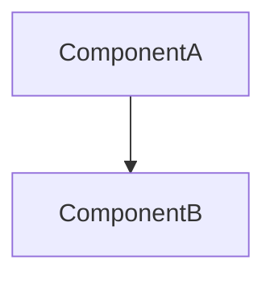

This diagram has a Mermaid block with a `%% ref:` annotation that does not resolve — should trigger W408.

```mermaid
graph TD
  A["ComponentA"]
  B["ComponentB"]
  A --> B
  %% ref: NoSuchPackage::ComponentA
```
