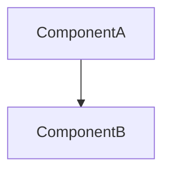

This diagram has a Mermaid block with a `%% link:` annotation pointing to an unknown element — should trigger W410.

```mermaid
graph TD
  A["ComponentA"]
  B["ComponentB"]
  A --> B
  %% ref: NoSuchPackage::ComponentA
  %% link: A NoSuchPackage::ComponentA
```
