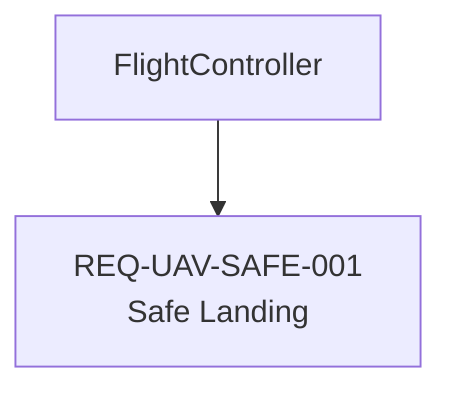

Requirement trace diagram with a clickable node.

```mermaid
graph TD
  SAFE["REQ-UAV-SAFE-001<br/>Safe Landing"]
  FC["FlightController"]
  FC --> SAFE
  %% link: SAFE Requirements::SafeLanding
  %% link: FC UAV::Avionics::FlightController
```
